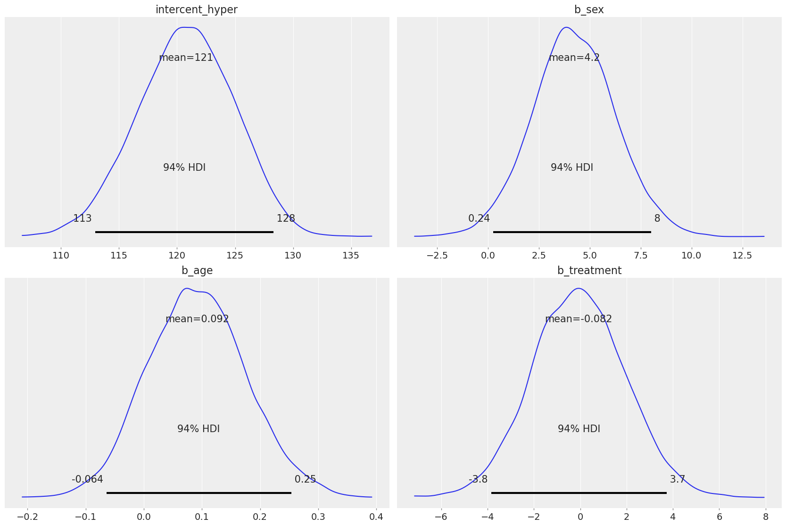

PyMC v4 is here and one of the big changes is that the inference routines (e.g., `pm.sample()`) will return an [ArviZ](https://arviz-devs.github.io/arviz/) InferenceData object by default (recent releases of PyMV3 have made this optional).  This post is intended to explore a bit about how the InferenceData object works, how it intersects with PyMC parameter arrays and how the labeling of dimensions and coordinates can make life easier.  If you haven't already checked out [Oriol Abril's fantastic post about PyMC, coords, and dims](https://oriolabril.github.io/oriol_unraveled/python/arviz/pymc3/xarray/2020/09/22/pymc3-arviz.html), I would strongly encourage you to do so.

Oriol's post focuses on the use of labeled dimensions, how these dimensions can be used to create parameter arrays, and how Arviz acknowledges and utilizes the labels when processing the prior/posterior (e.g., plotting).  Here, I want to focus on how named dimensions/cooridnates can be used to create parameter arrays, contrasting it with the way things were done in PyMC3.  I will also illustrate how to access information in the posterior and compare labeled dimensions with unlabeled.

## Table of Contents
- [xarray](#xarray)
- [Example Data](#data)
- [Unlabeled Approach (Old)](#unlabeled)
- [Labeled Approach (New)](#labeled)
- [Full Example](#fullexample)
- [Wrap-Up](#wrapup)


```python
import arviz as az
import numpy as np
import pandas as pd
import pymc as pm
import xarray as xr
%matplotlib inline

az.style.use("arviz-darkgrid")
rng = np.random.default_rng(101010)
```


## xarray <a id='xarray'></a>

The new(ish) ArviZ inferenceData object is basically an xarray Dataset object. [xarray](https://xarray.pydata.org) describes itself as a generalization of both Numpy arrays and Pandas dataframes.  Its design also borrows heavily from the netCDF file specification.  But let's see what xarray objects actually look like.  Here is a standard numy array.


```python
npdata = rng.standard_normal(size=(2, 3))
npdata
```


    array([[-0.91412107, -0.32402107,  1.29165606],
           [ 0.52327975,  0.95708885,  0.52139111]])


Here we will use this numpy array to create an xarray DataArray.


```python
data = xr.DataArray(npdata, dims=("user", "day"), coords={"user": ['Alice', 'Bob'], "day":["yesterday", "today", "tomorrow"]})
data
```


<div><svg style="position: absolute; width: 0; height: 0; overflow: hidden">
<defs>
<symbol id="icon-database" viewBox="0 0 32 32">
<path d="M16 0c-8.837 0-16 2.239-16 5v4c0 2.761 7.163 5 16 5s16-2.239 16-5v-4c0-2.761-7.163-5-16-5z"></path>
<path d="M16 17c-8.837 0-16-2.239-16-5v6c0 2.761 7.163 5 16 5s16-2.239 16-5v-6c0 2.761-7.163 5-16 5z"></path>
<path d="M16 26c-8.837 0-16-2.239-16-5v6c0 2.761 7.163 5 16 5s16-2.239 16-5v-6c0 2.761-7.163 5-16 5z"></path>
</symbol>
<symbol id="icon-file-text2" viewBox="0 0 32 32">
<path d="M28.681 7.159c-0.694-0.947-1.662-2.053-2.724-3.116s-2.169-2.030-3.116-2.724c-1.612-1.182-2.393-1.319-2.841-1.319h-15.5c-1.378 0-2.5 1.121-2.5 2.5v27c0 1.378 1.122 2.5 2.5 2.5h23c1.378 0 2.5-1.122 2.5-2.5v-19.5c0-0.448-0.137-1.23-1.319-2.841zM24.543 5.457c0.959 0.959 1.712 1.825 2.268 2.543h-4.811v-4.811c0.718 0.556 1.584 1.309 2.543 2.268zM28 29.5c0 0.271-0.229 0.5-0.5 0.5h-23c-0.271 0-0.5-0.229-0.5-0.5v-27c0-0.271 0.229-0.5 0.5-0.5 0 0 15.499-0 15.5 0v7c0 0.552 0.448 1 1 1h7v19.5z"></path>
<path d="M23 26h-14c-0.552 0-1-0.448-1-1s0.448-1 1-1h14c0.552 0 1 0.448 1 1s-0.448 1-1 1z"></path>
<path d="M23 22h-14c-0.552 0-1-0.448-1-1s0.448-1 1-1h14c0.552 0 1 0.448 1 1s-0.448 1-1 1z"></path>
<path d="M23 18h-14c-0.552 0-1-0.448-1-1s0.448-1 1-1h14c0.552 0 1 0.448 1 1s-0.448 1-1 1z"></path>
</symbol>
</defs>
</svg>
<style>/* CSS stylesheet for displaying xarray objects in jupyterlab.
 *
 */

:root {
  --xr-font-color0: var(--jp-content-font-color0, rgba(0, 0, 0, 1));
  --xr-font-color2: var(--jp-content-font-color2, rgba(0, 0, 0, 0.54));
  --xr-font-color3: var(--jp-content-font-color3, rgba(0, 0, 0, 0.38));
  --xr-border-color: var(--jp-border-color2, #e0e0e0);
  --xr-disabled-color: var(--jp-layout-color3, #bdbdbd);
  --xr-background-color: var(--jp-layout-color0, white);
  --xr-background-color-row-even: var(--jp-layout-color1, white);
  --xr-background-color-row-odd: var(--jp-layout-color2, #eeeeee);
}

html[theme=dark],
body.vscode-dark {
  --xr-font-color0: rgba(255, 255, 255, 1);
  --xr-font-color2: rgba(255, 255, 255, 0.54);
  --xr-font-color3: rgba(255, 255, 255, 0.38);
  --xr-border-color: #1F1F1F;
  --xr-disabled-color: #515151;
  --xr-background-color: #111111;
  --xr-background-color-row-even: #111111;
  --xr-background-color-row-odd: #313131;
}

.xr-wrap {
  display: block !important;
  min-width: 300px;
  max-width: 700px;
}

.xr-text-repr-fallback {
  /* fallback to plain text repr when CSS is not injected (untrusted notebook) */
  display: none;
}

.xr-header {
  padding-top: 6px;
  padding-bottom: 6px;
  margin-bottom: 4px;
  border-bottom: solid 1px var(--xr-border-color);
}

.xr-header > div,
.xr-header > ul {
  display: inline;
  margin-top: 0;
  margin-bottom: 0;
}

.xr-obj-type,
.xr-array-name {
  margin-left: 2px;
  margin-right: 10px;
}

.xr-obj-type {
  color: var(--xr-font-color2);
}

.xr-sections {
  padding-left: 0 !important;
  display: grid;
  grid-template-columns: 150px auto auto 1fr 20px 20px;
}

.xr-section-item {
  display: contents;
}

.xr-section-item input {
  display: none;
}

.xr-section-item input + label {
  color: var(--xr-disabled-color);
}

.xr-section-item input:enabled + label {
  cursor: pointer;
  color: var(--xr-font-color2);
}

.xr-section-item input:enabled + label:hover {
  color: var(--xr-font-color0);
}

.xr-section-summary {
  grid-column: 1;
  color: var(--xr-font-color2);
  font-weight: 500;
}

.xr-section-summary > span {
  display: inline-block;
  padding-left: 0.5em;
}

.xr-section-summary-in:disabled + label {
  color: var(--xr-font-color2);
}

.xr-section-summary-in + label:before {
  display: inline-block;
  content: '►';
  font-size: 11px;
  width: 15px;
  text-align: center;
}

.xr-section-summary-in:disabled + label:before {
  color: var(--xr-disabled-color);
}

.xr-section-summary-in:checked + label:before {
  content: '▼';
}

.xr-section-summary-in:checked + label > span {
  display: none;
}

.xr-section-summary,
.xr-section-inline-details {
  padding-top: 4px;
  padding-bottom: 4px;
}

.xr-section-inline-details {
  grid-column: 2 / -1;
}

.xr-section-details {
  display: none;
  grid-column: 1 / -1;
  margin-bottom: 5px;
}

.xr-section-summary-in:checked ~ .xr-section-details {
  display: contents;
}

.xr-array-wrap {
  grid-column: 1 / -1;
  display: grid;
  grid-template-columns: 20px auto;
}

.xr-array-wrap > label {
  grid-column: 1;
  vertical-align: top;
}

.xr-preview {
  color: var(--xr-font-color3);
}

.xr-array-preview,
.xr-array-data {
  padding: 0 5px !important;
  grid-column: 2;
}

.xr-array-data,
.xr-array-in:checked ~ .xr-array-preview {
  display: none;
}

.xr-array-in:checked ~ .xr-array-data,
.xr-array-preview {
  display: inline-block;
}

.xr-dim-list {
  display: inline-block !important;
  list-style: none;
  padding: 0 !important;
  margin: 0;
}

.xr-dim-list li {
  display: inline-block;
  padding: 0;
  margin: 0;
}

.xr-dim-list:before {
  content: '(';
}

.xr-dim-list:after {
  content: ')';
}

.xr-dim-list li:not(:last-child):after {
  content: ',';
  padding-right: 5px;
}

.xr-has-index {
  font-weight: bold;
}

.xr-var-list,
.xr-var-item {
  display: contents;
}

.xr-var-item > div,
.xr-var-item label,
.xr-var-item > .xr-var-name span {
  background-color: var(--xr-background-color-row-even);
  margin-bottom: 0;
}

.xr-var-item > .xr-var-name:hover span {
  padding-right: 5px;
}

.xr-var-list > li:nth-child(odd) > div,
.xr-var-list > li:nth-child(odd) > label,
.xr-var-list > li:nth-child(odd) > .xr-var-name span {
  background-color: var(--xr-background-color-row-odd);
}

.xr-var-name {
  grid-column: 1;
}

.xr-var-dims {
  grid-column: 2;
}

.xr-var-dtype {
  grid-column: 3;
  text-align: right;
  color: var(--xr-font-color2);
}

.xr-var-preview {
  grid-column: 4;
}

.xr-var-name,
.xr-var-dims,
.xr-var-dtype,
.xr-preview,
.xr-attrs dt {
  white-space: nowrap;
  overflow: hidden;
  text-overflow: ellipsis;
  padding-right: 10px;
}

.xr-var-name:hover,
.xr-var-dims:hover,
.xr-var-dtype:hover,
.xr-attrs dt:hover {
  overflow: visible;
  width: auto;
  z-index: 1;
}

.xr-var-attrs,
.xr-var-data {
  display: none;
  background-color: var(--xr-background-color) !important;
  padding-bottom: 5px !important;
}

.xr-var-attrs-in:checked ~ .xr-var-attrs,
.xr-var-data-in:checked ~ .xr-var-data {
  display: block;
}

.xr-var-data > table {
  float: right;
}

.xr-var-name span,
.xr-var-data,
.xr-attrs {
  padding-left: 25px !important;
}

.xr-attrs,
.xr-var-attrs,
.xr-var-data {
  grid-column: 1 / -1;
}

dl.xr-attrs {
  padding: 0;
  margin: 0;
  display: grid;
  grid-template-columns: 125px auto;
}

.xr-attrs dt,
.xr-attrs dd {
  padding: 0;
  margin: 0;
  float: left;
  padding-right: 10px;
  width: auto;
}

.xr-attrs dt {
  font-weight: normal;
  grid-column: 1;
}

.xr-attrs dt:hover span {
  display: inline-block;
  background: var(--xr-background-color);
  padding-right: 10px;
}

.xr-attrs dd {
  grid-column: 2;
  white-space: pre-wrap;
  word-break: break-all;
}

.xr-icon-database,
.xr-icon-file-text2 {
  display: inline-block;
  vertical-align: middle;
  width: 1em;
  height: 1.5em !important;
  stroke-width: 0;
  stroke: currentColor;
  fill: currentColor;
}
</style><pre class='xr-text-repr-fallback'>&lt;xarray.DataArray (user: 2, day: 3)&gt;
array([[-0.91412107, -0.32402107,  1.29165606],
       [ 0.52327975,  0.95708885,  0.52139111]])
Coordinates:
  * user     (user) &lt;U5 &#x27;Alice&#x27; &#x27;Bob&#x27;
  * day      (day) &lt;U9 &#x27;yesterday&#x27; &#x27;today&#x27; &#x27;tomorrow&#x27;</pre><div class='xr-wrap' style='display:none'><div class='xr-header'><div class='xr-obj-type'>xarray.DataArray</div><div class='xr-array-name'></div><ul class='xr-dim-list'><li><span class='xr-has-index'>user</span>: 2</li><li><span class='xr-has-index'>day</span>: 3</li></ul></div><ul class='xr-sections'><li class='xr-section-item'><div class='xr-array-wrap'><input id='section-46d49557-0b45-42b4-9a41-d07940a2f6f5' class='xr-array-in' type='checkbox' checked><label for='section-46d49557-0b45-42b4-9a41-d07940a2f6f5' title='Show/hide data repr'><svg class='icon xr-icon-database'><use xlink:href='#icon-database'></use></svg></label><div class='xr-array-preview xr-preview'><span>-0.9141 -0.324 1.292 0.5233 0.9571 0.5214</span></div><div class='xr-array-data'><pre>array([[-0.91412107, -0.32402107,  1.29165606],
       [ 0.52327975,  0.95708885,  0.52139111]])</pre></div></div></li><li class='xr-section-item'><input id='section-230fe0e5-1a03-4ab5-bc52-b5cfb2778e83' class='xr-section-summary-in' type='checkbox'  checked><label for='section-230fe0e5-1a03-4ab5-bc52-b5cfb2778e83' class='xr-section-summary' >Coordinates: <span>(2)</span></label><div class='xr-section-inline-details'></div><div class='xr-section-details'><ul class='xr-var-list'><li class='xr-var-item'><div class='xr-var-name'><span class='xr-has-index'>user</span></div><div class='xr-var-dims'>(user)</div><div class='xr-var-dtype'>&lt;U5</div><div class='xr-var-preview xr-preview'>&#x27;Alice&#x27; &#x27;Bob&#x27;</div><input id='attrs-51c9498b-5477-41fb-ab1b-ea2af9a5fdff' class='xr-var-attrs-in' type='checkbox' disabled><label for='attrs-51c9498b-5477-41fb-ab1b-ea2af9a5fdff' title='Show/Hide attributes'><svg class='icon xr-icon-file-text2'><use xlink:href='#icon-file-text2'></use></svg></label><input id='data-cb8d0b9d-50b8-448e-8954-46c8254c298e' class='xr-var-data-in' type='checkbox'><label for='data-cb8d0b9d-50b8-448e-8954-46c8254c298e' title='Show/Hide data repr'><svg class='icon xr-icon-database'><use xlink:href='#icon-database'></use></svg></label><div class='xr-var-attrs'><dl class='xr-attrs'></dl></div><div class='xr-var-data'><pre>array([&#x27;Alice&#x27;, &#x27;Bob&#x27;], dtype=&#x27;&lt;U5&#x27;)</pre></div></li><li class='xr-var-item'><div class='xr-var-name'><span class='xr-has-index'>day</span></div><div class='xr-var-dims'>(day)</div><div class='xr-var-dtype'>&lt;U9</div><div class='xr-var-preview xr-preview'>&#x27;yesterday&#x27; &#x27;today&#x27; &#x27;tomorrow&#x27;</div><input id='attrs-35e269bb-25c1-46be-b109-38d3a52bd289' class='xr-var-attrs-in' type='checkbox' disabled><label for='attrs-35e269bb-25c1-46be-b109-38d3a52bd289' title='Show/Hide attributes'><svg class='icon xr-icon-file-text2'><use xlink:href='#icon-file-text2'></use></svg></label><input id='data-76bae224-f382-4467-a21d-d491bd52a7e4' class='xr-var-data-in' type='checkbox'><label for='data-76bae224-f382-4467-a21d-d491bd52a7e4' title='Show/Hide data repr'><svg class='icon xr-icon-database'><use xlink:href='#icon-database'></use></svg></label><div class='xr-var-attrs'><dl class='xr-attrs'></dl></div><div class='xr-var-data'><pre>array([&#x27;yesterday&#x27;, &#x27;today&#x27;, &#x27;tomorrow&#x27;], dtype=&#x27;&lt;U9&#x27;)</pre></div></li></ul></div></li><li class='xr-section-item'><input id='section-8ed5ba08-c28d-4ea3-a42e-ea2aa43472e9' class='xr-section-summary-in' type='checkbox' disabled ><label for='section-8ed5ba08-c28d-4ea3-a42e-ea2aa43472e9' class='xr-section-summary'  title='Expand/collapse section'>Attributes: <span>(0)</span></label><div class='xr-section-inline-details'></div><div class='xr-section-details'><dl class='xr-attrs'></dl></div></li></ul></div></div>


As you can see, the data hasn't changed at all, but it now comes with all sorts of extra information.  Let's get a bit of terminology out of the way.  Our xarray object is an `DataArray`.  The array has 2 **dimensions**: one labeled "user" and the other labeled "day".


```python
data.dims
```


    ('user', 'day')


Each dimension has several **coordinates**.  The "user" dimension includes coordinates "Alice" or "Bob".  The "day" dimension includes coordinates "yesterday", "today", and "tomorrow".


```python
data.coords
```


    Coordinates:
      * user     (user) <U5 'Alice' 'Bob'
      * day      (day) <U9 'yesterday' 'today' 'tomorrow'


These coordinates can be used instead of standard numerical indicies.  Here is how we select the value corresponding to "Alice" and "yesterday" from our numpy array.


```python
npdata[0,0]
```


    -0.9141210682943073


And here is how we select that same value from our xarray DataArray.


```python
data.sel(user="Alice", day="yesterday")
```


<div><svg style="position: absolute; width: 0; height: 0; overflow: hidden">
<defs>
<symbol id="icon-database" viewBox="0 0 32 32">
<path d="M16 0c-8.837 0-16 2.239-16 5v4c0 2.761 7.163 5 16 5s16-2.239 16-5v-4c0-2.761-7.163-5-16-5z"></path>
<path d="M16 17c-8.837 0-16-2.239-16-5v6c0 2.761 7.163 5 16 5s16-2.239 16-5v-6c0 2.761-7.163 5-16 5z"></path>
<path d="M16 26c-8.837 0-16-2.239-16-5v6c0 2.761 7.163 5 16 5s16-2.239 16-5v-6c0 2.761-7.163 5-16 5z"></path>
</symbol>
<symbol id="icon-file-text2" viewBox="0 0 32 32">
<path d="M28.681 7.159c-0.694-0.947-1.662-2.053-2.724-3.116s-2.169-2.030-3.116-2.724c-1.612-1.182-2.393-1.319-2.841-1.319h-15.5c-1.378 0-2.5 1.121-2.5 2.5v27c0 1.378 1.122 2.5 2.5 2.5h23c1.378 0 2.5-1.122 2.5-2.5v-19.5c0-0.448-0.137-1.23-1.319-2.841zM24.543 5.457c0.959 0.959 1.712 1.825 2.268 2.543h-4.811v-4.811c0.718 0.556 1.584 1.309 2.543 2.268zM28 29.5c0 0.271-0.229 0.5-0.5 0.5h-23c-0.271 0-0.5-0.229-0.5-0.5v-27c0-0.271 0.229-0.5 0.5-0.5 0 0 15.499-0 15.5 0v7c0 0.552 0.448 1 1 1h7v19.5z"></path>
<path d="M23 26h-14c-0.552 0-1-0.448-1-1s0.448-1 1-1h14c0.552 0 1 0.448 1 1s-0.448 1-1 1z"></path>
<path d="M23 22h-14c-0.552 0-1-0.448-1-1s0.448-1 1-1h14c0.552 0 1 0.448 1 1s-0.448 1-1 1z"></path>
<path d="M23 18h-14c-0.552 0-1-0.448-1-1s0.448-1 1-1h14c0.552 0 1 0.448 1 1s-0.448 1-1 1z"></path>
</symbol>
</defs>
</svg>
<style>/* CSS stylesheet for displaying xarray objects in jupyterlab.
 *
 */

:root {
  --xr-font-color0: var(--jp-content-font-color0, rgba(0, 0, 0, 1));
  --xr-font-color2: var(--jp-content-font-color2, rgba(0, 0, 0, 0.54));
  --xr-font-color3: var(--jp-content-font-color3, rgba(0, 0, 0, 0.38));
  --xr-border-color: var(--jp-border-color2, #e0e0e0);
  --xr-disabled-color: var(--jp-layout-color3, #bdbdbd);
  --xr-background-color: var(--jp-layout-color0, white);
  --xr-background-color-row-even: var(--jp-layout-color1, white);
  --xr-background-color-row-odd: var(--jp-layout-color2, #eeeeee);
}

html[theme=dark],
body.vscode-dark {
  --xr-font-color0: rgba(255, 255, 255, 1);
  --xr-font-color2: rgba(255, 255, 255, 0.54);
  --xr-font-color3: rgba(255, 255, 255, 0.38);
  --xr-border-color: #1F1F1F;
  --xr-disabled-color: #515151;
  --xr-background-color: #111111;
  --xr-background-color-row-even: #111111;
  --xr-background-color-row-odd: #313131;
}

.xr-wrap {
  display: block !important;
  min-width: 300px;
  max-width: 700px;
}

.xr-text-repr-fallback {
  /* fallback to plain text repr when CSS is not injected (untrusted notebook) */
  display: none;
}

.xr-header {
  padding-top: 6px;
  padding-bottom: 6px;
  margin-bottom: 4px;
  border-bottom: solid 1px var(--xr-border-color);
}

.xr-header > div,
.xr-header > ul {
  display: inline;
  margin-top: 0;
  margin-bottom: 0;
}

.xr-obj-type,
.xr-array-name {
  margin-left: 2px;
  margin-right: 10px;
}

.xr-obj-type {
  color: var(--xr-font-color2);
}

.xr-sections {
  padding-left: 0 !important;
  display: grid;
  grid-template-columns: 150px auto auto 1fr 20px 20px;
}

.xr-section-item {
  display: contents;
}

.xr-section-item input {
  display: none;
}

.xr-section-item input + label {
  color: var(--xr-disabled-color);
}

.xr-section-item input:enabled + label {
  cursor: pointer;
  color: var(--xr-font-color2);
}

.xr-section-item input:enabled + label:hover {
  color: var(--xr-font-color0);
}

.xr-section-summary {
  grid-column: 1;
  color: var(--xr-font-color2);
  font-weight: 500;
}

.xr-section-summary > span {
  display: inline-block;
  padding-left: 0.5em;
}

.xr-section-summary-in:disabled + label {
  color: var(--xr-font-color2);
}

.xr-section-summary-in + label:before {
  display: inline-block;
  content: '►';
  font-size: 11px;
  width: 15px;
  text-align: center;
}

.xr-section-summary-in:disabled + label:before {
  color: var(--xr-disabled-color);
}

.xr-section-summary-in:checked + label:before {
  content: '▼';
}

.xr-section-summary-in:checked + label > span {
  display: none;
}

.xr-section-summary,
.xr-section-inline-details {
  padding-top: 4px;
  padding-bottom: 4px;
}

.xr-section-inline-details {
  grid-column: 2 / -1;
}

.xr-section-details {
  display: none;
  grid-column: 1 / -1;
  margin-bottom: 5px;
}

.xr-section-summary-in:checked ~ .xr-section-details {
  display: contents;
}

.xr-array-wrap {
  grid-column: 1 / -1;
  display: grid;
  grid-template-columns: 20px auto;
}

.xr-array-wrap > label {
  grid-column: 1;
  vertical-align: top;
}

.xr-preview {
  color: var(--xr-font-color3);
}

.xr-array-preview,
.xr-array-data {
  padding: 0 5px !important;
  grid-column: 2;
}

.xr-array-data,
.xr-array-in:checked ~ .xr-array-preview {
  display: none;
}

.xr-array-in:checked ~ .xr-array-data,
.xr-array-preview {
  display: inline-block;
}

.xr-dim-list {
  display: inline-block !important;
  list-style: none;
  padding: 0 !important;
  margin: 0;
}

.xr-dim-list li {
  display: inline-block;
  padding: 0;
  margin: 0;
}

.xr-dim-list:before {
  content: '(';
}

.xr-dim-list:after {
  content: ')';
}

.xr-dim-list li:not(:last-child):after {
  content: ',';
  padding-right: 5px;
}

.xr-has-index {
  font-weight: bold;
}

.xr-var-list,
.xr-var-item {
  display: contents;
}

.xr-var-item > div,
.xr-var-item label,
.xr-var-item > .xr-var-name span {
  background-color: var(--xr-background-color-row-even);
  margin-bottom: 0;
}

.xr-var-item > .xr-var-name:hover span {
  padding-right: 5px;
}

.xr-var-list > li:nth-child(odd) > div,
.xr-var-list > li:nth-child(odd) > label,
.xr-var-list > li:nth-child(odd) > .xr-var-name span {
  background-color: var(--xr-background-color-row-odd);
}

.xr-var-name {
  grid-column: 1;
}

.xr-var-dims {
  grid-column: 2;
}

.xr-var-dtype {
  grid-column: 3;
  text-align: right;
  color: var(--xr-font-color2);
}

.xr-var-preview {
  grid-column: 4;
}

.xr-var-name,
.xr-var-dims,
.xr-var-dtype,
.xr-preview,
.xr-attrs dt {
  white-space: nowrap;
  overflow: hidden;
  text-overflow: ellipsis;
  padding-right: 10px;
}

.xr-var-name:hover,
.xr-var-dims:hover,
.xr-var-dtype:hover,
.xr-attrs dt:hover {
  overflow: visible;
  width: auto;
  z-index: 1;
}

.xr-var-attrs,
.xr-var-data {
  display: none;
  background-color: var(--xr-background-color) !important;
  padding-bottom: 5px !important;
}

.xr-var-attrs-in:checked ~ .xr-var-attrs,
.xr-var-data-in:checked ~ .xr-var-data {
  display: block;
}

.xr-var-data > table {
  float: right;
}

.xr-var-name span,
.xr-var-data,
.xr-attrs {
  padding-left: 25px !important;
}

.xr-attrs,
.xr-var-attrs,
.xr-var-data {
  grid-column: 1 / -1;
}

dl.xr-attrs {
  padding: 0;
  margin: 0;
  display: grid;
  grid-template-columns: 125px auto;
}

.xr-attrs dt,
.xr-attrs dd {
  padding: 0;
  margin: 0;
  float: left;
  padding-right: 10px;
  width: auto;
}

.xr-attrs dt {
  font-weight: normal;
  grid-column: 1;
}

.xr-attrs dt:hover span {
  display: inline-block;
  background: var(--xr-background-color);
  padding-right: 10px;
}

.xr-attrs dd {
  grid-column: 2;
  white-space: pre-wrap;
  word-break: break-all;
}

.xr-icon-database,
.xr-icon-file-text2 {
  display: inline-block;
  vertical-align: middle;
  width: 1em;
  height: 1.5em !important;
  stroke-width: 0;
  stroke: currentColor;
  fill: currentColor;
}
</style><pre class='xr-text-repr-fallback'>&lt;xarray.DataArray ()&gt;
array(-0.91412107)
Coordinates:
    user     &lt;U5 &#x27;Alice&#x27;
    day      &lt;U9 &#x27;yesterday&#x27;</pre><div class='xr-wrap' style='display:none'><div class='xr-header'><div class='xr-obj-type'>xarray.DataArray</div><div class='xr-array-name'></div></div><ul class='xr-sections'><li class='xr-section-item'><div class='xr-array-wrap'><input id='section-8b475c36-4312-4577-a311-d84554bd275f' class='xr-array-in' type='checkbox' checked><label for='section-8b475c36-4312-4577-a311-d84554bd275f' title='Show/hide data repr'><svg class='icon xr-icon-database'><use xlink:href='#icon-database'></use></svg></label><div class='xr-array-preview xr-preview'><span>-0.9141</span></div><div class='xr-array-data'><pre>array(-0.91412107)</pre></div></div></li><li class='xr-section-item'><input id='section-f715c7a7-230b-4508-b3da-8146a5665e3d' class='xr-section-summary-in' type='checkbox'  checked><label for='section-f715c7a7-230b-4508-b3da-8146a5665e3d' class='xr-section-summary' >Coordinates: <span>(2)</span></label><div class='xr-section-inline-details'></div><div class='xr-section-details'><ul class='xr-var-list'><li class='xr-var-item'><div class='xr-var-name'><span>user</span></div><div class='xr-var-dims'>()</div><div class='xr-var-dtype'>&lt;U5</div><div class='xr-var-preview xr-preview'>&#x27;Alice&#x27;</div><input id='attrs-c0ea424b-fcaf-4685-b151-03bc5deaa878' class='xr-var-attrs-in' type='checkbox' disabled><label for='attrs-c0ea424b-fcaf-4685-b151-03bc5deaa878' title='Show/Hide attributes'><svg class='icon xr-icon-file-text2'><use xlink:href='#icon-file-text2'></use></svg></label><input id='data-a305888e-0f08-4e59-9a5f-fff27129ce56' class='xr-var-data-in' type='checkbox'><label for='data-a305888e-0f08-4e59-9a5f-fff27129ce56' title='Show/Hide data repr'><svg class='icon xr-icon-database'><use xlink:href='#icon-database'></use></svg></label><div class='xr-var-attrs'><dl class='xr-attrs'></dl></div><div class='xr-var-data'><pre>array(&#x27;Alice&#x27;, dtype=&#x27;&lt;U5&#x27;)</pre></div></li><li class='xr-var-item'><div class='xr-var-name'><span>day</span></div><div class='xr-var-dims'>()</div><div class='xr-var-dtype'>&lt;U9</div><div class='xr-var-preview xr-preview'>&#x27;yesterday&#x27;</div><input id='attrs-8cc9cdc9-f739-448d-ab11-4d9625056fe1' class='xr-var-attrs-in' type='checkbox' disabled><label for='attrs-8cc9cdc9-f739-448d-ab11-4d9625056fe1' title='Show/Hide attributes'><svg class='icon xr-icon-file-text2'><use xlink:href='#icon-file-text2'></use></svg></label><input id='data-ad188553-946f-4dea-8653-3b44e161e7f9' class='xr-var-data-in' type='checkbox'><label for='data-ad188553-946f-4dea-8653-3b44e161e7f9' title='Show/Hide data repr'><svg class='icon xr-icon-database'><use xlink:href='#icon-database'></use></svg></label><div class='xr-var-attrs'><dl class='xr-attrs'></dl></div><div class='xr-var-data'><pre>array(&#x27;yesterday&#x27;, dtype=&#x27;&lt;U9&#x27;)</pre></div></li></ul></div></li><li class='xr-section-item'><input id='section-c050b802-c256-4b10-9fad-65a0870c23c0' class='xr-section-summary-in' type='checkbox' disabled ><label for='section-c050b802-c256-4b10-9fad-65a0870c23c0' class='xr-section-summary'  title='Expand/collapse section'>Attributes: <span>(0)</span></label><div class='xr-section-inline-details'></div><div class='xr-section-details'><dl class='xr-attrs'></dl></div></li></ul></div></div>


So one benefit of xarray objects is that there are a nice, semantically labeled coordinates.  You no longer have to remember that `npdata[:,0]` corresponds to "yesterday" and that `npdata[1,:]` corresponds to "Bob".  But it's even better than that.  You don't even need to remember which axis is which.  The order in which the dimensions are stored is not relevant because you are just using the dimensions' labels (though you can use numerical indexing if you wish).


```python
data.sel(day="yesterday", user="Alice")
```


<div><svg style="position: absolute; width: 0; height: 0; overflow: hidden">
<defs>
<symbol id="icon-database" viewBox="0 0 32 32">
<path d="M16 0c-8.837 0-16 2.239-16 5v4c0 2.761 7.163 5 16 5s16-2.239 16-5v-4c0-2.761-7.163-5-16-5z"></path>
<path d="M16 17c-8.837 0-16-2.239-16-5v6c0 2.761 7.163 5 16 5s16-2.239 16-5v-6c0 2.761-7.163 5-16 5z"></path>
<path d="M16 26c-8.837 0-16-2.239-16-5v6c0 2.761 7.163 5 16 5s16-2.239 16-5v-6c0 2.761-7.163 5-16 5z"></path>
</symbol>
<symbol id="icon-file-text2" viewBox="0 0 32 32">
<path d="M28.681 7.159c-0.694-0.947-1.662-2.053-2.724-3.116s-2.169-2.030-3.116-2.724c-1.612-1.182-2.393-1.319-2.841-1.319h-15.5c-1.378 0-2.5 1.121-2.5 2.5v27c0 1.378 1.122 2.5 2.5 2.5h23c1.378 0 2.5-1.122 2.5-2.5v-19.5c0-0.448-0.137-1.23-1.319-2.841zM24.543 5.457c0.959 0.959 1.712 1.825 2.268 2.543h-4.811v-4.811c0.718 0.556 1.584 1.309 2.543 2.268zM28 29.5c0 0.271-0.229 0.5-0.5 0.5h-23c-0.271 0-0.5-0.229-0.5-0.5v-27c0-0.271 0.229-0.5 0.5-0.5 0 0 15.499-0 15.5 0v7c0 0.552 0.448 1 1 1h7v19.5z"></path>
<path d="M23 26h-14c-0.552 0-1-0.448-1-1s0.448-1 1-1h14c0.552 0 1 0.448 1 1s-0.448 1-1 1z"></path>
<path d="M23 22h-14c-0.552 0-1-0.448-1-1s0.448-1 1-1h14c0.552 0 1 0.448 1 1s-0.448 1-1 1z"></path>
<path d="M23 18h-14c-0.552 0-1-0.448-1-1s0.448-1 1-1h14c0.552 0 1 0.448 1 1s-0.448 1-1 1z"></path>
</symbol>
</defs>
</svg>
<style>/* CSS stylesheet for displaying xarray objects in jupyterlab.
 *
 */

:root {
  --xr-font-color0: var(--jp-content-font-color0, rgba(0, 0, 0, 1));
  --xr-font-color2: var(--jp-content-font-color2, rgba(0, 0, 0, 0.54));
  --xr-font-color3: var(--jp-content-font-color3, rgba(0, 0, 0, 0.38));
  --xr-border-color: var(--jp-border-color2, #e0e0e0);
  --xr-disabled-color: var(--jp-layout-color3, #bdbdbd);
  --xr-background-color: var(--jp-layout-color0, white);
  --xr-background-color-row-even: var(--jp-layout-color1, white);
  --xr-background-color-row-odd: var(--jp-layout-color2, #eeeeee);
}

html[theme=dark],
body.vscode-dark {
  --xr-font-color0: rgba(255, 255, 255, 1);
  --xr-font-color2: rgba(255, 255, 255, 0.54);
  --xr-font-color3: rgba(255, 255, 255, 0.38);
  --xr-border-color: #1F1F1F;
  --xr-disabled-color: #515151;
  --xr-background-color: #111111;
  --xr-background-color-row-even: #111111;
  --xr-background-color-row-odd: #313131;
}

.xr-wrap {
  display: block !important;
  min-width: 300px;
  max-width: 700px;
}

.xr-text-repr-fallback {
  /* fallback to plain text repr when CSS is not injected (untrusted notebook) */
  display: none;
}

.xr-header {
  padding-top: 6px;
  padding-bottom: 6px;
  margin-bottom: 4px;
  border-bottom: solid 1px var(--xr-border-color);
}

.xr-header > div,
.xr-header > ul {
  display: inline;
  margin-top: 0;
  margin-bottom: 0;
}

.xr-obj-type,
.xr-array-name {
  margin-left: 2px;
  margin-right: 10px;
}

.xr-obj-type {
  color: var(--xr-font-color2);
}

.xr-sections {
  padding-left: 0 !important;
  display: grid;
  grid-template-columns: 150px auto auto 1fr 20px 20px;
}

.xr-section-item {
  display: contents;
}

.xr-section-item input {
  display: none;
}

.xr-section-item input + label {
  color: var(--xr-disabled-color);
}

.xr-section-item input:enabled + label {
  cursor: pointer;
  color: var(--xr-font-color2);
}

.xr-section-item input:enabled + label:hover {
  color: var(--xr-font-color0);
}

.xr-section-summary {
  grid-column: 1;
  color: var(--xr-font-color2);
  font-weight: 500;
}

.xr-section-summary > span {
  display: inline-block;
  padding-left: 0.5em;
}

.xr-section-summary-in:disabled + label {
  color: var(--xr-font-color2);
}

.xr-section-summary-in + label:before {
  display: inline-block;
  content: '►';
  font-size: 11px;
  width: 15px;
  text-align: center;
}

.xr-section-summary-in:disabled + label:before {
  color: var(--xr-disabled-color);
}

.xr-section-summary-in:checked + label:before {
  content: '▼';
}

.xr-section-summary-in:checked + label > span {
  display: none;
}

.xr-section-summary,
.xr-section-inline-details {
  padding-top: 4px;
  padding-bottom: 4px;
}

.xr-section-inline-details {
  grid-column: 2 / -1;
}

.xr-section-details {
  display: none;
  grid-column: 1 / -1;
  margin-bottom: 5px;
}

.xr-section-summary-in:checked ~ .xr-section-details {
  display: contents;
}

.xr-array-wrap {
  grid-column: 1 / -1;
  display: grid;
  grid-template-columns: 20px auto;
}

.xr-array-wrap > label {
  grid-column: 1;
  vertical-align: top;
}

.xr-preview {
  color: var(--xr-font-color3);
}

.xr-array-preview,
.xr-array-data {
  padding: 0 5px !important;
  grid-column: 2;
}

.xr-array-data,
.xr-array-in:checked ~ .xr-array-preview {
  display: none;
}

.xr-array-in:checked ~ .xr-array-data,
.xr-array-preview {
  display: inline-block;
}

.xr-dim-list {
  display: inline-block !important;
  list-style: none;
  padding: 0 !important;
  margin: 0;
}

.xr-dim-list li {
  display: inline-block;
  padding: 0;
  margin: 0;
}

.xr-dim-list:before {
  content: '(';
}

.xr-dim-list:after {
  content: ')';
}

.xr-dim-list li:not(:last-child):after {
  content: ',';
  padding-right: 5px;
}

.xr-has-index {
  font-weight: bold;
}

.xr-var-list,
.xr-var-item {
  display: contents;
}

.xr-var-item > div,
.xr-var-item label,
.xr-var-item > .xr-var-name span {
  background-color: var(--xr-background-color-row-even);
  margin-bottom: 0;
}

.xr-var-item > .xr-var-name:hover span {
  padding-right: 5px;
}

.xr-var-list > li:nth-child(odd) > div,
.xr-var-list > li:nth-child(odd) > label,
.xr-var-list > li:nth-child(odd) > .xr-var-name span {
  background-color: var(--xr-background-color-row-odd);
}

.xr-var-name {
  grid-column: 1;
}

.xr-var-dims {
  grid-column: 2;
}

.xr-var-dtype {
  grid-column: 3;
  text-align: right;
  color: var(--xr-font-color2);
}

.xr-var-preview {
  grid-column: 4;
}

.xr-var-name,
.xr-var-dims,
.xr-var-dtype,
.xr-preview,
.xr-attrs dt {
  white-space: nowrap;
  overflow: hidden;
  text-overflow: ellipsis;
  padding-right: 10px;
}

.xr-var-name:hover,
.xr-var-dims:hover,
.xr-var-dtype:hover,
.xr-attrs dt:hover {
  overflow: visible;
  width: auto;
  z-index: 1;
}

.xr-var-attrs,
.xr-var-data {
  display: none;
  background-color: var(--xr-background-color) !important;
  padding-bottom: 5px !important;
}

.xr-var-attrs-in:checked ~ .xr-var-attrs,
.xr-var-data-in:checked ~ .xr-var-data {
  display: block;
}

.xr-var-data > table {
  float: right;
}

.xr-var-name span,
.xr-var-data,
.xr-attrs {
  padding-left: 25px !important;
}

.xr-attrs,
.xr-var-attrs,
.xr-var-data {
  grid-column: 1 / -1;
}

dl.xr-attrs {
  padding: 0;
  margin: 0;
  display: grid;
  grid-template-columns: 125px auto;
}

.xr-attrs dt,
.xr-attrs dd {
  padding: 0;
  margin: 0;
  float: left;
  padding-right: 10px;
  width: auto;
}

.xr-attrs dt {
  font-weight: normal;
  grid-column: 1;
}

.xr-attrs dt:hover span {
  display: inline-block;
  background: var(--xr-background-color);
  padding-right: 10px;
}

.xr-attrs dd {
  grid-column: 2;
  white-space: pre-wrap;
  word-break: break-all;
}

.xr-icon-database,
.xr-icon-file-text2 {
  display: inline-block;
  vertical-align: middle;
  width: 1em;
  height: 1.5em !important;
  stroke-width: 0;
  stroke: currentColor;
  fill: currentColor;
}
</style><pre class='xr-text-repr-fallback'>&lt;xarray.DataArray ()&gt;
array(-0.91412107)
Coordinates:
    user     &lt;U5 &#x27;Alice&#x27;
    day      &lt;U9 &#x27;yesterday&#x27;</pre><div class='xr-wrap' style='display:none'><div class='xr-header'><div class='xr-obj-type'>xarray.DataArray</div><div class='xr-array-name'></div></div><ul class='xr-sections'><li class='xr-section-item'><div class='xr-array-wrap'><input id='section-880cf139-14f3-43a0-9e00-280d926780f7' class='xr-array-in' type='checkbox' checked><label for='section-880cf139-14f3-43a0-9e00-280d926780f7' title='Show/hide data repr'><svg class='icon xr-icon-database'><use xlink:href='#icon-database'></use></svg></label><div class='xr-array-preview xr-preview'><span>-0.9141</span></div><div class='xr-array-data'><pre>array(-0.91412107)</pre></div></div></li><li class='xr-section-item'><input id='section-68a72c8c-4e51-4157-a317-fe7e394167e2' class='xr-section-summary-in' type='checkbox'  checked><label for='section-68a72c8c-4e51-4157-a317-fe7e394167e2' class='xr-section-summary' >Coordinates: <span>(2)</span></label><div class='xr-section-inline-details'></div><div class='xr-section-details'><ul class='xr-var-list'><li class='xr-var-item'><div class='xr-var-name'><span>user</span></div><div class='xr-var-dims'>()</div><div class='xr-var-dtype'>&lt;U5</div><div class='xr-var-preview xr-preview'>&#x27;Alice&#x27;</div><input id='attrs-59486be9-bf73-42fb-9ad7-faa051c7ba17' class='xr-var-attrs-in' type='checkbox' disabled><label for='attrs-59486be9-bf73-42fb-9ad7-faa051c7ba17' title='Show/Hide attributes'><svg class='icon xr-icon-file-text2'><use xlink:href='#icon-file-text2'></use></svg></label><input id='data-54aa9560-7ccf-4bc3-b056-62d4e50f568e' class='xr-var-data-in' type='checkbox'><label for='data-54aa9560-7ccf-4bc3-b056-62d4e50f568e' title='Show/Hide data repr'><svg class='icon xr-icon-database'><use xlink:href='#icon-database'></use></svg></label><div class='xr-var-attrs'><dl class='xr-attrs'></dl></div><div class='xr-var-data'><pre>array(&#x27;Alice&#x27;, dtype=&#x27;&lt;U5&#x27;)</pre></div></li><li class='xr-var-item'><div class='xr-var-name'><span>day</span></div><div class='xr-var-dims'>()</div><div class='xr-var-dtype'>&lt;U9</div><div class='xr-var-preview xr-preview'>&#x27;yesterday&#x27;</div><input id='attrs-35b7df74-6a2a-437c-89c5-893478d13791' class='xr-var-attrs-in' type='checkbox' disabled><label for='attrs-35b7df74-6a2a-437c-89c5-893478d13791' title='Show/Hide attributes'><svg class='icon xr-icon-file-text2'><use xlink:href='#icon-file-text2'></use></svg></label><input id='data-f257ceb8-98a4-47f9-a035-63e0c4ff3bc3' class='xr-var-data-in' type='checkbox'><label for='data-f257ceb8-98a4-47f9-a035-63e0c4ff3bc3' title='Show/Hide data repr'><svg class='icon xr-icon-database'><use xlink:href='#icon-database'></use></svg></label><div class='xr-var-attrs'><dl class='xr-attrs'></dl></div><div class='xr-var-data'><pre>array(&#x27;yesterday&#x27;, dtype=&#x27;&lt;U9&#x27;)</pre></div></li></ul></div></li><li class='xr-section-item'><input id='section-6d749027-cef5-4e2c-8abb-d794fb037a19' class='xr-section-summary-in' type='checkbox' disabled ><label for='section-6d749027-cef5-4e2c-8abb-d794fb037a19' class='xr-section-summary'  title='Expand/collapse section'>Attributes: <span>(0)</span></label><div class='xr-section-inline-details'></div><div class='xr-section-details'><dl class='xr-attrs'></dl></div></li></ul></div></div>


```python
data.sel(user="Alice", day="yesterday")
```


<div><svg style="position: absolute; width: 0; height: 0; overflow: hidden">
<defs>
<symbol id="icon-database" viewBox="0 0 32 32">
<path d="M16 0c-8.837 0-16 2.239-16 5v4c0 2.761 7.163 5 16 5s16-2.239 16-5v-4c0-2.761-7.163-5-16-5z"></path>
<path d="M16 17c-8.837 0-16-2.239-16-5v6c0 2.761 7.163 5 16 5s16-2.239 16-5v-6c0 2.761-7.163 5-16 5z"></path>
<path d="M16 26c-8.837 0-16-2.239-16-5v6c0 2.761 7.163 5 16 5s16-2.239 16-5v-6c0 2.761-7.163 5-16 5z"></path>
</symbol>
<symbol id="icon-file-text2" viewBox="0 0 32 32">
<path d="M28.681 7.159c-0.694-0.947-1.662-2.053-2.724-3.116s-2.169-2.030-3.116-2.724c-1.612-1.182-2.393-1.319-2.841-1.319h-15.5c-1.378 0-2.5 1.121-2.5 2.5v27c0 1.378 1.122 2.5 2.5 2.5h23c1.378 0 2.5-1.122 2.5-2.5v-19.5c0-0.448-0.137-1.23-1.319-2.841zM24.543 5.457c0.959 0.959 1.712 1.825 2.268 2.543h-4.811v-4.811c0.718 0.556 1.584 1.309 2.543 2.268zM28 29.5c0 0.271-0.229 0.5-0.5 0.5h-23c-0.271 0-0.5-0.229-0.5-0.5v-27c0-0.271 0.229-0.5 0.5-0.5 0 0 15.499-0 15.5 0v7c0 0.552 0.448 1 1 1h7v19.5z"></path>
<path d="M23 26h-14c-0.552 0-1-0.448-1-1s0.448-1 1-1h14c0.552 0 1 0.448 1 1s-0.448 1-1 1z"></path>
<path d="M23 22h-14c-0.552 0-1-0.448-1-1s0.448-1 1-1h14c0.552 0 1 0.448 1 1s-0.448 1-1 1z"></path>
<path d="M23 18h-14c-0.552 0-1-0.448-1-1s0.448-1 1-1h14c0.552 0 1 0.448 1 1s-0.448 1-1 1z"></path>
</symbol>
</defs>
</svg>
<style>/* CSS stylesheet for displaying xarray objects in jupyterlab.
 *
 */

:root {
  --xr-font-color0: var(--jp-content-font-color0, rgba(0, 0, 0, 1));
  --xr-font-color2: var(--jp-content-font-color2, rgba(0, 0, 0, 0.54));
  --xr-font-color3: var(--jp-content-font-color3, rgba(0, 0, 0, 0.38));
  --xr-border-color: var(--jp-border-color2, #e0e0e0);
  --xr-disabled-color: var(--jp-layout-color3, #bdbdbd);
  --xr-background-color: var(--jp-layout-color0, white);
  --xr-background-color-row-even: var(--jp-layout-color1, white);
  --xr-background-color-row-odd: var(--jp-layout-color2, #eeeeee);
}

html[theme=dark],
body.vscode-dark {
  --xr-font-color0: rgba(255, 255, 255, 1);
  --xr-font-color2: rgba(255, 255, 255, 0.54);
  --xr-font-color3: rgba(255, 255, 255, 0.38);
  --xr-border-color: #1F1F1F;
  --xr-disabled-color: #515151;
  --xr-background-color: #111111;
  --xr-background-color-row-even: #111111;
  --xr-background-color-row-odd: #313131;
}

.xr-wrap {
  display: block !important;
  min-width: 300px;
  max-width: 700px;
}

.xr-text-repr-fallback {
  /* fallback to plain text repr when CSS is not injected (untrusted notebook) */
  display: none;
}

.xr-header {
  padding-top: 6px;
  padding-bottom: 6px;
  margin-bottom: 4px;
  border-bottom: solid 1px var(--xr-border-color);
}

.xr-header > div,
.xr-header > ul {
  display: inline;
  margin-top: 0;
  margin-bottom: 0;
}

.xr-obj-type,
.xr-array-name {
  margin-left: 2px;
  margin-right: 10px;
}

.xr-obj-type {
  color: var(--xr-font-color2);
}

.xr-sections {
  padding-left: 0 !important;
  display: grid;
  grid-template-columns: 150px auto auto 1fr 20px 20px;
}

.xr-section-item {
  display: contents;
}

.xr-section-item input {
  display: none;
}

.xr-section-item input + label {
  color: var(--xr-disabled-color);
}

.xr-section-item input:enabled + label {
  cursor: pointer;
  color: var(--xr-font-color2);
}

.xr-section-item input:enabled + label:hover {
  color: var(--xr-font-color0);
}

.xr-section-summary {
  grid-column: 1;
  color: var(--xr-font-color2);
  font-weight: 500;
}

.xr-section-summary > span {
  display: inline-block;
  padding-left: 0.5em;
}

.xr-section-summary-in:disabled + label {
  color: var(--xr-font-color2);
}

.xr-section-summary-in + label:before {
  display: inline-block;
  content: '►';
  font-size: 11px;
  width: 15px;
  text-align: center;
}

.xr-section-summary-in:disabled + label:before {
  color: var(--xr-disabled-color);
}

.xr-section-summary-in:checked + label:before {
  content: '▼';
}

.xr-section-summary-in:checked + label > span {
  display: none;
}

.xr-section-summary,
.xr-section-inline-details {
  padding-top: 4px;
  padding-bottom: 4px;
}

.xr-section-inline-details {
  grid-column: 2 / -1;
}

.xr-section-details {
  display: none;
  grid-column: 1 / -1;
  margin-bottom: 5px;
}

.xr-section-summary-in:checked ~ .xr-section-details {
  display: contents;
}

.xr-array-wrap {
  grid-column: 1 / -1;
  display: grid;
  grid-template-columns: 20px auto;
}

.xr-array-wrap > label {
  grid-column: 1;
  vertical-align: top;
}

.xr-preview {
  color: var(--xr-font-color3);
}

.xr-array-preview,
.xr-array-data {
  padding: 0 5px !important;
  grid-column: 2;
}

.xr-array-data,
.xr-array-in:checked ~ .xr-array-preview {
  display: none;
}

.xr-array-in:checked ~ .xr-array-data,
.xr-array-preview {
  display: inline-block;
}

.xr-dim-list {
  display: inline-block !important;
  list-style: none;
  padding: 0 !important;
  margin: 0;
}

.xr-dim-list li {
  display: inline-block;
  padding: 0;
  margin: 0;
}

.xr-dim-list:before {
  content: '(';
}

.xr-dim-list:after {
  content: ')';
}

.xr-dim-list li:not(:last-child):after {
  content: ',';
  padding-right: 5px;
}

.xr-has-index {
  font-weight: bold;
}

.xr-var-list,
.xr-var-item {
  display: contents;
}

.xr-var-item > div,
.xr-var-item label,
.xr-var-item > .xr-var-name span {
  background-color: var(--xr-background-color-row-even);
  margin-bottom: 0;
}

.xr-var-item > .xr-var-name:hover span {
  padding-right: 5px;
}

.xr-var-list > li:nth-child(odd) > div,
.xr-var-list > li:nth-child(odd) > label,
.xr-var-list > li:nth-child(odd) > .xr-var-name span {
  background-color: var(--xr-background-color-row-odd);
}

.xr-var-name {
  grid-column: 1;
}

.xr-var-dims {
  grid-column: 2;
}

.xr-var-dtype {
  grid-column: 3;
  text-align: right;
  color: var(--xr-font-color2);
}

.xr-var-preview {
  grid-column: 4;
}

.xr-var-name,
.xr-var-dims,
.xr-var-dtype,
.xr-preview,
.xr-attrs dt {
  white-space: nowrap;
  overflow: hidden;
  text-overflow: ellipsis;
  padding-right: 10px;
}

.xr-var-name:hover,
.xr-var-dims:hover,
.xr-var-dtype:hover,
.xr-attrs dt:hover {
  overflow: visible;
  width: auto;
  z-index: 1;
}

.xr-var-attrs,
.xr-var-data {
  display: none;
  background-color: var(--xr-background-color) !important;
  padding-bottom: 5px !important;
}

.xr-var-attrs-in:checked ~ .xr-var-attrs,
.xr-var-data-in:checked ~ .xr-var-data {
  display: block;
}

.xr-var-data > table {
  float: right;
}

.xr-var-name span,
.xr-var-data,
.xr-attrs {
  padding-left: 25px !important;
}

.xr-attrs,
.xr-var-attrs,
.xr-var-data {
  grid-column: 1 / -1;
}

dl.xr-attrs {
  padding: 0;
  margin: 0;
  display: grid;
  grid-template-columns: 125px auto;
}

.xr-attrs dt,
.xr-attrs dd {
  padding: 0;
  margin: 0;
  float: left;
  padding-right: 10px;
  width: auto;
}

.xr-attrs dt {
  font-weight: normal;
  grid-column: 1;
}

.xr-attrs dt:hover span {
  display: inline-block;
  background: var(--xr-background-color);
  padding-right: 10px;
}

.xr-attrs dd {
  grid-column: 2;
  white-space: pre-wrap;
  word-break: break-all;
}

.xr-icon-database,
.xr-icon-file-text2 {
  display: inline-block;
  vertical-align: middle;
  width: 1em;
  height: 1.5em !important;
  stroke-width: 0;
  stroke: currentColor;
  fill: currentColor;
}
</style><pre class='xr-text-repr-fallback'>&lt;xarray.DataArray ()&gt;
array(-0.91412107)
Coordinates:
    user     &lt;U5 &#x27;Alice&#x27;
    day      &lt;U9 &#x27;yesterday&#x27;</pre><div class='xr-wrap' style='display:none'><div class='xr-header'><div class='xr-obj-type'>xarray.DataArray</div><div class='xr-array-name'></div></div><ul class='xr-sections'><li class='xr-section-item'><div class='xr-array-wrap'><input id='section-c70631e4-4206-4d0f-8e94-ce66ae385d21' class='xr-array-in' type='checkbox' checked><label for='section-c70631e4-4206-4d0f-8e94-ce66ae385d21' title='Show/hide data repr'><svg class='icon xr-icon-database'><use xlink:href='#icon-database'></use></svg></label><div class='xr-array-preview xr-preview'><span>-0.9141</span></div><div class='xr-array-data'><pre>array(-0.91412107)</pre></div></div></li><li class='xr-section-item'><input id='section-f5135f99-d621-41a5-891a-f3c9b95843fb' class='xr-section-summary-in' type='checkbox'  checked><label for='section-f5135f99-d621-41a5-891a-f3c9b95843fb' class='xr-section-summary' >Coordinates: <span>(2)</span></label><div class='xr-section-inline-details'></div><div class='xr-section-details'><ul class='xr-var-list'><li class='xr-var-item'><div class='xr-var-name'><span>user</span></div><div class='xr-var-dims'>()</div><div class='xr-var-dtype'>&lt;U5</div><div class='xr-var-preview xr-preview'>&#x27;Alice&#x27;</div><input id='attrs-37b09917-8037-40dc-8c52-73f35101e7f0' class='xr-var-attrs-in' type='checkbox' disabled><label for='attrs-37b09917-8037-40dc-8c52-73f35101e7f0' title='Show/Hide attributes'><svg class='icon xr-icon-file-text2'><use xlink:href='#icon-file-text2'></use></svg></label><input id='data-cf84278b-20c4-44b6-a066-3ffc6b0a5933' class='xr-var-data-in' type='checkbox'><label for='data-cf84278b-20c4-44b6-a066-3ffc6b0a5933' title='Show/Hide data repr'><svg class='icon xr-icon-database'><use xlink:href='#icon-database'></use></svg></label><div class='xr-var-attrs'><dl class='xr-attrs'></dl></div><div class='xr-var-data'><pre>array(&#x27;Alice&#x27;, dtype=&#x27;&lt;U5&#x27;)</pre></div></li><li class='xr-var-item'><div class='xr-var-name'><span>day</span></div><div class='xr-var-dims'>()</div><div class='xr-var-dtype'>&lt;U9</div><div class='xr-var-preview xr-preview'>&#x27;yesterday&#x27;</div><input id='attrs-3063e10f-7f6e-4142-ab28-7408b9474f7f' class='xr-var-attrs-in' type='checkbox' disabled><label for='attrs-3063e10f-7f6e-4142-ab28-7408b9474f7f' title='Show/Hide attributes'><svg class='icon xr-icon-file-text2'><use xlink:href='#icon-file-text2'></use></svg></label><input id='data-662733b3-fdc6-4984-b244-a78cea6850de' class='xr-var-data-in' type='checkbox'><label for='data-662733b3-fdc6-4984-b244-a78cea6850de' title='Show/Hide data repr'><svg class='icon xr-icon-database'><use xlink:href='#icon-database'></use></svg></label><div class='xr-var-attrs'><dl class='xr-attrs'></dl></div><div class='xr-var-data'><pre>array(&#x27;yesterday&#x27;, dtype=&#x27;&lt;U9&#x27;)</pre></div></li></ul></div></li><li class='xr-section-item'><input id='section-3614f9ba-2d9f-4c90-b128-70bd48f06e4d' class='xr-section-summary-in' type='checkbox' disabled ><label for='section-3614f9ba-2d9f-4c90-b128-70bd48f06e4d' class='xr-section-summary'  title='Expand/collapse section'>Attributes: <span>(0)</span></label><div class='xr-section-inline-details'></div><div class='xr-section-details'><dl class='xr-attrs'></dl></div></li></ul></div></div>


Finally, xarray also permits the creation of objects that include multiple `DataArray` objects.  xarray calls such an object a `Dataset`.  This is essentially what we will be dealing with when we get an ArviZ inferenceData object back after sampling.


```python
var2 = xr.DataArray(rng.standard_normal(size=(2, 2)),
                    dims=("x", "y"),
                    coords={"x": [0,1], "y":[11,42]}
                   )
var3 = xr.DataArray(rng.standard_normal(size=(2, 2)),
                    dims=("a", "b"),
                    coords={"a": [4.2, 11.8], "b":['Geneva','London']}
                   )
ds = xr.Dataset(dict(orig=data, v2=var2, v3=var3))
ds
```


<div><svg style="position: absolute; width: 0; height: 0; overflow: hidden">
<defs>
<symbol id="icon-database" viewBox="0 0 32 32">
<path d="M16 0c-8.837 0-16 2.239-16 5v4c0 2.761 7.163 5 16 5s16-2.239 16-5v-4c0-2.761-7.163-5-16-5z"></path>
<path d="M16 17c-8.837 0-16-2.239-16-5v6c0 2.761 7.163 5 16 5s16-2.239 16-5v-6c0 2.761-7.163 5-16 5z"></path>
<path d="M16 26c-8.837 0-16-2.239-16-5v6c0 2.761 7.163 5 16 5s16-2.239 16-5v-6c0 2.761-7.163 5-16 5z"></path>
</symbol>
<symbol id="icon-file-text2" viewBox="0 0 32 32">
<path d="M28.681 7.159c-0.694-0.947-1.662-2.053-2.724-3.116s-2.169-2.030-3.116-2.724c-1.612-1.182-2.393-1.319-2.841-1.319h-15.5c-1.378 0-2.5 1.121-2.5 2.5v27c0 1.378 1.122 2.5 2.5 2.5h23c1.378 0 2.5-1.122 2.5-2.5v-19.5c0-0.448-0.137-1.23-1.319-2.841zM24.543 5.457c0.959 0.959 1.712 1.825 2.268 2.543h-4.811v-4.811c0.718 0.556 1.584 1.309 2.543 2.268zM28 29.5c0 0.271-0.229 0.5-0.5 0.5h-23c-0.271 0-0.5-0.229-0.5-0.5v-27c0-0.271 0.229-0.5 0.5-0.5 0 0 15.499-0 15.5 0v7c0 0.552 0.448 1 1 1h7v19.5z"></path>
<path d="M23 26h-14c-0.552 0-1-0.448-1-1s0.448-1 1-1h14c0.552 0 1 0.448 1 1s-0.448 1-1 1z"></path>
<path d="M23 22h-14c-0.552 0-1-0.448-1-1s0.448-1 1-1h14c0.552 0 1 0.448 1 1s-0.448 1-1 1z"></path>
<path d="M23 18h-14c-0.552 0-1-0.448-1-1s0.448-1 1-1h14c0.552 0 1 0.448 1 1s-0.448 1-1 1z"></path>
</symbol>
</defs>
</svg>
<style>/* CSS stylesheet for displaying xarray objects in jupyterlab.
 *
 */

:root {
  --xr-font-color0: var(--jp-content-font-color0, rgba(0, 0, 0, 1));
  --xr-font-color2: var(--jp-content-font-color2, rgba(0, 0, 0, 0.54));
  --xr-font-color3: var(--jp-content-font-color3, rgba(0, 0, 0, 0.38));
  --xr-border-color: var(--jp-border-color2, #e0e0e0);
  --xr-disabled-color: var(--jp-layout-color3, #bdbdbd);
  --xr-background-color: var(--jp-layout-color0, white);
  --xr-background-color-row-even: var(--jp-layout-color1, white);
  --xr-background-color-row-odd: var(--jp-layout-color2, #eeeeee);
}

html[theme=dark],
body.vscode-dark {
  --xr-font-color0: rgba(255, 255, 255, 1);
  --xr-font-color2: rgba(255, 255, 255, 0.54);
  --xr-font-color3: rgba(255, 255, 255, 0.38);
  --xr-border-color: #1F1F1F;
  --xr-disabled-color: #515151;
  --xr-background-color: #111111;
  --xr-background-color-row-even: #111111;
  --xr-background-color-row-odd: #313131;
}

.xr-wrap {
  display: block !important;
  min-width: 300px;
  max-width: 700px;
}

.xr-text-repr-fallback {
  /* fallback to plain text repr when CSS is not injected (untrusted notebook) */
  display: none;
}

.xr-header {
  padding-top: 6px;
  padding-bottom: 6px;
  margin-bottom: 4px;
  border-bottom: solid 1px var(--xr-border-color);
}

.xr-header > div,
.xr-header > ul {
  display: inline;
  margin-top: 0;
  margin-bottom: 0;
}

.xr-obj-type,
.xr-array-name {
  margin-left: 2px;
  margin-right: 10px;
}

.xr-obj-type {
  color: var(--xr-font-color2);
}

.xr-sections {
  padding-left: 0 !important;
  display: grid;
  grid-template-columns: 150px auto auto 1fr 20px 20px;
}

.xr-section-item {
  display: contents;
}

.xr-section-item input {
  display: none;
}

.xr-section-item input + label {
  color: var(--xr-disabled-color);
}

.xr-section-item input:enabled + label {
  cursor: pointer;
  color: var(--xr-font-color2);
}

.xr-section-item input:enabled + label:hover {
  color: var(--xr-font-color0);
}

.xr-section-summary {
  grid-column: 1;
  color: var(--xr-font-color2);
  font-weight: 500;
}

.xr-section-summary > span {
  display: inline-block;
  padding-left: 0.5em;
}

.xr-section-summary-in:disabled + label {
  color: var(--xr-font-color2);
}

.xr-section-summary-in + label:before {
  display: inline-block;
  content: '►';
  font-size: 11px;
  width: 15px;
  text-align: center;
}

.xr-section-summary-in:disabled + label:before {
  color: var(--xr-disabled-color);
}

.xr-section-summary-in:checked + label:before {
  content: '▼';
}

.xr-section-summary-in:checked + label > span {
  display: none;
}

.xr-section-summary,
.xr-section-inline-details {
  padding-top: 4px;
  padding-bottom: 4px;
}

.xr-section-inline-details {
  grid-column: 2 / -1;
}

.xr-section-details {
  display: none;
  grid-column: 1 / -1;
  margin-bottom: 5px;
}

.xr-section-summary-in:checked ~ .xr-section-details {
  display: contents;
}

.xr-array-wrap {
  grid-column: 1 / -1;
  display: grid;
  grid-template-columns: 20px auto;
}

.xr-array-wrap > label {
  grid-column: 1;
  vertical-align: top;
}

.xr-preview {
  color: var(--xr-font-color3);
}

.xr-array-preview,
.xr-array-data {
  padding: 0 5px !important;
  grid-column: 2;
}

.xr-array-data,
.xr-array-in:checked ~ .xr-array-preview {
  display: none;
}

.xr-array-in:checked ~ .xr-array-data,
.xr-array-preview {
  display: inline-block;
}

.xr-dim-list {
  display: inline-block !important;
  list-style: none;
  padding: 0 !important;
  margin: 0;
}

.xr-dim-list li {
  display: inline-block;
  padding: 0;
  margin: 0;
}

.xr-dim-list:before {
  content: '(';
}

.xr-dim-list:after {
  content: ')';
}

.xr-dim-list li:not(:last-child):after {
  content: ',';
  padding-right: 5px;
}

.xr-has-index {
  font-weight: bold;
}

.xr-var-list,
.xr-var-item {
  display: contents;
}

.xr-var-item > div,
.xr-var-item label,
.xr-var-item > .xr-var-name span {
  background-color: var(--xr-background-color-row-even);
  margin-bottom: 0;
}

.xr-var-item > .xr-var-name:hover span {
  padding-right: 5px;
}

.xr-var-list > li:nth-child(odd) > div,
.xr-var-list > li:nth-child(odd) > label,
.xr-var-list > li:nth-child(odd) > .xr-var-name span {
  background-color: var(--xr-background-color-row-odd);
}

.xr-var-name {
  grid-column: 1;
}

.xr-var-dims {
  grid-column: 2;
}

.xr-var-dtype {
  grid-column: 3;
  text-align: right;
  color: var(--xr-font-color2);
}

.xr-var-preview {
  grid-column: 4;
}

.xr-var-name,
.xr-var-dims,
.xr-var-dtype,
.xr-preview,
.xr-attrs dt {
  white-space: nowrap;
  overflow: hidden;
  text-overflow: ellipsis;
  padding-right: 10px;
}

.xr-var-name:hover,
.xr-var-dims:hover,
.xr-var-dtype:hover,
.xr-attrs dt:hover {
  overflow: visible;
  width: auto;
  z-index: 1;
}

.xr-var-attrs,
.xr-var-data {
  display: none;
  background-color: var(--xr-background-color) !important;
  padding-bottom: 5px !important;
}

.xr-var-attrs-in:checked ~ .xr-var-attrs,
.xr-var-data-in:checked ~ .xr-var-data {
  display: block;
}

.xr-var-data > table {
  float: right;
}

.xr-var-name span,
.xr-var-data,
.xr-attrs {
  padding-left: 25px !important;
}

.xr-attrs,
.xr-var-attrs,
.xr-var-data {
  grid-column: 1 / -1;
}

dl.xr-attrs {
  padding: 0;
  margin: 0;
  display: grid;
  grid-template-columns: 125px auto;
}

.xr-attrs dt,
.xr-attrs dd {
  padding: 0;
  margin: 0;
  float: left;
  padding-right: 10px;
  width: auto;
}

.xr-attrs dt {
  font-weight: normal;
  grid-column: 1;
}

.xr-attrs dt:hover span {
  display: inline-block;
  background: var(--xr-background-color);
  padding-right: 10px;
}

.xr-attrs dd {
  grid-column: 2;
  white-space: pre-wrap;
  word-break: break-all;
}

.xr-icon-database,
.xr-icon-file-text2 {
  display: inline-block;
  vertical-align: middle;
  width: 1em;
  height: 1.5em !important;
  stroke-width: 0;
  stroke: currentColor;
  fill: currentColor;
}
</style><pre class='xr-text-repr-fallback'>&lt;xarray.Dataset&gt;
Dimensions:  (user: 2, day: 3, x: 2, y: 2, a: 2, b: 2)
Coordinates:
  * user     (user) &lt;U5 &#x27;Alice&#x27; &#x27;Bob&#x27;
  * day      (day) &lt;U9 &#x27;yesterday&#x27; &#x27;today&#x27; &#x27;tomorrow&#x27;
  * x        (x) int64 0 1
  * y        (y) int64 11 42
  * a        (a) float64 4.2 11.8
  * b        (b) &lt;U6 &#x27;Geneva&#x27; &#x27;London&#x27;
Data variables:
    orig     (user, day) float64 -0.9141 -0.324 1.292 0.5233 0.9571 0.5214
    v2       (x, y) float64 -0.2851 -1.626 -0.08508 0.9506
    v3       (a, b) float64 -0.4798 1.463 0.07777 0.09208</pre><div class='xr-wrap' style='display:none'><div class='xr-header'><div class='xr-obj-type'>xarray.Dataset</div></div><ul class='xr-sections'><li class='xr-section-item'><input id='section-33122825-f6c2-4056-8cab-9695f7186150' class='xr-section-summary-in' type='checkbox' disabled ><label for='section-33122825-f6c2-4056-8cab-9695f7186150' class='xr-section-summary'  title='Expand/collapse section'>Dimensions:</label><div class='xr-section-inline-details'><ul class='xr-dim-list'><li><span class='xr-has-index'>user</span>: 2</li><li><span class='xr-has-index'>day</span>: 3</li><li><span class='xr-has-index'>x</span>: 2</li><li><span class='xr-has-index'>y</span>: 2</li><li><span class='xr-has-index'>a</span>: 2</li><li><span class='xr-has-index'>b</span>: 2</li></ul></div><div class='xr-section-details'></div></li><li class='xr-section-item'><input id='section-44927cd3-d3dc-461d-acfd-1269020b664b' class='xr-section-summary-in' type='checkbox'  checked><label for='section-44927cd3-d3dc-461d-acfd-1269020b664b' class='xr-section-summary' >Coordinates: <span>(6)</span></label><div class='xr-section-inline-details'></div><div class='xr-section-details'><ul class='xr-var-list'><li class='xr-var-item'><div class='xr-var-name'><span class='xr-has-index'>user</span></div><div class='xr-var-dims'>(user)</div><div class='xr-var-dtype'>&lt;U5</div><div class='xr-var-preview xr-preview'>&#x27;Alice&#x27; &#x27;Bob&#x27;</div><input id='attrs-6ce99262-3514-4ff8-a288-4a855ad46323' class='xr-var-attrs-in' type='checkbox' disabled><label for='attrs-6ce99262-3514-4ff8-a288-4a855ad46323' title='Show/Hide attributes'><svg class='icon xr-icon-file-text2'><use xlink:href='#icon-file-text2'></use></svg></label><input id='data-bb468fc9-e469-4d64-8dbe-d4879b635c5a' class='xr-var-data-in' type='checkbox'><label for='data-bb468fc9-e469-4d64-8dbe-d4879b635c5a' title='Show/Hide data repr'><svg class='icon xr-icon-database'><use xlink:href='#icon-database'></use></svg></label><div class='xr-var-attrs'><dl class='xr-attrs'></dl></div><div class='xr-var-data'><pre>array([&#x27;Alice&#x27;, &#x27;Bob&#x27;], dtype=&#x27;&lt;U5&#x27;)</pre></div></li><li class='xr-var-item'><div class='xr-var-name'><span class='xr-has-index'>day</span></div><div class='xr-var-dims'>(day)</div><div class='xr-var-dtype'>&lt;U9</div><div class='xr-var-preview xr-preview'>&#x27;yesterday&#x27; &#x27;today&#x27; &#x27;tomorrow&#x27;</div><input id='attrs-9699788b-cead-4bd7-9591-e61b3cd95bec' class='xr-var-attrs-in' type='checkbox' disabled><label for='attrs-9699788b-cead-4bd7-9591-e61b3cd95bec' title='Show/Hide attributes'><svg class='icon xr-icon-file-text2'><use xlink:href='#icon-file-text2'></use></svg></label><input id='data-3d9d4b9f-da75-4045-ac0e-f33d2112070c' class='xr-var-data-in' type='checkbox'><label for='data-3d9d4b9f-da75-4045-ac0e-f33d2112070c' title='Show/Hide data repr'><svg class='icon xr-icon-database'><use xlink:href='#icon-database'></use></svg></label><div class='xr-var-attrs'><dl class='xr-attrs'></dl></div><div class='xr-var-data'><pre>array([&#x27;yesterday&#x27;, &#x27;today&#x27;, &#x27;tomorrow&#x27;], dtype=&#x27;&lt;U9&#x27;)</pre></div></li><li class='xr-var-item'><div class='xr-var-name'><span class='xr-has-index'>x</span></div><div class='xr-var-dims'>(x)</div><div class='xr-var-dtype'>int64</div><div class='xr-var-preview xr-preview'>0 1</div><input id='attrs-be0e73f8-c25e-4b9e-9d81-64e5bcbbc1b1' class='xr-var-attrs-in' type='checkbox' disabled><label for='attrs-be0e73f8-c25e-4b9e-9d81-64e5bcbbc1b1' title='Show/Hide attributes'><svg class='icon xr-icon-file-text2'><use xlink:href='#icon-file-text2'></use></svg></label><input id='data-b978bb6d-def7-492f-b5ca-31b117c85e5e' class='xr-var-data-in' type='checkbox'><label for='data-b978bb6d-def7-492f-b5ca-31b117c85e5e' title='Show/Hide data repr'><svg class='icon xr-icon-database'><use xlink:href='#icon-database'></use></svg></label><div class='xr-var-attrs'><dl class='xr-attrs'></dl></div><div class='xr-var-data'><pre>array([0, 1])</pre></div></li><li class='xr-var-item'><div class='xr-var-name'><span class='xr-has-index'>y</span></div><div class='xr-var-dims'>(y)</div><div class='xr-var-dtype'>int64</div><div class='xr-var-preview xr-preview'>11 42</div><input id='attrs-8a8c9772-7c8c-4906-81fe-4427278698c1' class='xr-var-attrs-in' type='checkbox' disabled><label for='attrs-8a8c9772-7c8c-4906-81fe-4427278698c1' title='Show/Hide attributes'><svg class='icon xr-icon-file-text2'><use xlink:href='#icon-file-text2'></use></svg></label><input id='data-955d9b1e-c14d-4ca1-8c04-6e42e53d23ca' class='xr-var-data-in' type='checkbox'><label for='data-955d9b1e-c14d-4ca1-8c04-6e42e53d23ca' title='Show/Hide data repr'><svg class='icon xr-icon-database'><use xlink:href='#icon-database'></use></svg></label><div class='xr-var-attrs'><dl class='xr-attrs'></dl></div><div class='xr-var-data'><pre>array([11, 42])</pre></div></li><li class='xr-var-item'><div class='xr-var-name'><span class='xr-has-index'>a</span></div><div class='xr-var-dims'>(a)</div><div class='xr-var-dtype'>float64</div><div class='xr-var-preview xr-preview'>4.2 11.8</div><input id='attrs-fab11a59-fd4f-4332-ad42-2ce8a34205de' class='xr-var-attrs-in' type='checkbox' disabled><label for='attrs-fab11a59-fd4f-4332-ad42-2ce8a34205de' title='Show/Hide attributes'><svg class='icon xr-icon-file-text2'><use xlink:href='#icon-file-text2'></use></svg></label><input id='data-1ef010b8-c5a1-4698-b15d-7b7d3e94d592' class='xr-var-data-in' type='checkbox'><label for='data-1ef010b8-c5a1-4698-b15d-7b7d3e94d592' title='Show/Hide data repr'><svg class='icon xr-icon-database'><use xlink:href='#icon-database'></use></svg></label><div class='xr-var-attrs'><dl class='xr-attrs'></dl></div><div class='xr-var-data'><pre>array([ 4.2, 11.8])</pre></div></li><li class='xr-var-item'><div class='xr-var-name'><span class='xr-has-index'>b</span></div><div class='xr-var-dims'>(b)</div><div class='xr-var-dtype'>&lt;U6</div><div class='xr-var-preview xr-preview'>&#x27;Geneva&#x27; &#x27;London&#x27;</div><input id='attrs-a36af0bb-2ec9-4b08-a712-1f99e71584b7' class='xr-var-attrs-in' type='checkbox' disabled><label for='attrs-a36af0bb-2ec9-4b08-a712-1f99e71584b7' title='Show/Hide attributes'><svg class='icon xr-icon-file-text2'><use xlink:href='#icon-file-text2'></use></svg></label><input id='data-85235543-db44-41c6-8b60-b5180b8b375e' class='xr-var-data-in' type='checkbox'><label for='data-85235543-db44-41c6-8b60-b5180b8b375e' title='Show/Hide data repr'><svg class='icon xr-icon-database'><use xlink:href='#icon-database'></use></svg></label><div class='xr-var-attrs'><dl class='xr-attrs'></dl></div><div class='xr-var-data'><pre>array([&#x27;Geneva&#x27;, &#x27;London&#x27;], dtype=&#x27;&lt;U6&#x27;)</pre></div></li></ul></div></li><li class='xr-section-item'><input id='section-636707f8-81ab-44d2-b056-865ab979e187' class='xr-section-summary-in' type='checkbox'  checked><label for='section-636707f8-81ab-44d2-b056-865ab979e187' class='xr-section-summary' >Data variables: <span>(3)</span></label><div class='xr-section-inline-details'></div><div class='xr-section-details'><ul class='xr-var-list'><li class='xr-var-item'><div class='xr-var-name'><span>orig</span></div><div class='xr-var-dims'>(user, day)</div><div class='xr-var-dtype'>float64</div><div class='xr-var-preview xr-preview'>-0.9141 -0.324 ... 0.9571 0.5214</div><input id='attrs-4fc188ce-02c2-48bb-9503-77dacd80e086' class='xr-var-attrs-in' type='checkbox' disabled><label for='attrs-4fc188ce-02c2-48bb-9503-77dacd80e086' title='Show/Hide attributes'><svg class='icon xr-icon-file-text2'><use xlink:href='#icon-file-text2'></use></svg></label><input id='data-2ca6bd28-7de1-4351-9c02-635ecdcb72e8' class='xr-var-data-in' type='checkbox'><label for='data-2ca6bd28-7de1-4351-9c02-635ecdcb72e8' title='Show/Hide data repr'><svg class='icon xr-icon-database'><use xlink:href='#icon-database'></use></svg></label><div class='xr-var-attrs'><dl class='xr-attrs'></dl></div><div class='xr-var-data'><pre>array([[-0.91412107, -0.32402107,  1.29165606],
       [ 0.52327975,  0.95708885,  0.52139111]])</pre></div></li><li class='xr-var-item'><div class='xr-var-name'><span>v2</span></div><div class='xr-var-dims'>(x, y)</div><div class='xr-var-dtype'>float64</div><div class='xr-var-preview xr-preview'>-0.2851 -1.626 -0.08508 0.9506</div><input id='attrs-e2964770-93c4-4d21-a62d-465b5e27574c' class='xr-var-attrs-in' type='checkbox' disabled><label for='attrs-e2964770-93c4-4d21-a62d-465b5e27574c' title='Show/Hide attributes'><svg class='icon xr-icon-file-text2'><use xlink:href='#icon-file-text2'></use></svg></label><input id='data-125f8a5e-b06a-48d5-8610-0b137546f07d' class='xr-var-data-in' type='checkbox'><label for='data-125f8a5e-b06a-48d5-8610-0b137546f07d' title='Show/Hide data repr'><svg class='icon xr-icon-database'><use xlink:href='#icon-database'></use></svg></label><div class='xr-var-attrs'><dl class='xr-attrs'></dl></div><div class='xr-var-data'><pre>array([[-0.28513891, -1.62619068],
       [-0.08508324,  0.95058622]])</pre></div></li><li class='xr-var-item'><div class='xr-var-name'><span>v3</span></div><div class='xr-var-dims'>(a, b)</div><div class='xr-var-dtype'>float64</div><div class='xr-var-preview xr-preview'>-0.4798 1.463 0.07777 0.09208</div><input id='attrs-d5a632b0-b10b-4f35-8adc-22c0c62e376b' class='xr-var-attrs-in' type='checkbox' disabled><label for='attrs-d5a632b0-b10b-4f35-8adc-22c0c62e376b' title='Show/Hide attributes'><svg class='icon xr-icon-file-text2'><use xlink:href='#icon-file-text2'></use></svg></label><input id='data-1b6a29c9-b564-4e5a-8464-989c9156caf1' class='xr-var-data-in' type='checkbox'><label for='data-1b6a29c9-b564-4e5a-8464-989c9156caf1' title='Show/Hide data repr'><svg class='icon xr-icon-database'><use xlink:href='#icon-database'></use></svg></label><div class='xr-var-attrs'><dl class='xr-attrs'></dl></div><div class='xr-var-data'><pre>array([[-0.47979087,  1.46327566],
       [ 0.07776975,  0.09207604]])</pre></div></li></ul></div></li><li class='xr-section-item'><input id='section-ed069e37-6105-4824-87d5-b962f77eb6cf' class='xr-section-summary-in' type='checkbox' disabled ><label for='section-ed069e37-6105-4824-87d5-b962f77eb6cf' class='xr-section-summary'  title='Expand/collapse section'>Attributes: <span>(0)</span></label><div class='xr-section-inline-details'></div><div class='xr-section-details'><dl class='xr-attrs'></dl></div></li></ul></div></div>


Note that we have 6 dimensions (user, day, x, y, a, and b), but that each variable in our Dataset only uses 2 of them.

To get access to each individual variable out as a DataArray, we can use dictionary-style indexing:


```python
ds['orig']
```


<div><svg style="position: absolute; width: 0; height: 0; overflow: hidden">
<defs>
<symbol id="icon-database" viewBox="0 0 32 32">
<path d="M16 0c-8.837 0-16 2.239-16 5v4c0 2.761 7.163 5 16 5s16-2.239 16-5v-4c0-2.761-7.163-5-16-5z"></path>
<path d="M16 17c-8.837 0-16-2.239-16-5v6c0 2.761 7.163 5 16 5s16-2.239 16-5v-6c0 2.761-7.163 5-16 5z"></path>
<path d="M16 26c-8.837 0-16-2.239-16-5v6c0 2.761 7.163 5 16 5s16-2.239 16-5v-6c0 2.761-7.163 5-16 5z"></path>
</symbol>
<symbol id="icon-file-text2" viewBox="0 0 32 32">
<path d="M28.681 7.159c-0.694-0.947-1.662-2.053-2.724-3.116s-2.169-2.030-3.116-2.724c-1.612-1.182-2.393-1.319-2.841-1.319h-15.5c-1.378 0-2.5 1.121-2.5 2.5v27c0 1.378 1.122 2.5 2.5 2.5h23c1.378 0 2.5-1.122 2.5-2.5v-19.5c0-0.448-0.137-1.23-1.319-2.841zM24.543 5.457c0.959 0.959 1.712 1.825 2.268 2.543h-4.811v-4.811c0.718 0.556 1.584 1.309 2.543 2.268zM28 29.5c0 0.271-0.229 0.5-0.5 0.5h-23c-0.271 0-0.5-0.229-0.5-0.5v-27c0-0.271 0.229-0.5 0.5-0.5 0 0 15.499-0 15.5 0v7c0 0.552 0.448 1 1 1h7v19.5z"></path>
<path d="M23 26h-14c-0.552 0-1-0.448-1-1s0.448-1 1-1h14c0.552 0 1 0.448 1 1s-0.448 1-1 1z"></path>
<path d="M23 22h-14c-0.552 0-1-0.448-1-1s0.448-1 1-1h14c0.552 0 1 0.448 1 1s-0.448 1-1 1z"></path>
<path d="M23 18h-14c-0.552 0-1-0.448-1-1s0.448-1 1-1h14c0.552 0 1 0.448 1 1s-0.448 1-1 1z"></path>
</symbol>
</defs>
</svg>
<style>/* CSS stylesheet for displaying xarray objects in jupyterlab.
 *
 */

:root {
  --xr-font-color0: var(--jp-content-font-color0, rgba(0, 0, 0, 1));
  --xr-font-color2: var(--jp-content-font-color2, rgba(0, 0, 0, 0.54));
  --xr-font-color3: var(--jp-content-font-color3, rgba(0, 0, 0, 0.38));
  --xr-border-color: var(--jp-border-color2, #e0e0e0);
  --xr-disabled-color: var(--jp-layout-color3, #bdbdbd);
  --xr-background-color: var(--jp-layout-color0, white);
  --xr-background-color-row-even: var(--jp-layout-color1, white);
  --xr-background-color-row-odd: var(--jp-layout-color2, #eeeeee);
}

html[theme=dark],
body.vscode-dark {
  --xr-font-color0: rgba(255, 255, 255, 1);
  --xr-font-color2: rgba(255, 255, 255, 0.54);
  --xr-font-color3: rgba(255, 255, 255, 0.38);
  --xr-border-color: #1F1F1F;
  --xr-disabled-color: #515151;
  --xr-background-color: #111111;
  --xr-background-color-row-even: #111111;
  --xr-background-color-row-odd: #313131;
}

.xr-wrap {
  display: block !important;
  min-width: 300px;
  max-width: 700px;
}

.xr-text-repr-fallback {
  /* fallback to plain text repr when CSS is not injected (untrusted notebook) */
  display: none;
}

.xr-header {
  padding-top: 6px;
  padding-bottom: 6px;
  margin-bottom: 4px;
  border-bottom: solid 1px var(--xr-border-color);
}

.xr-header > div,
.xr-header > ul {
  display: inline;
  margin-top: 0;
  margin-bottom: 0;
}

.xr-obj-type,
.xr-array-name {
  margin-left: 2px;
  margin-right: 10px;
}

.xr-obj-type {
  color: var(--xr-font-color2);
}

.xr-sections {
  padding-left: 0 !important;
  display: grid;
  grid-template-columns: 150px auto auto 1fr 20px 20px;
}

.xr-section-item {
  display: contents;
}

.xr-section-item input {
  display: none;
}

.xr-section-item input + label {
  color: var(--xr-disabled-color);
}

.xr-section-item input:enabled + label {
  cursor: pointer;
  color: var(--xr-font-color2);
}

.xr-section-item input:enabled + label:hover {
  color: var(--xr-font-color0);
}

.xr-section-summary {
  grid-column: 1;
  color: var(--xr-font-color2);
  font-weight: 500;
}

.xr-section-summary > span {
  display: inline-block;
  padding-left: 0.5em;
}

.xr-section-summary-in:disabled + label {
  color: var(--xr-font-color2);
}

.xr-section-summary-in + label:before {
  display: inline-block;
  content: '►';
  font-size: 11px;
  width: 15px;
  text-align: center;
}

.xr-section-summary-in:disabled + label:before {
  color: var(--xr-disabled-color);
}

.xr-section-summary-in:checked + label:before {
  content: '▼';
}

.xr-section-summary-in:checked + label > span {
  display: none;
}

.xr-section-summary,
.xr-section-inline-details {
  padding-top: 4px;
  padding-bottom: 4px;
}

.xr-section-inline-details {
  grid-column: 2 / -1;
}

.xr-section-details {
  display: none;
  grid-column: 1 / -1;
  margin-bottom: 5px;
}

.xr-section-summary-in:checked ~ .xr-section-details {
  display: contents;
}

.xr-array-wrap {
  grid-column: 1 / -1;
  display: grid;
  grid-template-columns: 20px auto;
}

.xr-array-wrap > label {
  grid-column: 1;
  vertical-align: top;
}

.xr-preview {
  color: var(--xr-font-color3);
}

.xr-array-preview,
.xr-array-data {
  padding: 0 5px !important;
  grid-column: 2;
}

.xr-array-data,
.xr-array-in:checked ~ .xr-array-preview {
  display: none;
}

.xr-array-in:checked ~ .xr-array-data,
.xr-array-preview {
  display: inline-block;
}

.xr-dim-list {
  display: inline-block !important;
  list-style: none;
  padding: 0 !important;
  margin: 0;
}

.xr-dim-list li {
  display: inline-block;
  padding: 0;
  margin: 0;
}

.xr-dim-list:before {
  content: '(';
}

.xr-dim-list:after {
  content: ')';
}

.xr-dim-list li:not(:last-child):after {
  content: ',';
  padding-right: 5px;
}

.xr-has-index {
  font-weight: bold;
}

.xr-var-list,
.xr-var-item {
  display: contents;
}

.xr-var-item > div,
.xr-var-item label,
.xr-var-item > .xr-var-name span {
  background-color: var(--xr-background-color-row-even);
  margin-bottom: 0;
}

.xr-var-item > .xr-var-name:hover span {
  padding-right: 5px;
}

.xr-var-list > li:nth-child(odd) > div,
.xr-var-list > li:nth-child(odd) > label,
.xr-var-list > li:nth-child(odd) > .xr-var-name span {
  background-color: var(--xr-background-color-row-odd);
}

.xr-var-name {
  grid-column: 1;
}

.xr-var-dims {
  grid-column: 2;
}

.xr-var-dtype {
  grid-column: 3;
  text-align: right;
  color: var(--xr-font-color2);
}

.xr-var-preview {
  grid-column: 4;
}

.xr-var-name,
.xr-var-dims,
.xr-var-dtype,
.xr-preview,
.xr-attrs dt {
  white-space: nowrap;
  overflow: hidden;
  text-overflow: ellipsis;
  padding-right: 10px;
}

.xr-var-name:hover,
.xr-var-dims:hover,
.xr-var-dtype:hover,
.xr-attrs dt:hover {
  overflow: visible;
  width: auto;
  z-index: 1;
}

.xr-var-attrs,
.xr-var-data {
  display: none;
  background-color: var(--xr-background-color) !important;
  padding-bottom: 5px !important;
}

.xr-var-attrs-in:checked ~ .xr-var-attrs,
.xr-var-data-in:checked ~ .xr-var-data {
  display: block;
}

.xr-var-data > table {
  float: right;
}

.xr-var-name span,
.xr-var-data,
.xr-attrs {
  padding-left: 25px !important;
}

.xr-attrs,
.xr-var-attrs,
.xr-var-data {
  grid-column: 1 / -1;
}

dl.xr-attrs {
  padding: 0;
  margin: 0;
  display: grid;
  grid-template-columns: 125px auto;
}

.xr-attrs dt,
.xr-attrs dd {
  padding: 0;
  margin: 0;
  float: left;
  padding-right: 10px;
  width: auto;
}

.xr-attrs dt {
  font-weight: normal;
  grid-column: 1;
}

.xr-attrs dt:hover span {
  display: inline-block;
  background: var(--xr-background-color);
  padding-right: 10px;
}

.xr-attrs dd {
  grid-column: 2;
  white-space: pre-wrap;
  word-break: break-all;
}

.xr-icon-database,
.xr-icon-file-text2 {
  display: inline-block;
  vertical-align: middle;
  width: 1em;
  height: 1.5em !important;
  stroke-width: 0;
  stroke: currentColor;
  fill: currentColor;
}
</style><pre class='xr-text-repr-fallback'>&lt;xarray.DataArray &#x27;orig&#x27; (user: 2, day: 3)&gt;
array([[-0.91412107, -0.32402107,  1.29165606],
       [ 0.52327975,  0.95708885,  0.52139111]])
Coordinates:
  * user     (user) &lt;U5 &#x27;Alice&#x27; &#x27;Bob&#x27;
  * day      (day) &lt;U9 &#x27;yesterday&#x27; &#x27;today&#x27; &#x27;tomorrow&#x27;</pre><div class='xr-wrap' style='display:none'><div class='xr-header'><div class='xr-obj-type'>xarray.DataArray</div><div class='xr-array-name'>'orig'</div><ul class='xr-dim-list'><li><span class='xr-has-index'>user</span>: 2</li><li><span class='xr-has-index'>day</span>: 3</li></ul></div><ul class='xr-sections'><li class='xr-section-item'><div class='xr-array-wrap'><input id='section-508bf3c5-f4dc-43b6-b911-bd2bdcccd961' class='xr-array-in' type='checkbox' checked><label for='section-508bf3c5-f4dc-43b6-b911-bd2bdcccd961' title='Show/hide data repr'><svg class='icon xr-icon-database'><use xlink:href='#icon-database'></use></svg></label><div class='xr-array-preview xr-preview'><span>-0.9141 -0.324 1.292 0.5233 0.9571 0.5214</span></div><div class='xr-array-data'><pre>array([[-0.91412107, -0.32402107,  1.29165606],
       [ 0.52327975,  0.95708885,  0.52139111]])</pre></div></div></li><li class='xr-section-item'><input id='section-9a67cd3e-5ba6-4aef-b384-70dbde90211f' class='xr-section-summary-in' type='checkbox'  checked><label for='section-9a67cd3e-5ba6-4aef-b384-70dbde90211f' class='xr-section-summary' >Coordinates: <span>(2)</span></label><div class='xr-section-inline-details'></div><div class='xr-section-details'><ul class='xr-var-list'><li class='xr-var-item'><div class='xr-var-name'><span class='xr-has-index'>user</span></div><div class='xr-var-dims'>(user)</div><div class='xr-var-dtype'>&lt;U5</div><div class='xr-var-preview xr-preview'>&#x27;Alice&#x27; &#x27;Bob&#x27;</div><input id='attrs-bc8db4a3-74f4-4c6d-a4ad-47d1ed1ba67a' class='xr-var-attrs-in' type='checkbox' disabled><label for='attrs-bc8db4a3-74f4-4c6d-a4ad-47d1ed1ba67a' title='Show/Hide attributes'><svg class='icon xr-icon-file-text2'><use xlink:href='#icon-file-text2'></use></svg></label><input id='data-87b54678-b6a4-425a-be80-8b1b26ba0754' class='xr-var-data-in' type='checkbox'><label for='data-87b54678-b6a4-425a-be80-8b1b26ba0754' title='Show/Hide data repr'><svg class='icon xr-icon-database'><use xlink:href='#icon-database'></use></svg></label><div class='xr-var-attrs'><dl class='xr-attrs'></dl></div><div class='xr-var-data'><pre>array([&#x27;Alice&#x27;, &#x27;Bob&#x27;], dtype=&#x27;&lt;U5&#x27;)</pre></div></li><li class='xr-var-item'><div class='xr-var-name'><span class='xr-has-index'>day</span></div><div class='xr-var-dims'>(day)</div><div class='xr-var-dtype'>&lt;U9</div><div class='xr-var-preview xr-preview'>&#x27;yesterday&#x27; &#x27;today&#x27; &#x27;tomorrow&#x27;</div><input id='attrs-2d67503c-42a2-4510-9b82-409cd11d7ad4' class='xr-var-attrs-in' type='checkbox' disabled><label for='attrs-2d67503c-42a2-4510-9b82-409cd11d7ad4' title='Show/Hide attributes'><svg class='icon xr-icon-file-text2'><use xlink:href='#icon-file-text2'></use></svg></label><input id='data-bbd69648-62a6-4930-8943-e8684e813bc8' class='xr-var-data-in' type='checkbox'><label for='data-bbd69648-62a6-4930-8943-e8684e813bc8' title='Show/Hide data repr'><svg class='icon xr-icon-database'><use xlink:href='#icon-database'></use></svg></label><div class='xr-var-attrs'><dl class='xr-attrs'></dl></div><div class='xr-var-data'><pre>array([&#x27;yesterday&#x27;, &#x27;today&#x27;, &#x27;tomorrow&#x27;], dtype=&#x27;&lt;U9&#x27;)</pre></div></li></ul></div></li><li class='xr-section-item'><input id='section-028ce6a9-1d92-48c7-9775-6eb6033dcd69' class='xr-section-summary-in' type='checkbox' disabled ><label for='section-028ce6a9-1d92-48c7-9775-6eb6033dcd69' class='xr-section-summary'  title='Expand/collapse section'>Attributes: <span>(0)</span></label><div class='xr-section-inline-details'></div><div class='xr-section-details'><dl class='xr-attrs'></dl></div></li></ul></div></div>


xarray provides loads of indexing options, dimension/coordinate-aware computation, split-apply-combine operations, and much more.  [Go read up on xarray](https://xarray.pydata.org) to discover all of its functionality.

## Example Data <a id='data'></a>
In the examples below, we'll be working with some synthetic data involving two groups: one group receiving an experimental medication and one group receiving a placebo.  For each patient, we have their age, sex, systolic blood pressure, and a flag indicating which treatment they have received.  Each patient also has a unique ID.  Let's generate it.


```python
group_size = 100
systolic_f = rng.normal(loc=123, scale=5, size=group_size)
systolic_m = rng.normal(loc=127, scale=5, size=group_size)
systolic = np.hstack((systolic_f, systolic_m))
sex = (['female'] * group_size) + (['male'] * group_size)
age = rng.normal(loc=50, scale=7, size=len(systolic))
treat_group = rng.integers(low=1, high=3, size=len(systolic))
patient_id = rng.choice(1000, size=len(systolic), replace=False)
systolic = systolic + (.05 * age)
df = pd.DataFrame({'bp':systolic,
                   'sex':sex,
                   'age':age,
                   'treat_group':treat_group})
df.index = patient_id
df.index.name = "patientID"
df.head()
```


<div>
<style scoped>
    .dataframe tbody tr th:only-of-type {
        vertical-align: middle;
    }

    .dataframe tbody tr th {
        vertical-align: top;
    }

    .dataframe thead th {
        text-align: right;
    }
</style>
<table border="1" class="dataframe">
  <thead>
    <tr style="text-align: right;">
      <th></th>
      <th>bp</th>
      <th>sex</th>
      <th>age</th>
      <th>treat_group</th>
    </tr>
    <tr>
      <th>patientID</th>
      <th></th>
      <th></th>
      <th></th>
      <th></th>
    </tr>
  </thead>
  <tbody>
    <tr>
      <th>979</th>
      <td>128.750951</td>
      <td>female</td>
      <td>53.901474</td>
      <td>2</td>
    </tr>
    <tr>
      <th>924</th>
      <td>123.935881</td>
      <td>female</td>
      <td>50.596643</td>
      <td>1</td>
    </tr>
    <tr>
      <th>522</th>
      <td>121.683066</td>
      <td>female</td>
      <td>57.149881</td>
      <td>1</td>
    </tr>
    <tr>
      <th>912</th>
      <td>135.144287</td>
      <td>female</td>
      <td>50.263664</td>
      <td>2</td>
    </tr>
    <tr>
      <th>787</th>
      <td>121.420322</td>
      <td>female</td>
      <td>47.802665</td>
      <td>1</td>
    </tr>
  </tbody>
</table>
</div>


## Old Method <a id='unlabeled'></a>
Let's construct a model in which we estimate the mean of each group.  But let's do it the way we might have in PyMC3, using an unlabeled parameter array.  Because we need to index into the parameter array numerically, the first thing we have to do is to use panda's categorical data type to extract category codes (e.g., 0,1,2...) that numerically indicate group membership.


```python
sex_idx,sex_codes = pd.factorize(df["sex"])
n_sex = len(sex_codes)
```


```python
with pm.Model() as unlabeled_model:
    # hyper prior
    mu_hyper = pm.Normal('mu_hyper', mu=120, sigma=15)
    # per-group prior
    mu = pm.Normal('mu', mu=mu_hyper, sigma=15, shape=n_sex)
    # likelihood
    likelihood = pm.Normal('likelihood', mu=mu[sex_idx], sigma=15, observed=df['bp'])
```


```python
with unlabeled_model:
    unlabeled_idata = pm.sample()
```

    Auto-assigning NUTS sampler...
    Initializing NUTS using jitter+adapt_diag...
    Multiprocess sampling (2 chains in 2 jobs)
    NUTS: [mu_hyper, mu]


<style>
    /* Turns off some styling */
    progress {
        /* gets rid of default border in Firefox and Opera. */
        border: none;
        /* Needs to be in here for Safari polyfill so background images work as expected. */
        background-size: auto;
    }
    .progress-bar-interrupted, .progress-bar-interrupted::-webkit-progress-bar {
        background: #F44336;
    }
</style>


<div>
  <progress value='4000' class='' max='4000' style='width:300px; height:20px; vertical-align: middle;'></progress>
  100.00% [4000/4000 00:02<00:00 Sampling 2 chains, 0 divergences]
</div>


    Sampling 2 chains for 1_000 tune and 1_000 draw iterations (2_000 + 2_000 draws total) took 3 seconds.


```python
unlabeled_idata.posterior
```


<div><svg style="position: absolute; width: 0; height: 0; overflow: hidden">
<defs>
<symbol id="icon-database" viewBox="0 0 32 32">
<path d="M16 0c-8.837 0-16 2.239-16 5v4c0 2.761 7.163 5 16 5s16-2.239 16-5v-4c0-2.761-7.163-5-16-5z"></path>
<path d="M16 17c-8.837 0-16-2.239-16-5v6c0 2.761 7.163 5 16 5s16-2.239 16-5v-6c0 2.761-7.163 5-16 5z"></path>
<path d="M16 26c-8.837 0-16-2.239-16-5v6c0 2.761 7.163 5 16 5s16-2.239 16-5v-6c0 2.761-7.163 5-16 5z"></path>
</symbol>
<symbol id="icon-file-text2" viewBox="0 0 32 32">
<path d="M28.681 7.159c-0.694-0.947-1.662-2.053-2.724-3.116s-2.169-2.030-3.116-2.724c-1.612-1.182-2.393-1.319-2.841-1.319h-15.5c-1.378 0-2.5 1.121-2.5 2.5v27c0 1.378 1.122 2.5 2.5 2.5h23c1.378 0 2.5-1.122 2.5-2.5v-19.5c0-0.448-0.137-1.23-1.319-2.841zM24.543 5.457c0.959 0.959 1.712 1.825 2.268 2.543h-4.811v-4.811c0.718 0.556 1.584 1.309 2.543 2.268zM28 29.5c0 0.271-0.229 0.5-0.5 0.5h-23c-0.271 0-0.5-0.229-0.5-0.5v-27c0-0.271 0.229-0.5 0.5-0.5 0 0 15.499-0 15.5 0v7c0 0.552 0.448 1 1 1h7v19.5z"></path>
<path d="M23 26h-14c-0.552 0-1-0.448-1-1s0.448-1 1-1h14c0.552 0 1 0.448 1 1s-0.448 1-1 1z"></path>
<path d="M23 22h-14c-0.552 0-1-0.448-1-1s0.448-1 1-1h14c0.552 0 1 0.448 1 1s-0.448 1-1 1z"></path>
<path d="M23 18h-14c-0.552 0-1-0.448-1-1s0.448-1 1-1h14c0.552 0 1 0.448 1 1s-0.448 1-1 1z"></path>
</symbol>
</defs>
</svg>
<style>/* CSS stylesheet for displaying xarray objects in jupyterlab.
 *
 */

:root {
  --xr-font-color0: var(--jp-content-font-color0, rgba(0, 0, 0, 1));
  --xr-font-color2: var(--jp-content-font-color2, rgba(0, 0, 0, 0.54));
  --xr-font-color3: var(--jp-content-font-color3, rgba(0, 0, 0, 0.38));
  --xr-border-color: var(--jp-border-color2, #e0e0e0);
  --xr-disabled-color: var(--jp-layout-color3, #bdbdbd);
  --xr-background-color: var(--jp-layout-color0, white);
  --xr-background-color-row-even: var(--jp-layout-color1, white);
  --xr-background-color-row-odd: var(--jp-layout-color2, #eeeeee);
}

html[theme=dark],
body.vscode-dark {
  --xr-font-color0: rgba(255, 255, 255, 1);
  --xr-font-color2: rgba(255, 255, 255, 0.54);
  --xr-font-color3: rgba(255, 255, 255, 0.38);
  --xr-border-color: #1F1F1F;
  --xr-disabled-color: #515151;
  --xr-background-color: #111111;
  --xr-background-color-row-even: #111111;
  --xr-background-color-row-odd: #313131;
}

.xr-wrap {
  display: block !important;
  min-width: 300px;
  max-width: 700px;
}

.xr-text-repr-fallback {
  /* fallback to plain text repr when CSS is not injected (untrusted notebook) */
  display: none;
}

.xr-header {
  padding-top: 6px;
  padding-bottom: 6px;
  margin-bottom: 4px;
  border-bottom: solid 1px var(--xr-border-color);
}

.xr-header > div,
.xr-header > ul {
  display: inline;
  margin-top: 0;
  margin-bottom: 0;
}

.xr-obj-type,
.xr-array-name {
  margin-left: 2px;
  margin-right: 10px;
}

.xr-obj-type {
  color: var(--xr-font-color2);
}

.xr-sections {
  padding-left: 0 !important;
  display: grid;
  grid-template-columns: 150px auto auto 1fr 20px 20px;
}

.xr-section-item {
  display: contents;
}

.xr-section-item input {
  display: none;
}

.xr-section-item input + label {
  color: var(--xr-disabled-color);
}

.xr-section-item input:enabled + label {
  cursor: pointer;
  color: var(--xr-font-color2);
}

.xr-section-item input:enabled + label:hover {
  color: var(--xr-font-color0);
}

.xr-section-summary {
  grid-column: 1;
  color: var(--xr-font-color2);
  font-weight: 500;
}

.xr-section-summary > span {
  display: inline-block;
  padding-left: 0.5em;
}

.xr-section-summary-in:disabled + label {
  color: var(--xr-font-color2);
}

.xr-section-summary-in + label:before {
  display: inline-block;
  content: '►';
  font-size: 11px;
  width: 15px;
  text-align: center;
}

.xr-section-summary-in:disabled + label:before {
  color: var(--xr-disabled-color);
}

.xr-section-summary-in:checked + label:before {
  content: '▼';
}

.xr-section-summary-in:checked + label > span {
  display: none;
}

.xr-section-summary,
.xr-section-inline-details {
  padding-top: 4px;
  padding-bottom: 4px;
}

.xr-section-inline-details {
  grid-column: 2 / -1;
}

.xr-section-details {
  display: none;
  grid-column: 1 / -1;
  margin-bottom: 5px;
}

.xr-section-summary-in:checked ~ .xr-section-details {
  display: contents;
}

.xr-array-wrap {
  grid-column: 1 / -1;
  display: grid;
  grid-template-columns: 20px auto;
}

.xr-array-wrap > label {
  grid-column: 1;
  vertical-align: top;
}

.xr-preview {
  color: var(--xr-font-color3);
}

.xr-array-preview,
.xr-array-data {
  padding: 0 5px !important;
  grid-column: 2;
}

.xr-array-data,
.xr-array-in:checked ~ .xr-array-preview {
  display: none;
}

.xr-array-in:checked ~ .xr-array-data,
.xr-array-preview {
  display: inline-block;
}

.xr-dim-list {
  display: inline-block !important;
  list-style: none;
  padding: 0 !important;
  margin: 0;
}

.xr-dim-list li {
  display: inline-block;
  padding: 0;
  margin: 0;
}

.xr-dim-list:before {
  content: '(';
}

.xr-dim-list:after {
  content: ')';
}

.xr-dim-list li:not(:last-child):after {
  content: ',';
  padding-right: 5px;
}

.xr-has-index {
  font-weight: bold;
}

.xr-var-list,
.xr-var-item {
  display: contents;
}

.xr-var-item > div,
.xr-var-item label,
.xr-var-item > .xr-var-name span {
  background-color: var(--xr-background-color-row-even);
  margin-bottom: 0;
}

.xr-var-item > .xr-var-name:hover span {
  padding-right: 5px;
}

.xr-var-list > li:nth-child(odd) > div,
.xr-var-list > li:nth-child(odd) > label,
.xr-var-list > li:nth-child(odd) > .xr-var-name span {
  background-color: var(--xr-background-color-row-odd);
}

.xr-var-name {
  grid-column: 1;
}

.xr-var-dims {
  grid-column: 2;
}

.xr-var-dtype {
  grid-column: 3;
  text-align: right;
  color: var(--xr-font-color2);
}

.xr-var-preview {
  grid-column: 4;
}

.xr-var-name,
.xr-var-dims,
.xr-var-dtype,
.xr-preview,
.xr-attrs dt {
  white-space: nowrap;
  overflow: hidden;
  text-overflow: ellipsis;
  padding-right: 10px;
}

.xr-var-name:hover,
.xr-var-dims:hover,
.xr-var-dtype:hover,
.xr-attrs dt:hover {
  overflow: visible;
  width: auto;
  z-index: 1;
}

.xr-var-attrs,
.xr-var-data {
  display: none;
  background-color: var(--xr-background-color) !important;
  padding-bottom: 5px !important;
}

.xr-var-attrs-in:checked ~ .xr-var-attrs,
.xr-var-data-in:checked ~ .xr-var-data {
  display: block;
}

.xr-var-data > table {
  float: right;
}

.xr-var-name span,
.xr-var-data,
.xr-attrs {
  padding-left: 25px !important;
}

.xr-attrs,
.xr-var-attrs,
.xr-var-data {
  grid-column: 1 / -1;
}

dl.xr-attrs {
  padding: 0;
  margin: 0;
  display: grid;
  grid-template-columns: 125px auto;
}

.xr-attrs dt,
.xr-attrs dd {
  padding: 0;
  margin: 0;
  float: left;
  padding-right: 10px;
  width: auto;
}

.xr-attrs dt {
  font-weight: normal;
  grid-column: 1;
}

.xr-attrs dt:hover span {
  display: inline-block;
  background: var(--xr-background-color);
  padding-right: 10px;
}

.xr-attrs dd {
  grid-column: 2;
  white-space: pre-wrap;
  word-break: break-all;
}

.xr-icon-database,
.xr-icon-file-text2 {
  display: inline-block;
  vertical-align: middle;
  width: 1em;
  height: 1.5em !important;
  stroke-width: 0;
  stroke: currentColor;
  fill: currentColor;
}
</style><pre class='xr-text-repr-fallback'>&lt;xarray.Dataset&gt;
Dimensions:   (chain: 2, draw: 1000, mu_dim_0: 2)
Coordinates:
  * chain     (chain) int64 0 1
  * draw      (draw) int64 0 1 2 3 4 5 6 7 8 ... 992 993 994 995 996 997 998 999
  * mu_dim_0  (mu_dim_0) int64 0 1
Data variables:
    mu_hyper  (chain, draw) float64 123.0 114.9 126.2 ... 130.0 123.8 125.5
    mu        (chain, draw, mu_dim_0) float64 124.9 129.1 124.0 ... 125.9 127.9
Attributes:
    created_at:                 2022-06-04T19:46:36.434190
    arviz_version:              0.12.1
    inference_library:          pymc
    inference_library_version:  4.0.0b6
    sampling_time:              3.3800315856933594
    tuning_steps:               1000</pre><div class='xr-wrap' style='display:none'><div class='xr-header'><div class='xr-obj-type'>xarray.Dataset</div></div><ul class='xr-sections'><li class='xr-section-item'><input id='section-c43e2b84-e60a-44da-acee-8e96dbc11fba' class='xr-section-summary-in' type='checkbox' disabled ><label for='section-c43e2b84-e60a-44da-acee-8e96dbc11fba' class='xr-section-summary'  title='Expand/collapse section'>Dimensions:</label><div class='xr-section-inline-details'><ul class='xr-dim-list'><li><span class='xr-has-index'>chain</span>: 2</li><li><span class='xr-has-index'>draw</span>: 1000</li><li><span class='xr-has-index'>mu_dim_0</span>: 2</li></ul></div><div class='xr-section-details'></div></li><li class='xr-section-item'><input id='section-184633bf-210c-4442-96df-49d75532591f' class='xr-section-summary-in' type='checkbox'  checked><label for='section-184633bf-210c-4442-96df-49d75532591f' class='xr-section-summary' >Coordinates: <span>(3)</span></label><div class='xr-section-inline-details'></div><div class='xr-section-details'><ul class='xr-var-list'><li class='xr-var-item'><div class='xr-var-name'><span class='xr-has-index'>chain</span></div><div class='xr-var-dims'>(chain)</div><div class='xr-var-dtype'>int64</div><div class='xr-var-preview xr-preview'>0 1</div><input id='attrs-c52cf117-679d-4560-8e5b-35c2f386ef77' class='xr-var-attrs-in' type='checkbox' disabled><label for='attrs-c52cf117-679d-4560-8e5b-35c2f386ef77' title='Show/Hide attributes'><svg class='icon xr-icon-file-text2'><use xlink:href='#icon-file-text2'></use></svg></label><input id='data-f0b70a8d-89c0-4eab-a22c-bc40396be6ce' class='xr-var-data-in' type='checkbox'><label for='data-f0b70a8d-89c0-4eab-a22c-bc40396be6ce' title='Show/Hide data repr'><svg class='icon xr-icon-database'><use xlink:href='#icon-database'></use></svg></label><div class='xr-var-attrs'><dl class='xr-attrs'></dl></div><div class='xr-var-data'><pre>array([0, 1])</pre></div></li><li class='xr-var-item'><div class='xr-var-name'><span class='xr-has-index'>draw</span></div><div class='xr-var-dims'>(draw)</div><div class='xr-var-dtype'>int64</div><div class='xr-var-preview xr-preview'>0 1 2 3 4 5 ... 995 996 997 998 999</div><input id='attrs-e8b41d7f-bcde-4553-8864-fd1d2eb93e78' class='xr-var-attrs-in' type='checkbox' disabled><label for='attrs-e8b41d7f-bcde-4553-8864-fd1d2eb93e78' title='Show/Hide attributes'><svg class='icon xr-icon-file-text2'><use xlink:href='#icon-file-text2'></use></svg></label><input id='data-a08935a4-6d64-4bb4-9378-77be8c281300' class='xr-var-data-in' type='checkbox'><label for='data-a08935a4-6d64-4bb4-9378-77be8c281300' title='Show/Hide data repr'><svg class='icon xr-icon-database'><use xlink:href='#icon-database'></use></svg></label><div class='xr-var-attrs'><dl class='xr-attrs'></dl></div><div class='xr-var-data'><pre>array([  0,   1,   2, ..., 997, 998, 999])</pre></div></li><li class='xr-var-item'><div class='xr-var-name'><span class='xr-has-index'>mu_dim_0</span></div><div class='xr-var-dims'>(mu_dim_0)</div><div class='xr-var-dtype'>int64</div><div class='xr-var-preview xr-preview'>0 1</div><input id='attrs-2af1eb47-5d9f-48c6-a21c-95baab847285' class='xr-var-attrs-in' type='checkbox' disabled><label for='attrs-2af1eb47-5d9f-48c6-a21c-95baab847285' title='Show/Hide attributes'><svg class='icon xr-icon-file-text2'><use xlink:href='#icon-file-text2'></use></svg></label><input id='data-5e260681-2310-4671-bff3-b9ce4d9c44f4' class='xr-var-data-in' type='checkbox'><label for='data-5e260681-2310-4671-bff3-b9ce4d9c44f4' title='Show/Hide data repr'><svg class='icon xr-icon-database'><use xlink:href='#icon-database'></use></svg></label><div class='xr-var-attrs'><dl class='xr-attrs'></dl></div><div class='xr-var-data'><pre>array([0, 1])</pre></div></li></ul></div></li><li class='xr-section-item'><input id='section-6fee7c21-5451-4ed0-b9c1-4d7c04b24a8e' class='xr-section-summary-in' type='checkbox'  checked><label for='section-6fee7c21-5451-4ed0-b9c1-4d7c04b24a8e' class='xr-section-summary' >Data variables: <span>(2)</span></label><div class='xr-section-inline-details'></div><div class='xr-section-details'><ul class='xr-var-list'><li class='xr-var-item'><div class='xr-var-name'><span>mu_hyper</span></div><div class='xr-var-dims'>(chain, draw)</div><div class='xr-var-dtype'>float64</div><div class='xr-var-preview xr-preview'>123.0 114.9 126.2 ... 123.8 125.5</div><input id='attrs-1cb05042-024c-42df-b721-f96995cc00af' class='xr-var-attrs-in' type='checkbox' disabled><label for='attrs-1cb05042-024c-42df-b721-f96995cc00af' title='Show/Hide attributes'><svg class='icon xr-icon-file-text2'><use xlink:href='#icon-file-text2'></use></svg></label><input id='data-0eb0efae-fdd2-418d-8f48-4827ca124163' class='xr-var-data-in' type='checkbox'><label for='data-0eb0efae-fdd2-418d-8f48-4827ca124163' title='Show/Hide data repr'><svg class='icon xr-icon-database'><use xlink:href='#icon-database'></use></svg></label><div class='xr-var-attrs'><dl class='xr-attrs'></dl></div><div class='xr-var-data'><pre>array([[123.00435007, 114.86059768, 126.22443518, ..., 106.6128855 ,
        123.30495539, 123.30495539],
       [120.54586625, 116.84453927, 137.36321143, ..., 130.00975918,
        123.78130594, 125.50826176]])</pre></div></li><li class='xr-var-item'><div class='xr-var-name'><span>mu</span></div><div class='xr-var-dims'>(chain, draw, mu_dim_0)</div><div class='xr-var-dtype'>float64</div><div class='xr-var-preview xr-preview'>124.9 129.1 124.0 ... 125.9 127.9</div><input id='attrs-cd613bb6-d1a1-49be-b8b3-f0ed34caf771' class='xr-var-attrs-in' type='checkbox' disabled><label for='attrs-cd613bb6-d1a1-49be-b8b3-f0ed34caf771' title='Show/Hide attributes'><svg class='icon xr-icon-file-text2'><use xlink:href='#icon-file-text2'></use></svg></label><input id='data-fab15379-9e1a-423e-a062-65ab80fe6141' class='xr-var-data-in' type='checkbox'><label for='data-fab15379-9e1a-423e-a062-65ab80fe6141' title='Show/Hide data repr'><svg class='icon xr-icon-database'><use xlink:href='#icon-database'></use></svg></label><div class='xr-var-attrs'><dl class='xr-attrs'></dl></div><div class='xr-var-data'><pre>array([[[124.85311034, 129.06437058],
        [124.04599364, 129.73002699],
        [124.74487894, 130.18939123],
        ...,
        [126.171595  , 130.55412392],
        [125.55071625, 129.97903848],
        [125.55071625, 129.97903848]],

       [[124.74847894, 129.09550215],
        [122.20259379, 129.8071807 ],
        [126.15732607, 129.2269007 ],
        ...,
        [126.18684081, 129.06940765],
        [124.92729948, 130.69099774],
        [125.88147002, 127.89700098]]])</pre></div></li></ul></div></li><li class='xr-section-item'><input id='section-42485af8-bbcc-4b6e-b213-24269bd5e85f' class='xr-section-summary-in' type='checkbox'  checked><label for='section-42485af8-bbcc-4b6e-b213-24269bd5e85f' class='xr-section-summary' >Attributes: <span>(6)</span></label><div class='xr-section-inline-details'></div><div class='xr-section-details'><dl class='xr-attrs'><dt><span>created_at :</span></dt><dd>2022-06-04T19:46:36.434190</dd><dt><span>arviz_version :</span></dt><dd>0.12.1</dd><dt><span>inference_library :</span></dt><dd>pymc</dd><dt><span>inference_library_version :</span></dt><dd>4.0.0b6</dd><dt><span>sampling_time :</span></dt><dd>3.3800315856933594</dd><dt><span>tuning_steps :</span></dt><dd>1000</dd></dl></div></li></ul></div></div>


```python
az.summary(unlabeled_idata)
```


<div>
<style scoped>
    .dataframe tbody tr th:only-of-type {
        vertical-align: middle;
    }

    .dataframe tbody tr th {
        vertical-align: top;
    }

    .dataframe thead th {
        text-align: right;
    }
</style>
<table border="1" class="dataframe">
  <thead>
    <tr style="text-align: right;">
      <th></th>
      <th>mean</th>
      <th>sd</th>
      <th>hdi_3%</th>
      <th>hdi_97%</th>
      <th>mcse_mean</th>
      <th>mcse_sd</th>
      <th>ess_bulk</th>
      <th>ess_tail</th>
      <th>r_hat</th>
    </tr>
  </thead>
  <tbody>
    <tr>
      <th>mu_hyper</th>
      <td>125.107</td>
      <td>9.012</td>
      <td>107.842</td>
      <td>141.253</td>
      <td>0.171</td>
      <td>0.122</td>
      <td>2773.0</td>
      <td>1555.0</td>
      <td>1.0</td>
    </tr>
    <tr>
      <th>mu[0]</th>
      <td>124.983</td>
      <td>1.484</td>
      <td>122.392</td>
      <td>127.974</td>
      <td>0.027</td>
      <td>0.019</td>
      <td>2898.0</td>
      <td>1531.0</td>
      <td>1.0</td>
    </tr>
    <tr>
      <th>mu[1]</th>
      <td>129.874</td>
      <td>1.461</td>
      <td>127.117</td>
      <td>132.524</td>
      <td>0.027</td>
      <td>0.019</td>
      <td>2902.0</td>
      <td>1537.0</td>
      <td>1.0</td>
    </tr>
  </tbody>
</table>
</div>


We can also investigate the posterior directly.  Let's calculate the means of each group.


```python
# average over chains and draws
unlabeled_idata.posterior['mu'].mean(dim=['chain', 'draw'])
```


<div><svg style="position: absolute; width: 0; height: 0; overflow: hidden">
<defs>
<symbol id="icon-database" viewBox="0 0 32 32">
<path d="M16 0c-8.837 0-16 2.239-16 5v4c0 2.761 7.163 5 16 5s16-2.239 16-5v-4c0-2.761-7.163-5-16-5z"></path>
<path d="M16 17c-8.837 0-16-2.239-16-5v6c0 2.761 7.163 5 16 5s16-2.239 16-5v-6c0 2.761-7.163 5-16 5z"></path>
<path d="M16 26c-8.837 0-16-2.239-16-5v6c0 2.761 7.163 5 16 5s16-2.239 16-5v-6c0 2.761-7.163 5-16 5z"></path>
</symbol>
<symbol id="icon-file-text2" viewBox="0 0 32 32">
<path d="M28.681 7.159c-0.694-0.947-1.662-2.053-2.724-3.116s-2.169-2.030-3.116-2.724c-1.612-1.182-2.393-1.319-2.841-1.319h-15.5c-1.378 0-2.5 1.121-2.5 2.5v27c0 1.378 1.122 2.5 2.5 2.5h23c1.378 0 2.5-1.122 2.5-2.5v-19.5c0-0.448-0.137-1.23-1.319-2.841zM24.543 5.457c0.959 0.959 1.712 1.825 2.268 2.543h-4.811v-4.811c0.718 0.556 1.584 1.309 2.543 2.268zM28 29.5c0 0.271-0.229 0.5-0.5 0.5h-23c-0.271 0-0.5-0.229-0.5-0.5v-27c0-0.271 0.229-0.5 0.5-0.5 0 0 15.499-0 15.5 0v7c0 0.552 0.448 1 1 1h7v19.5z"></path>
<path d="M23 26h-14c-0.552 0-1-0.448-1-1s0.448-1 1-1h14c0.552 0 1 0.448 1 1s-0.448 1-1 1z"></path>
<path d="M23 22h-14c-0.552 0-1-0.448-1-1s0.448-1 1-1h14c0.552 0 1 0.448 1 1s-0.448 1-1 1z"></path>
<path d="M23 18h-14c-0.552 0-1-0.448-1-1s0.448-1 1-1h14c0.552 0 1 0.448 1 1s-0.448 1-1 1z"></path>
</symbol>
</defs>
</svg>
<style>/* CSS stylesheet for displaying xarray objects in jupyterlab.
 *
 */

:root {
  --xr-font-color0: var(--jp-content-font-color0, rgba(0, 0, 0, 1));
  --xr-font-color2: var(--jp-content-font-color2, rgba(0, 0, 0, 0.54));
  --xr-font-color3: var(--jp-content-font-color3, rgba(0, 0, 0, 0.38));
  --xr-border-color: var(--jp-border-color2, #e0e0e0);
  --xr-disabled-color: var(--jp-layout-color3, #bdbdbd);
  --xr-background-color: var(--jp-layout-color0, white);
  --xr-background-color-row-even: var(--jp-layout-color1, white);
  --xr-background-color-row-odd: var(--jp-layout-color2, #eeeeee);
}

html[theme=dark],
body.vscode-dark {
  --xr-font-color0: rgba(255, 255, 255, 1);
  --xr-font-color2: rgba(255, 255, 255, 0.54);
  --xr-font-color3: rgba(255, 255, 255, 0.38);
  --xr-border-color: #1F1F1F;
  --xr-disabled-color: #515151;
  --xr-background-color: #111111;
  --xr-background-color-row-even: #111111;
  --xr-background-color-row-odd: #313131;
}

.xr-wrap {
  display: block !important;
  min-width: 300px;
  max-width: 700px;
}

.xr-text-repr-fallback {
  /* fallback to plain text repr when CSS is not injected (untrusted notebook) */
  display: none;
}

.xr-header {
  padding-top: 6px;
  padding-bottom: 6px;
  margin-bottom: 4px;
  border-bottom: solid 1px var(--xr-border-color);
}

.xr-header > div,
.xr-header > ul {
  display: inline;
  margin-top: 0;
  margin-bottom: 0;
}

.xr-obj-type,
.xr-array-name {
  margin-left: 2px;
  margin-right: 10px;
}

.xr-obj-type {
  color: var(--xr-font-color2);
}

.xr-sections {
  padding-left: 0 !important;
  display: grid;
  grid-template-columns: 150px auto auto 1fr 20px 20px;
}

.xr-section-item {
  display: contents;
}

.xr-section-item input {
  display: none;
}

.xr-section-item input + label {
  color: var(--xr-disabled-color);
}

.xr-section-item input:enabled + label {
  cursor: pointer;
  color: var(--xr-font-color2);
}

.xr-section-item input:enabled + label:hover {
  color: var(--xr-font-color0);
}

.xr-section-summary {
  grid-column: 1;
  color: var(--xr-font-color2);
  font-weight: 500;
}

.xr-section-summary > span {
  display: inline-block;
  padding-left: 0.5em;
}

.xr-section-summary-in:disabled + label {
  color: var(--xr-font-color2);
}

.xr-section-summary-in + label:before {
  display: inline-block;
  content: '►';
  font-size: 11px;
  width: 15px;
  text-align: center;
}

.xr-section-summary-in:disabled + label:before {
  color: var(--xr-disabled-color);
}

.xr-section-summary-in:checked + label:before {
  content: '▼';
}

.xr-section-summary-in:checked + label > span {
  display: none;
}

.xr-section-summary,
.xr-section-inline-details {
  padding-top: 4px;
  padding-bottom: 4px;
}

.xr-section-inline-details {
  grid-column: 2 / -1;
}

.xr-section-details {
  display: none;
  grid-column: 1 / -1;
  margin-bottom: 5px;
}

.xr-section-summary-in:checked ~ .xr-section-details {
  display: contents;
}

.xr-array-wrap {
  grid-column: 1 / -1;
  display: grid;
  grid-template-columns: 20px auto;
}

.xr-array-wrap > label {
  grid-column: 1;
  vertical-align: top;
}

.xr-preview {
  color: var(--xr-font-color3);
}

.xr-array-preview,
.xr-array-data {
  padding: 0 5px !important;
  grid-column: 2;
}

.xr-array-data,
.xr-array-in:checked ~ .xr-array-preview {
  display: none;
}

.xr-array-in:checked ~ .xr-array-data,
.xr-array-preview {
  display: inline-block;
}

.xr-dim-list {
  display: inline-block !important;
  list-style: none;
  padding: 0 !important;
  margin: 0;
}

.xr-dim-list li {
  display: inline-block;
  padding: 0;
  margin: 0;
}

.xr-dim-list:before {
  content: '(';
}

.xr-dim-list:after {
  content: ')';
}

.xr-dim-list li:not(:last-child):after {
  content: ',';
  padding-right: 5px;
}

.xr-has-index {
  font-weight: bold;
}

.xr-var-list,
.xr-var-item {
  display: contents;
}

.xr-var-item > div,
.xr-var-item label,
.xr-var-item > .xr-var-name span {
  background-color: var(--xr-background-color-row-even);
  margin-bottom: 0;
}

.xr-var-item > .xr-var-name:hover span {
  padding-right: 5px;
}

.xr-var-list > li:nth-child(odd) > div,
.xr-var-list > li:nth-child(odd) > label,
.xr-var-list > li:nth-child(odd) > .xr-var-name span {
  background-color: var(--xr-background-color-row-odd);
}

.xr-var-name {
  grid-column: 1;
}

.xr-var-dims {
  grid-column: 2;
}

.xr-var-dtype {
  grid-column: 3;
  text-align: right;
  color: var(--xr-font-color2);
}

.xr-var-preview {
  grid-column: 4;
}

.xr-var-name,
.xr-var-dims,
.xr-var-dtype,
.xr-preview,
.xr-attrs dt {
  white-space: nowrap;
  overflow: hidden;
  text-overflow: ellipsis;
  padding-right: 10px;
}

.xr-var-name:hover,
.xr-var-dims:hover,
.xr-var-dtype:hover,
.xr-attrs dt:hover {
  overflow: visible;
  width: auto;
  z-index: 1;
}

.xr-var-attrs,
.xr-var-data {
  display: none;
  background-color: var(--xr-background-color) !important;
  padding-bottom: 5px !important;
}

.xr-var-attrs-in:checked ~ .xr-var-attrs,
.xr-var-data-in:checked ~ .xr-var-data {
  display: block;
}

.xr-var-data > table {
  float: right;
}

.xr-var-name span,
.xr-var-data,
.xr-attrs {
  padding-left: 25px !important;
}

.xr-attrs,
.xr-var-attrs,
.xr-var-data {
  grid-column: 1 / -1;
}

dl.xr-attrs {
  padding: 0;
  margin: 0;
  display: grid;
  grid-template-columns: 125px auto;
}

.xr-attrs dt,
.xr-attrs dd {
  padding: 0;
  margin: 0;
  float: left;
  padding-right: 10px;
  width: auto;
}

.xr-attrs dt {
  font-weight: normal;
  grid-column: 1;
}

.xr-attrs dt:hover span {
  display: inline-block;
  background: var(--xr-background-color);
  padding-right: 10px;
}

.xr-attrs dd {
  grid-column: 2;
  white-space: pre-wrap;
  word-break: break-all;
}

.xr-icon-database,
.xr-icon-file-text2 {
  display: inline-block;
  vertical-align: middle;
  width: 1em;
  height: 1.5em !important;
  stroke-width: 0;
  stroke: currentColor;
  fill: currentColor;
}
</style><pre class='xr-text-repr-fallback'>&lt;xarray.DataArray &#x27;mu&#x27; (mu_dim_0: 2)&gt;
array([124.98313775, 129.87418843])
Coordinates:
  * mu_dim_0  (mu_dim_0) int64 0 1</pre><div class='xr-wrap' style='display:none'><div class='xr-header'><div class='xr-obj-type'>xarray.DataArray</div><div class='xr-array-name'>'mu'</div><ul class='xr-dim-list'><li><span class='xr-has-index'>mu_dim_0</span>: 2</li></ul></div><ul class='xr-sections'><li class='xr-section-item'><div class='xr-array-wrap'><input id='section-3059d492-ce07-4a1c-ad2d-15633ece11c7' class='xr-array-in' type='checkbox' checked><label for='section-3059d492-ce07-4a1c-ad2d-15633ece11c7' title='Show/hide data repr'><svg class='icon xr-icon-database'><use xlink:href='#icon-database'></use></svg></label><div class='xr-array-preview xr-preview'><span>125.0 129.9</span></div><div class='xr-array-data'><pre>array([124.98313775, 129.87418843])</pre></div></div></li><li class='xr-section-item'><input id='section-ab37623d-92ad-44dc-b8f3-a89fb846baba' class='xr-section-summary-in' type='checkbox'  checked><label for='section-ab37623d-92ad-44dc-b8f3-a89fb846baba' class='xr-section-summary' >Coordinates: <span>(1)</span></label><div class='xr-section-inline-details'></div><div class='xr-section-details'><ul class='xr-var-list'><li class='xr-var-item'><div class='xr-var-name'><span class='xr-has-index'>mu_dim_0</span></div><div class='xr-var-dims'>(mu_dim_0)</div><div class='xr-var-dtype'>int64</div><div class='xr-var-preview xr-preview'>0 1</div><input id='attrs-5af60a0e-d142-491b-a144-c870f1932472' class='xr-var-attrs-in' type='checkbox' disabled><label for='attrs-5af60a0e-d142-491b-a144-c870f1932472' title='Show/Hide attributes'><svg class='icon xr-icon-file-text2'><use xlink:href='#icon-file-text2'></use></svg></label><input id='data-fe6c804e-1d35-41ac-9d89-55b161b4bc5e' class='xr-var-data-in' type='checkbox'><label for='data-fe6c804e-1d35-41ac-9d89-55b161b4bc5e' title='Show/Hide data repr'><svg class='icon xr-icon-database'><use xlink:href='#icon-database'></use></svg></label><div class='xr-var-attrs'><dl class='xr-attrs'></dl></div><div class='xr-var-data'><pre>array([0, 1])</pre></div></li></ul></div></li><li class='xr-section-item'><input id='section-6d747167-f3b6-4e0a-b21b-f1b20917962f' class='xr-section-summary-in' type='checkbox' disabled ><label for='section-6d747167-f3b6-4e0a-b21b-f1b20917962f' class='xr-section-summary'  title='Expand/collapse section'>Attributes: <span>(0)</span></label><div class='xr-section-inline-details'></div><div class='xr-section-details'><dl class='xr-attrs'></dl></div></li></ul></div></div>


More practically, we can calculate the probability that the blood pressures of the males and females differ from one another.


```python
( unlabeled_idata.posterior['mu'].sel(mu_dim_0=0) < 
  unlabeled_idata.posterior['mu'].sel(mu_dim_0=1) ).mean()
```


<div><svg style="position: absolute; width: 0; height: 0; overflow: hidden">
<defs>
<symbol id="icon-database" viewBox="0 0 32 32">
<path d="M16 0c-8.837 0-16 2.239-16 5v4c0 2.761 7.163 5 16 5s16-2.239 16-5v-4c0-2.761-7.163-5-16-5z"></path>
<path d="M16 17c-8.837 0-16-2.239-16-5v6c0 2.761 7.163 5 16 5s16-2.239 16-5v-6c0 2.761-7.163 5-16 5z"></path>
<path d="M16 26c-8.837 0-16-2.239-16-5v6c0 2.761 7.163 5 16 5s16-2.239 16-5v-6c0 2.761-7.163 5-16 5z"></path>
</symbol>
<symbol id="icon-file-text2" viewBox="0 0 32 32">
<path d="M28.681 7.159c-0.694-0.947-1.662-2.053-2.724-3.116s-2.169-2.030-3.116-2.724c-1.612-1.182-2.393-1.319-2.841-1.319h-15.5c-1.378 0-2.5 1.121-2.5 2.5v27c0 1.378 1.122 2.5 2.5 2.5h23c1.378 0 2.5-1.122 2.5-2.5v-19.5c0-0.448-0.137-1.23-1.319-2.841zM24.543 5.457c0.959 0.959 1.712 1.825 2.268 2.543h-4.811v-4.811c0.718 0.556 1.584 1.309 2.543 2.268zM28 29.5c0 0.271-0.229 0.5-0.5 0.5h-23c-0.271 0-0.5-0.229-0.5-0.5v-27c0-0.271 0.229-0.5 0.5-0.5 0 0 15.499-0 15.5 0v7c0 0.552 0.448 1 1 1h7v19.5z"></path>
<path d="M23 26h-14c-0.552 0-1-0.448-1-1s0.448-1 1-1h14c0.552 0 1 0.448 1 1s-0.448 1-1 1z"></path>
<path d="M23 22h-14c-0.552 0-1-0.448-1-1s0.448-1 1-1h14c0.552 0 1 0.448 1 1s-0.448 1-1 1z"></path>
<path d="M23 18h-14c-0.552 0-1-0.448-1-1s0.448-1 1-1h14c0.552 0 1 0.448 1 1s-0.448 1-1 1z"></path>
</symbol>
</defs>
</svg>
<style>/* CSS stylesheet for displaying xarray objects in jupyterlab.
 *
 */

:root {
  --xr-font-color0: var(--jp-content-font-color0, rgba(0, 0, 0, 1));
  --xr-font-color2: var(--jp-content-font-color2, rgba(0, 0, 0, 0.54));
  --xr-font-color3: var(--jp-content-font-color3, rgba(0, 0, 0, 0.38));
  --xr-border-color: var(--jp-border-color2, #e0e0e0);
  --xr-disabled-color: var(--jp-layout-color3, #bdbdbd);
  --xr-background-color: var(--jp-layout-color0, white);
  --xr-background-color-row-even: var(--jp-layout-color1, white);
  --xr-background-color-row-odd: var(--jp-layout-color2, #eeeeee);
}

html[theme=dark],
body.vscode-dark {
  --xr-font-color0: rgba(255, 255, 255, 1);
  --xr-font-color2: rgba(255, 255, 255, 0.54);
  --xr-font-color3: rgba(255, 255, 255, 0.38);
  --xr-border-color: #1F1F1F;
  --xr-disabled-color: #515151;
  --xr-background-color: #111111;
  --xr-background-color-row-even: #111111;
  --xr-background-color-row-odd: #313131;
}

.xr-wrap {
  display: block !important;
  min-width: 300px;
  max-width: 700px;
}

.xr-text-repr-fallback {
  /* fallback to plain text repr when CSS is not injected (untrusted notebook) */
  display: none;
}

.xr-header {
  padding-top: 6px;
  padding-bottom: 6px;
  margin-bottom: 4px;
  border-bottom: solid 1px var(--xr-border-color);
}

.xr-header > div,
.xr-header > ul {
  display: inline;
  margin-top: 0;
  margin-bottom: 0;
}

.xr-obj-type,
.xr-array-name {
  margin-left: 2px;
  margin-right: 10px;
}

.xr-obj-type {
  color: var(--xr-font-color2);
}

.xr-sections {
  padding-left: 0 !important;
  display: grid;
  grid-template-columns: 150px auto auto 1fr 20px 20px;
}

.xr-section-item {
  display: contents;
}

.xr-section-item input {
  display: none;
}

.xr-section-item input + label {
  color: var(--xr-disabled-color);
}

.xr-section-item input:enabled + label {
  cursor: pointer;
  color: var(--xr-font-color2);
}

.xr-section-item input:enabled + label:hover {
  color: var(--xr-font-color0);
}

.xr-section-summary {
  grid-column: 1;
  color: var(--xr-font-color2);
  font-weight: 500;
}

.xr-section-summary > span {
  display: inline-block;
  padding-left: 0.5em;
}

.xr-section-summary-in:disabled + label {
  color: var(--xr-font-color2);
}

.xr-section-summary-in + label:before {
  display: inline-block;
  content: '►';
  font-size: 11px;
  width: 15px;
  text-align: center;
}

.xr-section-summary-in:disabled + label:before {
  color: var(--xr-disabled-color);
}

.xr-section-summary-in:checked + label:before {
  content: '▼';
}

.xr-section-summary-in:checked + label > span {
  display: none;
}

.xr-section-summary,
.xr-section-inline-details {
  padding-top: 4px;
  padding-bottom: 4px;
}

.xr-section-inline-details {
  grid-column: 2 / -1;
}

.xr-section-details {
  display: none;
  grid-column: 1 / -1;
  margin-bottom: 5px;
}

.xr-section-summary-in:checked ~ .xr-section-details {
  display: contents;
}

.xr-array-wrap {
  grid-column: 1 / -1;
  display: grid;
  grid-template-columns: 20px auto;
}

.xr-array-wrap > label {
  grid-column: 1;
  vertical-align: top;
}

.xr-preview {
  color: var(--xr-font-color3);
}

.xr-array-preview,
.xr-array-data {
  padding: 0 5px !important;
  grid-column: 2;
}

.xr-array-data,
.xr-array-in:checked ~ .xr-array-preview {
  display: none;
}

.xr-array-in:checked ~ .xr-array-data,
.xr-array-preview {
  display: inline-block;
}

.xr-dim-list {
  display: inline-block !important;
  list-style: none;
  padding: 0 !important;
  margin: 0;
}

.xr-dim-list li {
  display: inline-block;
  padding: 0;
  margin: 0;
}

.xr-dim-list:before {
  content: '(';
}

.xr-dim-list:after {
  content: ')';
}

.xr-dim-list li:not(:last-child):after {
  content: ',';
  padding-right: 5px;
}

.xr-has-index {
  font-weight: bold;
}

.xr-var-list,
.xr-var-item {
  display: contents;
}

.xr-var-item > div,
.xr-var-item label,
.xr-var-item > .xr-var-name span {
  background-color: var(--xr-background-color-row-even);
  margin-bottom: 0;
}

.xr-var-item > .xr-var-name:hover span {
  padding-right: 5px;
}

.xr-var-list > li:nth-child(odd) > div,
.xr-var-list > li:nth-child(odd) > label,
.xr-var-list > li:nth-child(odd) > .xr-var-name span {
  background-color: var(--xr-background-color-row-odd);
}

.xr-var-name {
  grid-column: 1;
}

.xr-var-dims {
  grid-column: 2;
}

.xr-var-dtype {
  grid-column: 3;
  text-align: right;
  color: var(--xr-font-color2);
}

.xr-var-preview {
  grid-column: 4;
}

.xr-var-name,
.xr-var-dims,
.xr-var-dtype,
.xr-preview,
.xr-attrs dt {
  white-space: nowrap;
  overflow: hidden;
  text-overflow: ellipsis;
  padding-right: 10px;
}

.xr-var-name:hover,
.xr-var-dims:hover,
.xr-var-dtype:hover,
.xr-attrs dt:hover {
  overflow: visible;
  width: auto;
  z-index: 1;
}

.xr-var-attrs,
.xr-var-data {
  display: none;
  background-color: var(--xr-background-color) !important;
  padding-bottom: 5px !important;
}

.xr-var-attrs-in:checked ~ .xr-var-attrs,
.xr-var-data-in:checked ~ .xr-var-data {
  display: block;
}

.xr-var-data > table {
  float: right;
}

.xr-var-name span,
.xr-var-data,
.xr-attrs {
  padding-left: 25px !important;
}

.xr-attrs,
.xr-var-attrs,
.xr-var-data {
  grid-column: 1 / -1;
}

dl.xr-attrs {
  padding: 0;
  margin: 0;
  display: grid;
  grid-template-columns: 125px auto;
}

.xr-attrs dt,
.xr-attrs dd {
  padding: 0;
  margin: 0;
  float: left;
  padding-right: 10px;
  width: auto;
}

.xr-attrs dt {
  font-weight: normal;
  grid-column: 1;
}

.xr-attrs dt:hover span {
  display: inline-block;
  background: var(--xr-background-color);
  padding-right: 10px;
}

.xr-attrs dd {
  grid-column: 2;
  white-space: pre-wrap;
  word-break: break-all;
}

.xr-icon-database,
.xr-icon-file-text2 {
  display: inline-block;
  vertical-align: middle;
  width: 1em;
  height: 1.5em !important;
  stroke-width: 0;
  stroke: currentColor;
  fill: currentColor;
}
</style><pre class='xr-text-repr-fallback'>&lt;xarray.DataArray &#x27;mu&#x27; ()&gt;
array(0.993)</pre><div class='xr-wrap' style='display:none'><div class='xr-header'><div class='xr-obj-type'>xarray.DataArray</div><div class='xr-array-name'>'mu'</div></div><ul class='xr-sections'><li class='xr-section-item'><div class='xr-array-wrap'><input id='section-adc8fd2f-5e51-48fb-826c-47b9d6722a88' class='xr-array-in' type='checkbox' checked><label for='section-adc8fd2f-5e51-48fb-826c-47b9d6722a88' title='Show/hide data repr'><svg class='icon xr-icon-database'><use xlink:href='#icon-database'></use></svg></label><div class='xr-array-preview xr-preview'><span>0.993</span></div><div class='xr-array-data'><pre>array(0.993)</pre></div></div></li><li class='xr-section-item'><input id='section-79d0ba81-0b58-4d27-b8c6-c127074dba34' class='xr-section-summary-in' type='checkbox' disabled ><label for='section-79d0ba81-0b58-4d27-b8c6-c127074dba34' class='xr-section-summary'  title='Expand/collapse section'>Coordinates: <span>(0)</span></label><div class='xr-section-inline-details'></div><div class='xr-section-details'><ul class='xr-var-list'></ul></div></li><li class='xr-section-item'><input id='section-d01809e2-89c4-4823-abb7-7cf5b7c8a805' class='xr-section-summary-in' type='checkbox' disabled ><label for='section-d01809e2-89c4-4823-abb7-7cf5b7c8a805' class='xr-section-summary'  title='Expand/collapse section'>Attributes: <span>(0)</span></label><div class='xr-section-inline-details'></div><div class='xr-section-details'><dl class='xr-attrs'></dl></div></li></ul></div></div>


Ok.  We have our posterior and everything seems to be working.  But dealing with the posterior is cumbersome.  In particular, we have this annoying `mu_dim_0`.  What is that?  In our model, `mu` is a parameter array of size `(2,)`, so it has one dimension.  Because we have not labeled this dimension explicitly, it is automatically labeled for us in the inferenceData object: `mu_dim_0`.  The two coordinates on this dimension are `mu_dim_0=0` and `mu_dim_0=1`.  Which of these two refers to the female mean and which refers to the male mean?  Good question!  It's not immediately clear.  We would have to go back and see how we have handled our data.  Looking back, we can check the categorical codes that we asked pandas to generate for our `data['female']` variable.


```python
sex_codes
```


    Index(['female', 'male'], dtype='object')


```python
# first patient's index into the sex_codes map
sex_idx[0]
```


    0


So pandas has assigned the first patient an index of `0` and `sex_codes[0]=='female'`, suggesting that the first patient is female.  We can verify this by checking that the first patient's entry in the 'sex' column of our original data.


```python
# first patient's value in the 'sex' column
df['sex'].iloc[0]
```


    'female'


So `mu_dim_0=0` correponds to the females.  Thus, `mu_dim_0=1` must corresponds to the males.  Got all that?  No?  It's not particularly easy.  Let's see how labeled dimensions and coordinates can help.

## New Method <a id='labeled'></a>
Let's begin by defining sex as a dimension and labeling it as such.  We will simultaneously label the coordinates, or values, on this dimension.


```python
coords = {'sex':['female','male']}
```

Easy enough.  What do we do with this?  We pass it along to our PyMC model, which will allow us to use it when defining parameter arrays (among other things).  Let's see.


```python
with pm.Model(coords=coords) as labeled_model:
    # hyper prior
    mu_hyper = pm.Normal('mu_hyper', mu=120, sigma=15)
    # per-group prior
    mu = pm.Normal('mu', mu=mu_hyper, sigma=15, dims='sex')
    # likelihood
    likelihood = pm.Normal('likelihood', mu=mu[sex_idx], sigma=15, observed=df['bp'])
```

Notice that we are again asking for an array of parameters, `mu`.  But instead of asking for `shape=n_grps`, we now ask for `dims='sex'`.  This tells PyMC that we want an array of a normally-distributed parameters, one for each coordinate on our 'sex' dimension.

Just like in the previous example, we will index into this array using the `sex_idx` that pandas generated for us earlier.  But how do the values in `sex_idx` correspond to the coordinates?


```python
# a few patients' coordinate values
patient_ids = [0,75,150]
for idx in sex_idx[patient_ids]:
    print(coords['sex'][idx])
```

    female
    female
    male


So we have verified that indicies in `sex_idx` map into our coordinates in the desired manner.  Let's sample and see how our labeled dimensions and coordinates help us to unpack our posterior.


```python
with labeled_model:
    labeled_idata = pm.sample()
```

    Auto-assigning NUTS sampler...
    Initializing NUTS using jitter+adapt_diag...
    Multiprocess sampling (2 chains in 2 jobs)
    NUTS: [mu_hyper, mu]


<style>
    /* Turns off some styling */
    progress {
        /* gets rid of default border in Firefox and Opera. */
        border: none;
        /* Needs to be in here for Safari polyfill so background images work as expected. */
        background-size: auto;
    }
    .progress-bar-interrupted, .progress-bar-interrupted::-webkit-progress-bar {
        background: #F44336;
    }
</style>


<div>
  <progress value='4000' class='' max='4000' style='width:300px; height:20px; vertical-align: middle;'></progress>
  100.00% [4000/4000 00:03<00:00 Sampling 2 chains, 0 divergences]
</div>


    Sampling 2 chains for 1_000 tune and 1_000 draw iterations (2_000 + 2_000 draws total) took 3 seconds.


```python
az.summary(labeled_idata)
```


<div>
<style scoped>
    .dataframe tbody tr th:only-of-type {
        vertical-align: middle;
    }

    .dataframe tbody tr th {
        vertical-align: top;
    }

    .dataframe thead th {
        text-align: right;
    }
</style>
<table border="1" class="dataframe">
  <thead>
    <tr style="text-align: right;">
      <th></th>
      <th>mean</th>
      <th>sd</th>
      <th>hdi_3%</th>
      <th>hdi_97%</th>
      <th>mcse_mean</th>
      <th>mcse_sd</th>
      <th>ess_bulk</th>
      <th>ess_tail</th>
      <th>r_hat</th>
    </tr>
  </thead>
  <tbody>
    <tr>
      <th>mu_hyper</th>
      <td>124.935</td>
      <td>9.011</td>
      <td>107.734</td>
      <td>141.650</td>
      <td>0.173</td>
      <td>0.123</td>
      <td>2728.0</td>
      <td>1361.0</td>
      <td>1.0</td>
    </tr>
    <tr>
      <th>mu[female]</th>
      <td>125.016</td>
      <td>1.464</td>
      <td>122.195</td>
      <td>127.528</td>
      <td>0.030</td>
      <td>0.021</td>
      <td>2347.0</td>
      <td>1394.0</td>
      <td>1.0</td>
    </tr>
    <tr>
      <th>mu[male]</th>
      <td>129.841</td>
      <td>1.527</td>
      <td>127.085</td>
      <td>132.664</td>
      <td>0.028</td>
      <td>0.020</td>
      <td>2989.0</td>
      <td>1338.0</td>
      <td>1.0</td>
    </tr>
  </tbody>
</table>
</div>


We can already see that the multiple entries in our parameter array `mu` are now indexed by the meaningful labels, 'female' and 'male', so we don't have to wonder about which summary corresponds to which group.  These labels are also useful when interrogating the InferenceData object itself.


```python
# average over chains and draws
labeled_idata.posterior['mu'].mean(dim=['chain', 'draw'])
```


<div><svg style="position: absolute; width: 0; height: 0; overflow: hidden">
<defs>
<symbol id="icon-database" viewBox="0 0 32 32">
<path d="M16 0c-8.837 0-16 2.239-16 5v4c0 2.761 7.163 5 16 5s16-2.239 16-5v-4c0-2.761-7.163-5-16-5z"></path>
<path d="M16 17c-8.837 0-16-2.239-16-5v6c0 2.761 7.163 5 16 5s16-2.239 16-5v-6c0 2.761-7.163 5-16 5z"></path>
<path d="M16 26c-8.837 0-16-2.239-16-5v6c0 2.761 7.163 5 16 5s16-2.239 16-5v-6c0 2.761-7.163 5-16 5z"></path>
</symbol>
<symbol id="icon-file-text2" viewBox="0 0 32 32">
<path d="M28.681 7.159c-0.694-0.947-1.662-2.053-2.724-3.116s-2.169-2.030-3.116-2.724c-1.612-1.182-2.393-1.319-2.841-1.319h-15.5c-1.378 0-2.5 1.121-2.5 2.5v27c0 1.378 1.122 2.5 2.5 2.5h23c1.378 0 2.5-1.122 2.5-2.5v-19.5c0-0.448-0.137-1.23-1.319-2.841zM24.543 5.457c0.959 0.959 1.712 1.825 2.268 2.543h-4.811v-4.811c0.718 0.556 1.584 1.309 2.543 2.268zM28 29.5c0 0.271-0.229 0.5-0.5 0.5h-23c-0.271 0-0.5-0.229-0.5-0.5v-27c0-0.271 0.229-0.5 0.5-0.5 0 0 15.499-0 15.5 0v7c0 0.552 0.448 1 1 1h7v19.5z"></path>
<path d="M23 26h-14c-0.552 0-1-0.448-1-1s0.448-1 1-1h14c0.552 0 1 0.448 1 1s-0.448 1-1 1z"></path>
<path d="M23 22h-14c-0.552 0-1-0.448-1-1s0.448-1 1-1h14c0.552 0 1 0.448 1 1s-0.448 1-1 1z"></path>
<path d="M23 18h-14c-0.552 0-1-0.448-1-1s0.448-1 1-1h14c0.552 0 1 0.448 1 1s-0.448 1-1 1z"></path>
</symbol>
</defs>
</svg>
<style>/* CSS stylesheet for displaying xarray objects in jupyterlab.
 *
 */

:root {
  --xr-font-color0: var(--jp-content-font-color0, rgba(0, 0, 0, 1));
  --xr-font-color2: var(--jp-content-font-color2, rgba(0, 0, 0, 0.54));
  --xr-font-color3: var(--jp-content-font-color3, rgba(0, 0, 0, 0.38));
  --xr-border-color: var(--jp-border-color2, #e0e0e0);
  --xr-disabled-color: var(--jp-layout-color3, #bdbdbd);
  --xr-background-color: var(--jp-layout-color0, white);
  --xr-background-color-row-even: var(--jp-layout-color1, white);
  --xr-background-color-row-odd: var(--jp-layout-color2, #eeeeee);
}

html[theme=dark],
body.vscode-dark {
  --xr-font-color0: rgba(255, 255, 255, 1);
  --xr-font-color2: rgba(255, 255, 255, 0.54);
  --xr-font-color3: rgba(255, 255, 255, 0.38);
  --xr-border-color: #1F1F1F;
  --xr-disabled-color: #515151;
  --xr-background-color: #111111;
  --xr-background-color-row-even: #111111;
  --xr-background-color-row-odd: #313131;
}

.xr-wrap {
  display: block !important;
  min-width: 300px;
  max-width: 700px;
}

.xr-text-repr-fallback {
  /* fallback to plain text repr when CSS is not injected (untrusted notebook) */
  display: none;
}

.xr-header {
  padding-top: 6px;
  padding-bottom: 6px;
  margin-bottom: 4px;
  border-bottom: solid 1px var(--xr-border-color);
}

.xr-header > div,
.xr-header > ul {
  display: inline;
  margin-top: 0;
  margin-bottom: 0;
}

.xr-obj-type,
.xr-array-name {
  margin-left: 2px;
  margin-right: 10px;
}

.xr-obj-type {
  color: var(--xr-font-color2);
}

.xr-sections {
  padding-left: 0 !important;
  display: grid;
  grid-template-columns: 150px auto auto 1fr 20px 20px;
}

.xr-section-item {
  display: contents;
}

.xr-section-item input {
  display: none;
}

.xr-section-item input + label {
  color: var(--xr-disabled-color);
}

.xr-section-item input:enabled + label {
  cursor: pointer;
  color: var(--xr-font-color2);
}

.xr-section-item input:enabled + label:hover {
  color: var(--xr-font-color0);
}

.xr-section-summary {
  grid-column: 1;
  color: var(--xr-font-color2);
  font-weight: 500;
}

.xr-section-summary > span {
  display: inline-block;
  padding-left: 0.5em;
}

.xr-section-summary-in:disabled + label {
  color: var(--xr-font-color2);
}

.xr-section-summary-in + label:before {
  display: inline-block;
  content: '►';
  font-size: 11px;
  width: 15px;
  text-align: center;
}

.xr-section-summary-in:disabled + label:before {
  color: var(--xr-disabled-color);
}

.xr-section-summary-in:checked + label:before {
  content: '▼';
}

.xr-section-summary-in:checked + label > span {
  display: none;
}

.xr-section-summary,
.xr-section-inline-details {
  padding-top: 4px;
  padding-bottom: 4px;
}

.xr-section-inline-details {
  grid-column: 2 / -1;
}

.xr-section-details {
  display: none;
  grid-column: 1 / -1;
  margin-bottom: 5px;
}

.xr-section-summary-in:checked ~ .xr-section-details {
  display: contents;
}

.xr-array-wrap {
  grid-column: 1 / -1;
  display: grid;
  grid-template-columns: 20px auto;
}

.xr-array-wrap > label {
  grid-column: 1;
  vertical-align: top;
}

.xr-preview {
  color: var(--xr-font-color3);
}

.xr-array-preview,
.xr-array-data {
  padding: 0 5px !important;
  grid-column: 2;
}

.xr-array-data,
.xr-array-in:checked ~ .xr-array-preview {
  display: none;
}

.xr-array-in:checked ~ .xr-array-data,
.xr-array-preview {
  display: inline-block;
}

.xr-dim-list {
  display: inline-block !important;
  list-style: none;
  padding: 0 !important;
  margin: 0;
}

.xr-dim-list li {
  display: inline-block;
  padding: 0;
  margin: 0;
}

.xr-dim-list:before {
  content: '(';
}

.xr-dim-list:after {
  content: ')';
}

.xr-dim-list li:not(:last-child):after {
  content: ',';
  padding-right: 5px;
}

.xr-has-index {
  font-weight: bold;
}

.xr-var-list,
.xr-var-item {
  display: contents;
}

.xr-var-item > div,
.xr-var-item label,
.xr-var-item > .xr-var-name span {
  background-color: var(--xr-background-color-row-even);
  margin-bottom: 0;
}

.xr-var-item > .xr-var-name:hover span {
  padding-right: 5px;
}

.xr-var-list > li:nth-child(odd) > div,
.xr-var-list > li:nth-child(odd) > label,
.xr-var-list > li:nth-child(odd) > .xr-var-name span {
  background-color: var(--xr-background-color-row-odd);
}

.xr-var-name {
  grid-column: 1;
}

.xr-var-dims {
  grid-column: 2;
}

.xr-var-dtype {
  grid-column: 3;
  text-align: right;
  color: var(--xr-font-color2);
}

.xr-var-preview {
  grid-column: 4;
}

.xr-var-name,
.xr-var-dims,
.xr-var-dtype,
.xr-preview,
.xr-attrs dt {
  white-space: nowrap;
  overflow: hidden;
  text-overflow: ellipsis;
  padding-right: 10px;
}

.xr-var-name:hover,
.xr-var-dims:hover,
.xr-var-dtype:hover,
.xr-attrs dt:hover {
  overflow: visible;
  width: auto;
  z-index: 1;
}

.xr-var-attrs,
.xr-var-data {
  display: none;
  background-color: var(--xr-background-color) !important;
  padding-bottom: 5px !important;
}

.xr-var-attrs-in:checked ~ .xr-var-attrs,
.xr-var-data-in:checked ~ .xr-var-data {
  display: block;
}

.xr-var-data > table {
  float: right;
}

.xr-var-name span,
.xr-var-data,
.xr-attrs {
  padding-left: 25px !important;
}

.xr-attrs,
.xr-var-attrs,
.xr-var-data {
  grid-column: 1 / -1;
}

dl.xr-attrs {
  padding: 0;
  margin: 0;
  display: grid;
  grid-template-columns: 125px auto;
}

.xr-attrs dt,
.xr-attrs dd {
  padding: 0;
  margin: 0;
  float: left;
  padding-right: 10px;
  width: auto;
}

.xr-attrs dt {
  font-weight: normal;
  grid-column: 1;
}

.xr-attrs dt:hover span {
  display: inline-block;
  background: var(--xr-background-color);
  padding-right: 10px;
}

.xr-attrs dd {
  grid-column: 2;
  white-space: pre-wrap;
  word-break: break-all;
}

.xr-icon-database,
.xr-icon-file-text2 {
  display: inline-block;
  vertical-align: middle;
  width: 1em;
  height: 1.5em !important;
  stroke-width: 0;
  stroke: currentColor;
  fill: currentColor;
}
</style><pre class='xr-text-repr-fallback'>&lt;xarray.DataArray &#x27;mu&#x27; (sex: 2)&gt;
array([125.01577402, 129.84107401])
Coordinates:
  * sex      (sex) &lt;U6 &#x27;female&#x27; &#x27;male&#x27;</pre><div class='xr-wrap' style='display:none'><div class='xr-header'><div class='xr-obj-type'>xarray.DataArray</div><div class='xr-array-name'>'mu'</div><ul class='xr-dim-list'><li><span class='xr-has-index'>sex</span>: 2</li></ul></div><ul class='xr-sections'><li class='xr-section-item'><div class='xr-array-wrap'><input id='section-84d54d12-78b4-4c04-90e8-a7a78442d51a' class='xr-array-in' type='checkbox' checked><label for='section-84d54d12-78b4-4c04-90e8-a7a78442d51a' title='Show/hide data repr'><svg class='icon xr-icon-database'><use xlink:href='#icon-database'></use></svg></label><div class='xr-array-preview xr-preview'><span>125.0 129.8</span></div><div class='xr-array-data'><pre>array([125.01577402, 129.84107401])</pre></div></div></li><li class='xr-section-item'><input id='section-97c45164-8d3e-4524-ad12-ada47caf950c' class='xr-section-summary-in' type='checkbox'  checked><label for='section-97c45164-8d3e-4524-ad12-ada47caf950c' class='xr-section-summary' >Coordinates: <span>(1)</span></label><div class='xr-section-inline-details'></div><div class='xr-section-details'><ul class='xr-var-list'><li class='xr-var-item'><div class='xr-var-name'><span class='xr-has-index'>sex</span></div><div class='xr-var-dims'>(sex)</div><div class='xr-var-dtype'>&lt;U6</div><div class='xr-var-preview xr-preview'>&#x27;female&#x27; &#x27;male&#x27;</div><input id='attrs-2d925f7f-d705-4a06-aea6-474642f55b7d' class='xr-var-attrs-in' type='checkbox' disabled><label for='attrs-2d925f7f-d705-4a06-aea6-474642f55b7d' title='Show/Hide attributes'><svg class='icon xr-icon-file-text2'><use xlink:href='#icon-file-text2'></use></svg></label><input id='data-0b3e2048-dc57-4cd1-b3dc-8cfb664763a0' class='xr-var-data-in' type='checkbox'><label for='data-0b3e2048-dc57-4cd1-b3dc-8cfb664763a0' title='Show/Hide data repr'><svg class='icon xr-icon-database'><use xlink:href='#icon-database'></use></svg></label><div class='xr-var-attrs'><dl class='xr-attrs'></dl></div><div class='xr-var-data'><pre>array([&#x27;female&#x27;, &#x27;male&#x27;], dtype=&#x27;&lt;U6&#x27;)</pre></div></li></ul></div></li><li class='xr-section-item'><input id='section-64a0babb-9617-475d-bbef-63adff254da8' class='xr-section-summary-in' type='checkbox' disabled ><label for='section-64a0babb-9617-475d-bbef-63adff254da8' class='xr-section-summary'  title='Expand/collapse section'>Attributes: <span>(0)</span></label><div class='xr-section-inline-details'></div><div class='xr-section-details'><dl class='xr-attrs'></dl></div></li></ul></div></div>


Alternatively, we can pull out the two parameters manually, referring to `sex` and each of the two coordinates ('female' and 'male') intead of the unlabeled dimension `mu_dim_0`:


```python
labeled_idata.posterior['mu'].sel(sex='female').mean()
```


<div><svg style="position: absolute; width: 0; height: 0; overflow: hidden">
<defs>
<symbol id="icon-database" viewBox="0 0 32 32">
<path d="M16 0c-8.837 0-16 2.239-16 5v4c0 2.761 7.163 5 16 5s16-2.239 16-5v-4c0-2.761-7.163-5-16-5z"></path>
<path d="M16 17c-8.837 0-16-2.239-16-5v6c0 2.761 7.163 5 16 5s16-2.239 16-5v-6c0 2.761-7.163 5-16 5z"></path>
<path d="M16 26c-8.837 0-16-2.239-16-5v6c0 2.761 7.163 5 16 5s16-2.239 16-5v-6c0 2.761-7.163 5-16 5z"></path>
</symbol>
<symbol id="icon-file-text2" viewBox="0 0 32 32">
<path d="M28.681 7.159c-0.694-0.947-1.662-2.053-2.724-3.116s-2.169-2.030-3.116-2.724c-1.612-1.182-2.393-1.319-2.841-1.319h-15.5c-1.378 0-2.5 1.121-2.5 2.5v27c0 1.378 1.122 2.5 2.5 2.5h23c1.378 0 2.5-1.122 2.5-2.5v-19.5c0-0.448-0.137-1.23-1.319-2.841zM24.543 5.457c0.959 0.959 1.712 1.825 2.268 2.543h-4.811v-4.811c0.718 0.556 1.584 1.309 2.543 2.268zM28 29.5c0 0.271-0.229 0.5-0.5 0.5h-23c-0.271 0-0.5-0.229-0.5-0.5v-27c0-0.271 0.229-0.5 0.5-0.5 0 0 15.499-0 15.5 0v7c0 0.552 0.448 1 1 1h7v19.5z"></path>
<path d="M23 26h-14c-0.552 0-1-0.448-1-1s0.448-1 1-1h14c0.552 0 1 0.448 1 1s-0.448 1-1 1z"></path>
<path d="M23 22h-14c-0.552 0-1-0.448-1-1s0.448-1 1-1h14c0.552 0 1 0.448 1 1s-0.448 1-1 1z"></path>
<path d="M23 18h-14c-0.552 0-1-0.448-1-1s0.448-1 1-1h14c0.552 0 1 0.448 1 1s-0.448 1-1 1z"></path>
</symbol>
</defs>
</svg>
<style>/* CSS stylesheet for displaying xarray objects in jupyterlab.
 *
 */

:root {
  --xr-font-color0: var(--jp-content-font-color0, rgba(0, 0, 0, 1));
  --xr-font-color2: var(--jp-content-font-color2, rgba(0, 0, 0, 0.54));
  --xr-font-color3: var(--jp-content-font-color3, rgba(0, 0, 0, 0.38));
  --xr-border-color: var(--jp-border-color2, #e0e0e0);
  --xr-disabled-color: var(--jp-layout-color3, #bdbdbd);
  --xr-background-color: var(--jp-layout-color0, white);
  --xr-background-color-row-even: var(--jp-layout-color1, white);
  --xr-background-color-row-odd: var(--jp-layout-color2, #eeeeee);
}

html[theme=dark],
body.vscode-dark {
  --xr-font-color0: rgba(255, 255, 255, 1);
  --xr-font-color2: rgba(255, 255, 255, 0.54);
  --xr-font-color3: rgba(255, 255, 255, 0.38);
  --xr-border-color: #1F1F1F;
  --xr-disabled-color: #515151;
  --xr-background-color: #111111;
  --xr-background-color-row-even: #111111;
  --xr-background-color-row-odd: #313131;
}

.xr-wrap {
  display: block !important;
  min-width: 300px;
  max-width: 700px;
}

.xr-text-repr-fallback {
  /* fallback to plain text repr when CSS is not injected (untrusted notebook) */
  display: none;
}

.xr-header {
  padding-top: 6px;
  padding-bottom: 6px;
  margin-bottom: 4px;
  border-bottom: solid 1px var(--xr-border-color);
}

.xr-header > div,
.xr-header > ul {
  display: inline;
  margin-top: 0;
  margin-bottom: 0;
}

.xr-obj-type,
.xr-array-name {
  margin-left: 2px;
  margin-right: 10px;
}

.xr-obj-type {
  color: var(--xr-font-color2);
}

.xr-sections {
  padding-left: 0 !important;
  display: grid;
  grid-template-columns: 150px auto auto 1fr 20px 20px;
}

.xr-section-item {
  display: contents;
}

.xr-section-item input {
  display: none;
}

.xr-section-item input + label {
  color: var(--xr-disabled-color);
}

.xr-section-item input:enabled + label {
  cursor: pointer;
  color: var(--xr-font-color2);
}

.xr-section-item input:enabled + label:hover {
  color: var(--xr-font-color0);
}

.xr-section-summary {
  grid-column: 1;
  color: var(--xr-font-color2);
  font-weight: 500;
}

.xr-section-summary > span {
  display: inline-block;
  padding-left: 0.5em;
}

.xr-section-summary-in:disabled + label {
  color: var(--xr-font-color2);
}

.xr-section-summary-in + label:before {
  display: inline-block;
  content: '►';
  font-size: 11px;
  width: 15px;
  text-align: center;
}

.xr-section-summary-in:disabled + label:before {
  color: var(--xr-disabled-color);
}

.xr-section-summary-in:checked + label:before {
  content: '▼';
}

.xr-section-summary-in:checked + label > span {
  display: none;
}

.xr-section-summary,
.xr-section-inline-details {
  padding-top: 4px;
  padding-bottom: 4px;
}

.xr-section-inline-details {
  grid-column: 2 / -1;
}

.xr-section-details {
  display: none;
  grid-column: 1 / -1;
  margin-bottom: 5px;
}

.xr-section-summary-in:checked ~ .xr-section-details {
  display: contents;
}

.xr-array-wrap {
  grid-column: 1 / -1;
  display: grid;
  grid-template-columns: 20px auto;
}

.xr-array-wrap > label {
  grid-column: 1;
  vertical-align: top;
}

.xr-preview {
  color: var(--xr-font-color3);
}

.xr-array-preview,
.xr-array-data {
  padding: 0 5px !important;
  grid-column: 2;
}

.xr-array-data,
.xr-array-in:checked ~ .xr-array-preview {
  display: none;
}

.xr-array-in:checked ~ .xr-array-data,
.xr-array-preview {
  display: inline-block;
}

.xr-dim-list {
  display: inline-block !important;
  list-style: none;
  padding: 0 !important;
  margin: 0;
}

.xr-dim-list li {
  display: inline-block;
  padding: 0;
  margin: 0;
}

.xr-dim-list:before {
  content: '(';
}

.xr-dim-list:after {
  content: ')';
}

.xr-dim-list li:not(:last-child):after {
  content: ',';
  padding-right: 5px;
}

.xr-has-index {
  font-weight: bold;
}

.xr-var-list,
.xr-var-item {
  display: contents;
}

.xr-var-item > div,
.xr-var-item label,
.xr-var-item > .xr-var-name span {
  background-color: var(--xr-background-color-row-even);
  margin-bottom: 0;
}

.xr-var-item > .xr-var-name:hover span {
  padding-right: 5px;
}

.xr-var-list > li:nth-child(odd) > div,
.xr-var-list > li:nth-child(odd) > label,
.xr-var-list > li:nth-child(odd) > .xr-var-name span {
  background-color: var(--xr-background-color-row-odd);
}

.xr-var-name {
  grid-column: 1;
}

.xr-var-dims {
  grid-column: 2;
}

.xr-var-dtype {
  grid-column: 3;
  text-align: right;
  color: var(--xr-font-color2);
}

.xr-var-preview {
  grid-column: 4;
}

.xr-var-name,
.xr-var-dims,
.xr-var-dtype,
.xr-preview,
.xr-attrs dt {
  white-space: nowrap;
  overflow: hidden;
  text-overflow: ellipsis;
  padding-right: 10px;
}

.xr-var-name:hover,
.xr-var-dims:hover,
.xr-var-dtype:hover,
.xr-attrs dt:hover {
  overflow: visible;
  width: auto;
  z-index: 1;
}

.xr-var-attrs,
.xr-var-data {
  display: none;
  background-color: var(--xr-background-color) !important;
  padding-bottom: 5px !important;
}

.xr-var-attrs-in:checked ~ .xr-var-attrs,
.xr-var-data-in:checked ~ .xr-var-data {
  display: block;
}

.xr-var-data > table {
  float: right;
}

.xr-var-name span,
.xr-var-data,
.xr-attrs {
  padding-left: 25px !important;
}

.xr-attrs,
.xr-var-attrs,
.xr-var-data {
  grid-column: 1 / -1;
}

dl.xr-attrs {
  padding: 0;
  margin: 0;
  display: grid;
  grid-template-columns: 125px auto;
}

.xr-attrs dt,
.xr-attrs dd {
  padding: 0;
  margin: 0;
  float: left;
  padding-right: 10px;
  width: auto;
}

.xr-attrs dt {
  font-weight: normal;
  grid-column: 1;
}

.xr-attrs dt:hover span {
  display: inline-block;
  background: var(--xr-background-color);
  padding-right: 10px;
}

.xr-attrs dd {
  grid-column: 2;
  white-space: pre-wrap;
  word-break: break-all;
}

.xr-icon-database,
.xr-icon-file-text2 {
  display: inline-block;
  vertical-align: middle;
  width: 1em;
  height: 1.5em !important;
  stroke-width: 0;
  stroke: currentColor;
  fill: currentColor;
}
</style><pre class='xr-text-repr-fallback'>&lt;xarray.DataArray &#x27;mu&#x27; ()&gt;
array(125.01577402)
Coordinates:
    sex      &lt;U6 &#x27;female&#x27;</pre><div class='xr-wrap' style='display:none'><div class='xr-header'><div class='xr-obj-type'>xarray.DataArray</div><div class='xr-array-name'>'mu'</div></div><ul class='xr-sections'><li class='xr-section-item'><div class='xr-array-wrap'><input id='section-d59e592f-08d2-4675-904f-9ce23a490b7e' class='xr-array-in' type='checkbox' checked><label for='section-d59e592f-08d2-4675-904f-9ce23a490b7e' title='Show/hide data repr'><svg class='icon xr-icon-database'><use xlink:href='#icon-database'></use></svg></label><div class='xr-array-preview xr-preview'><span>125.0</span></div><div class='xr-array-data'><pre>array(125.01577402)</pre></div></div></li><li class='xr-section-item'><input id='section-79d512b7-1424-4c75-ac4f-3227754296b6' class='xr-section-summary-in' type='checkbox'  checked><label for='section-79d512b7-1424-4c75-ac4f-3227754296b6' class='xr-section-summary' >Coordinates: <span>(1)</span></label><div class='xr-section-inline-details'></div><div class='xr-section-details'><ul class='xr-var-list'><li class='xr-var-item'><div class='xr-var-name'><span>sex</span></div><div class='xr-var-dims'>()</div><div class='xr-var-dtype'>&lt;U6</div><div class='xr-var-preview xr-preview'>&#x27;female&#x27;</div><input id='attrs-f02f8e08-0009-46a5-aef3-6121709f6b67' class='xr-var-attrs-in' type='checkbox' disabled><label for='attrs-f02f8e08-0009-46a5-aef3-6121709f6b67' title='Show/Hide attributes'><svg class='icon xr-icon-file-text2'><use xlink:href='#icon-file-text2'></use></svg></label><input id='data-39de1719-4ce6-45b7-bd24-fdf171ec576b' class='xr-var-data-in' type='checkbox'><label for='data-39de1719-4ce6-45b7-bd24-fdf171ec576b' title='Show/Hide data repr'><svg class='icon xr-icon-database'><use xlink:href='#icon-database'></use></svg></label><div class='xr-var-attrs'><dl class='xr-attrs'></dl></div><div class='xr-var-data'><pre>array(&#x27;female&#x27;, dtype=&#x27;&lt;U6&#x27;)</pre></div></li></ul></div></li><li class='xr-section-item'><input id='section-dfe4392d-efa4-4432-8876-7b5db013d904' class='xr-section-summary-in' type='checkbox' disabled ><label for='section-dfe4392d-efa4-4432-8876-7b5db013d904' class='xr-section-summary'  title='Expand/collapse section'>Attributes: <span>(0)</span></label><div class='xr-section-inline-details'></div><div class='xr-section-details'><dl class='xr-attrs'></dl></div></li></ul></div></div>


```python
labeled_idata.posterior['mu'].sel(sex='male').mean()
```


<div><svg style="position: absolute; width: 0; height: 0; overflow: hidden">
<defs>
<symbol id="icon-database" viewBox="0 0 32 32">
<path d="M16 0c-8.837 0-16 2.239-16 5v4c0 2.761 7.163 5 16 5s16-2.239 16-5v-4c0-2.761-7.163-5-16-5z"></path>
<path d="M16 17c-8.837 0-16-2.239-16-5v6c0 2.761 7.163 5 16 5s16-2.239 16-5v-6c0 2.761-7.163 5-16 5z"></path>
<path d="M16 26c-8.837 0-16-2.239-16-5v6c0 2.761 7.163 5 16 5s16-2.239 16-5v-6c0 2.761-7.163 5-16 5z"></path>
</symbol>
<symbol id="icon-file-text2" viewBox="0 0 32 32">
<path d="M28.681 7.159c-0.694-0.947-1.662-2.053-2.724-3.116s-2.169-2.030-3.116-2.724c-1.612-1.182-2.393-1.319-2.841-1.319h-15.5c-1.378 0-2.5 1.121-2.5 2.5v27c0 1.378 1.122 2.5 2.5 2.5h23c1.378 0 2.5-1.122 2.5-2.5v-19.5c0-0.448-0.137-1.23-1.319-2.841zM24.543 5.457c0.959 0.959 1.712 1.825 2.268 2.543h-4.811v-4.811c0.718 0.556 1.584 1.309 2.543 2.268zM28 29.5c0 0.271-0.229 0.5-0.5 0.5h-23c-0.271 0-0.5-0.229-0.5-0.5v-27c0-0.271 0.229-0.5 0.5-0.5 0 0 15.499-0 15.5 0v7c0 0.552 0.448 1 1 1h7v19.5z"></path>
<path d="M23 26h-14c-0.552 0-1-0.448-1-1s0.448-1 1-1h14c0.552 0 1 0.448 1 1s-0.448 1-1 1z"></path>
<path d="M23 22h-14c-0.552 0-1-0.448-1-1s0.448-1 1-1h14c0.552 0 1 0.448 1 1s-0.448 1-1 1z"></path>
<path d="M23 18h-14c-0.552 0-1-0.448-1-1s0.448-1 1-1h14c0.552 0 1 0.448 1 1s-0.448 1-1 1z"></path>
</symbol>
</defs>
</svg>
<style>/* CSS stylesheet for displaying xarray objects in jupyterlab.
 *
 */

:root {
  --xr-font-color0: var(--jp-content-font-color0, rgba(0, 0, 0, 1));
  --xr-font-color2: var(--jp-content-font-color2, rgba(0, 0, 0, 0.54));
  --xr-font-color3: var(--jp-content-font-color3, rgba(0, 0, 0, 0.38));
  --xr-border-color: var(--jp-border-color2, #e0e0e0);
  --xr-disabled-color: var(--jp-layout-color3, #bdbdbd);
  --xr-background-color: var(--jp-layout-color0, white);
  --xr-background-color-row-even: var(--jp-layout-color1, white);
  --xr-background-color-row-odd: var(--jp-layout-color2, #eeeeee);
}

html[theme=dark],
body.vscode-dark {
  --xr-font-color0: rgba(255, 255, 255, 1);
  --xr-font-color2: rgba(255, 255, 255, 0.54);
  --xr-font-color3: rgba(255, 255, 255, 0.38);
  --xr-border-color: #1F1F1F;
  --xr-disabled-color: #515151;
  --xr-background-color: #111111;
  --xr-background-color-row-even: #111111;
  --xr-background-color-row-odd: #313131;
}

.xr-wrap {
  display: block !important;
  min-width: 300px;
  max-width: 700px;
}

.xr-text-repr-fallback {
  /* fallback to plain text repr when CSS is not injected (untrusted notebook) */
  display: none;
}

.xr-header {
  padding-top: 6px;
  padding-bottom: 6px;
  margin-bottom: 4px;
  border-bottom: solid 1px var(--xr-border-color);
}

.xr-header > div,
.xr-header > ul {
  display: inline;
  margin-top: 0;
  margin-bottom: 0;
}

.xr-obj-type,
.xr-array-name {
  margin-left: 2px;
  margin-right: 10px;
}

.xr-obj-type {
  color: var(--xr-font-color2);
}

.xr-sections {
  padding-left: 0 !important;
  display: grid;
  grid-template-columns: 150px auto auto 1fr 20px 20px;
}

.xr-section-item {
  display: contents;
}

.xr-section-item input {
  display: none;
}

.xr-section-item input + label {
  color: var(--xr-disabled-color);
}

.xr-section-item input:enabled + label {
  cursor: pointer;
  color: var(--xr-font-color2);
}

.xr-section-item input:enabled + label:hover {
  color: var(--xr-font-color0);
}

.xr-section-summary {
  grid-column: 1;
  color: var(--xr-font-color2);
  font-weight: 500;
}

.xr-section-summary > span {
  display: inline-block;
  padding-left: 0.5em;
}

.xr-section-summary-in:disabled + label {
  color: var(--xr-font-color2);
}

.xr-section-summary-in + label:before {
  display: inline-block;
  content: '►';
  font-size: 11px;
  width: 15px;
  text-align: center;
}

.xr-section-summary-in:disabled + label:before {
  color: var(--xr-disabled-color);
}

.xr-section-summary-in:checked + label:before {
  content: '▼';
}

.xr-section-summary-in:checked + label > span {
  display: none;
}

.xr-section-summary,
.xr-section-inline-details {
  padding-top: 4px;
  padding-bottom: 4px;
}

.xr-section-inline-details {
  grid-column: 2 / -1;
}

.xr-section-details {
  display: none;
  grid-column: 1 / -1;
  margin-bottom: 5px;
}

.xr-section-summary-in:checked ~ .xr-section-details {
  display: contents;
}

.xr-array-wrap {
  grid-column: 1 / -1;
  display: grid;
  grid-template-columns: 20px auto;
}

.xr-array-wrap > label {
  grid-column: 1;
  vertical-align: top;
}

.xr-preview {
  color: var(--xr-font-color3);
}

.xr-array-preview,
.xr-array-data {
  padding: 0 5px !important;
  grid-column: 2;
}

.xr-array-data,
.xr-array-in:checked ~ .xr-array-preview {
  display: none;
}

.xr-array-in:checked ~ .xr-array-data,
.xr-array-preview {
  display: inline-block;
}

.xr-dim-list {
  display: inline-block !important;
  list-style: none;
  padding: 0 !important;
  margin: 0;
}

.xr-dim-list li {
  display: inline-block;
  padding: 0;
  margin: 0;
}

.xr-dim-list:before {
  content: '(';
}

.xr-dim-list:after {
  content: ')';
}

.xr-dim-list li:not(:last-child):after {
  content: ',';
  padding-right: 5px;
}

.xr-has-index {
  font-weight: bold;
}

.xr-var-list,
.xr-var-item {
  display: contents;
}

.xr-var-item > div,
.xr-var-item label,
.xr-var-item > .xr-var-name span {
  background-color: var(--xr-background-color-row-even);
  margin-bottom: 0;
}

.xr-var-item > .xr-var-name:hover span {
  padding-right: 5px;
}

.xr-var-list > li:nth-child(odd) > div,
.xr-var-list > li:nth-child(odd) > label,
.xr-var-list > li:nth-child(odd) > .xr-var-name span {
  background-color: var(--xr-background-color-row-odd);
}

.xr-var-name {
  grid-column: 1;
}

.xr-var-dims {
  grid-column: 2;
}

.xr-var-dtype {
  grid-column: 3;
  text-align: right;
  color: var(--xr-font-color2);
}

.xr-var-preview {
  grid-column: 4;
}

.xr-var-name,
.xr-var-dims,
.xr-var-dtype,
.xr-preview,
.xr-attrs dt {
  white-space: nowrap;
  overflow: hidden;
  text-overflow: ellipsis;
  padding-right: 10px;
}

.xr-var-name:hover,
.xr-var-dims:hover,
.xr-var-dtype:hover,
.xr-attrs dt:hover {
  overflow: visible;
  width: auto;
  z-index: 1;
}

.xr-var-attrs,
.xr-var-data {
  display: none;
  background-color: var(--xr-background-color) !important;
  padding-bottom: 5px !important;
}

.xr-var-attrs-in:checked ~ .xr-var-attrs,
.xr-var-data-in:checked ~ .xr-var-data {
  display: block;
}

.xr-var-data > table {
  float: right;
}

.xr-var-name span,
.xr-var-data,
.xr-attrs {
  padding-left: 25px !important;
}

.xr-attrs,
.xr-var-attrs,
.xr-var-data {
  grid-column: 1 / -1;
}

dl.xr-attrs {
  padding: 0;
  margin: 0;
  display: grid;
  grid-template-columns: 125px auto;
}

.xr-attrs dt,
.xr-attrs dd {
  padding: 0;
  margin: 0;
  float: left;
  padding-right: 10px;
  width: auto;
}

.xr-attrs dt {
  font-weight: normal;
  grid-column: 1;
}

.xr-attrs dt:hover span {
  display: inline-block;
  background: var(--xr-background-color);
  padding-right: 10px;
}

.xr-attrs dd {
  grid-column: 2;
  white-space: pre-wrap;
  word-break: break-all;
}

.xr-icon-database,
.xr-icon-file-text2 {
  display: inline-block;
  vertical-align: middle;
  width: 1em;
  height: 1.5em !important;
  stroke-width: 0;
  stroke: currentColor;
  fill: currentColor;
}
</style><pre class='xr-text-repr-fallback'>&lt;xarray.DataArray &#x27;mu&#x27; ()&gt;
array(129.84107401)
Coordinates:
    sex      &lt;U6 &#x27;male&#x27;</pre><div class='xr-wrap' style='display:none'><div class='xr-header'><div class='xr-obj-type'>xarray.DataArray</div><div class='xr-array-name'>'mu'</div></div><ul class='xr-sections'><li class='xr-section-item'><div class='xr-array-wrap'><input id='section-6d91bd96-de9a-4e5e-968e-822a5e68ce36' class='xr-array-in' type='checkbox' checked><label for='section-6d91bd96-de9a-4e5e-968e-822a5e68ce36' title='Show/hide data repr'><svg class='icon xr-icon-database'><use xlink:href='#icon-database'></use></svg></label><div class='xr-array-preview xr-preview'><span>129.8</span></div><div class='xr-array-data'><pre>array(129.84107401)</pre></div></div></li><li class='xr-section-item'><input id='section-7def5bcc-3a01-4430-bd56-384417df64ed' class='xr-section-summary-in' type='checkbox'  checked><label for='section-7def5bcc-3a01-4430-bd56-384417df64ed' class='xr-section-summary' >Coordinates: <span>(1)</span></label><div class='xr-section-inline-details'></div><div class='xr-section-details'><ul class='xr-var-list'><li class='xr-var-item'><div class='xr-var-name'><span>sex</span></div><div class='xr-var-dims'>()</div><div class='xr-var-dtype'>&lt;U6</div><div class='xr-var-preview xr-preview'>&#x27;male&#x27;</div><input id='attrs-66f11647-5f0b-4b7f-82e8-32d0e47242cd' class='xr-var-attrs-in' type='checkbox' disabled><label for='attrs-66f11647-5f0b-4b7f-82e8-32d0e47242cd' title='Show/Hide attributes'><svg class='icon xr-icon-file-text2'><use xlink:href='#icon-file-text2'></use></svg></label><input id='data-aefce38d-e344-4f55-be7c-7c74369cf9ee' class='xr-var-data-in' type='checkbox'><label for='data-aefce38d-e344-4f55-be7c-7c74369cf9ee' title='Show/Hide data repr'><svg class='icon xr-icon-database'><use xlink:href='#icon-database'></use></svg></label><div class='xr-var-attrs'><dl class='xr-attrs'></dl></div><div class='xr-var-data'><pre>array(&#x27;male&#x27;, dtype=&#x27;&lt;U6&#x27;)</pre></div></li></ul></div></li><li class='xr-section-item'><input id='section-60244206-c85e-4462-8439-cd2b2e20e58e' class='xr-section-summary-in' type='checkbox' disabled ><label for='section-60244206-c85e-4462-8439-cd2b2e20e58e' class='xr-section-summary'  title='Expand/collapse section'>Attributes: <span>(0)</span></label><div class='xr-section-inline-details'></div><div class='xr-section-details'><dl class='xr-attrs'></dl></div></li></ul></div></div>


And here we can compare the two posteriors:


```python
( labeled_idata.posterior['mu'].sel(sex='female') <
  labeled_idata.posterior['mu'].sel(sex='male') ).mean()
```


<div><svg style="position: absolute; width: 0; height: 0; overflow: hidden">
<defs>
<symbol id="icon-database" viewBox="0 0 32 32">
<path d="M16 0c-8.837 0-16 2.239-16 5v4c0 2.761 7.163 5 16 5s16-2.239 16-5v-4c0-2.761-7.163-5-16-5z"></path>
<path d="M16 17c-8.837 0-16-2.239-16-5v6c0 2.761 7.163 5 16 5s16-2.239 16-5v-6c0 2.761-7.163 5-16 5z"></path>
<path d="M16 26c-8.837 0-16-2.239-16-5v6c0 2.761 7.163 5 16 5s16-2.239 16-5v-6c0 2.761-7.163 5-16 5z"></path>
</symbol>
<symbol id="icon-file-text2" viewBox="0 0 32 32">
<path d="M28.681 7.159c-0.694-0.947-1.662-2.053-2.724-3.116s-2.169-2.030-3.116-2.724c-1.612-1.182-2.393-1.319-2.841-1.319h-15.5c-1.378 0-2.5 1.121-2.5 2.5v27c0 1.378 1.122 2.5 2.5 2.5h23c1.378 0 2.5-1.122 2.5-2.5v-19.5c0-0.448-0.137-1.23-1.319-2.841zM24.543 5.457c0.959 0.959 1.712 1.825 2.268 2.543h-4.811v-4.811c0.718 0.556 1.584 1.309 2.543 2.268zM28 29.5c0 0.271-0.229 0.5-0.5 0.5h-23c-0.271 0-0.5-0.229-0.5-0.5v-27c0-0.271 0.229-0.5 0.5-0.5 0 0 15.499-0 15.5 0v7c0 0.552 0.448 1 1 1h7v19.5z"></path>
<path d="M23 26h-14c-0.552 0-1-0.448-1-1s0.448-1 1-1h14c0.552 0 1 0.448 1 1s-0.448 1-1 1z"></path>
<path d="M23 22h-14c-0.552 0-1-0.448-1-1s0.448-1 1-1h14c0.552 0 1 0.448 1 1s-0.448 1-1 1z"></path>
<path d="M23 18h-14c-0.552 0-1-0.448-1-1s0.448-1 1-1h14c0.552 0 1 0.448 1 1s-0.448 1-1 1z"></path>
</symbol>
</defs>
</svg>
<style>/* CSS stylesheet for displaying xarray objects in jupyterlab.
 *
 */

:root {
  --xr-font-color0: var(--jp-content-font-color0, rgba(0, 0, 0, 1));
  --xr-font-color2: var(--jp-content-font-color2, rgba(0, 0, 0, 0.54));
  --xr-font-color3: var(--jp-content-font-color3, rgba(0, 0, 0, 0.38));
  --xr-border-color: var(--jp-border-color2, #e0e0e0);
  --xr-disabled-color: var(--jp-layout-color3, #bdbdbd);
  --xr-background-color: var(--jp-layout-color0, white);
  --xr-background-color-row-even: var(--jp-layout-color1, white);
  --xr-background-color-row-odd: var(--jp-layout-color2, #eeeeee);
}

html[theme=dark],
body.vscode-dark {
  --xr-font-color0: rgba(255, 255, 255, 1);
  --xr-font-color2: rgba(255, 255, 255, 0.54);
  --xr-font-color3: rgba(255, 255, 255, 0.38);
  --xr-border-color: #1F1F1F;
  --xr-disabled-color: #515151;
  --xr-background-color: #111111;
  --xr-background-color-row-even: #111111;
  --xr-background-color-row-odd: #313131;
}

.xr-wrap {
  display: block !important;
  min-width: 300px;
  max-width: 700px;
}

.xr-text-repr-fallback {
  /* fallback to plain text repr when CSS is not injected (untrusted notebook) */
  display: none;
}

.xr-header {
  padding-top: 6px;
  padding-bottom: 6px;
  margin-bottom: 4px;
  border-bottom: solid 1px var(--xr-border-color);
}

.xr-header > div,
.xr-header > ul {
  display: inline;
  margin-top: 0;
  margin-bottom: 0;
}

.xr-obj-type,
.xr-array-name {
  margin-left: 2px;
  margin-right: 10px;
}

.xr-obj-type {
  color: var(--xr-font-color2);
}

.xr-sections {
  padding-left: 0 !important;
  display: grid;
  grid-template-columns: 150px auto auto 1fr 20px 20px;
}

.xr-section-item {
  display: contents;
}

.xr-section-item input {
  display: none;
}

.xr-section-item input + label {
  color: var(--xr-disabled-color);
}

.xr-section-item input:enabled + label {
  cursor: pointer;
  color: var(--xr-font-color2);
}

.xr-section-item input:enabled + label:hover {
  color: var(--xr-font-color0);
}

.xr-section-summary {
  grid-column: 1;
  color: var(--xr-font-color2);
  font-weight: 500;
}

.xr-section-summary > span {
  display: inline-block;
  padding-left: 0.5em;
}

.xr-section-summary-in:disabled + label {
  color: var(--xr-font-color2);
}

.xr-section-summary-in + label:before {
  display: inline-block;
  content: '►';
  font-size: 11px;
  width: 15px;
  text-align: center;
}

.xr-section-summary-in:disabled + label:before {
  color: var(--xr-disabled-color);
}

.xr-section-summary-in:checked + label:before {
  content: '▼';
}

.xr-section-summary-in:checked + label > span {
  display: none;
}

.xr-section-summary,
.xr-section-inline-details {
  padding-top: 4px;
  padding-bottom: 4px;
}

.xr-section-inline-details {
  grid-column: 2 / -1;
}

.xr-section-details {
  display: none;
  grid-column: 1 / -1;
  margin-bottom: 5px;
}

.xr-section-summary-in:checked ~ .xr-section-details {
  display: contents;
}

.xr-array-wrap {
  grid-column: 1 / -1;
  display: grid;
  grid-template-columns: 20px auto;
}

.xr-array-wrap > label {
  grid-column: 1;
  vertical-align: top;
}

.xr-preview {
  color: var(--xr-font-color3);
}

.xr-array-preview,
.xr-array-data {
  padding: 0 5px !important;
  grid-column: 2;
}

.xr-array-data,
.xr-array-in:checked ~ .xr-array-preview {
  display: none;
}

.xr-array-in:checked ~ .xr-array-data,
.xr-array-preview {
  display: inline-block;
}

.xr-dim-list {
  display: inline-block !important;
  list-style: none;
  padding: 0 !important;
  margin: 0;
}

.xr-dim-list li {
  display: inline-block;
  padding: 0;
  margin: 0;
}

.xr-dim-list:before {
  content: '(';
}

.xr-dim-list:after {
  content: ')';
}

.xr-dim-list li:not(:last-child):after {
  content: ',';
  padding-right: 5px;
}

.xr-has-index {
  font-weight: bold;
}

.xr-var-list,
.xr-var-item {
  display: contents;
}

.xr-var-item > div,
.xr-var-item label,
.xr-var-item > .xr-var-name span {
  background-color: var(--xr-background-color-row-even);
  margin-bottom: 0;
}

.xr-var-item > .xr-var-name:hover span {
  padding-right: 5px;
}

.xr-var-list > li:nth-child(odd) > div,
.xr-var-list > li:nth-child(odd) > label,
.xr-var-list > li:nth-child(odd) > .xr-var-name span {
  background-color: var(--xr-background-color-row-odd);
}

.xr-var-name {
  grid-column: 1;
}

.xr-var-dims {
  grid-column: 2;
}

.xr-var-dtype {
  grid-column: 3;
  text-align: right;
  color: var(--xr-font-color2);
}

.xr-var-preview {
  grid-column: 4;
}

.xr-var-name,
.xr-var-dims,
.xr-var-dtype,
.xr-preview,
.xr-attrs dt {
  white-space: nowrap;
  overflow: hidden;
  text-overflow: ellipsis;
  padding-right: 10px;
}

.xr-var-name:hover,
.xr-var-dims:hover,
.xr-var-dtype:hover,
.xr-attrs dt:hover {
  overflow: visible;
  width: auto;
  z-index: 1;
}

.xr-var-attrs,
.xr-var-data {
  display: none;
  background-color: var(--xr-background-color) !important;
  padding-bottom: 5px !important;
}

.xr-var-attrs-in:checked ~ .xr-var-attrs,
.xr-var-data-in:checked ~ .xr-var-data {
  display: block;
}

.xr-var-data > table {
  float: right;
}

.xr-var-name span,
.xr-var-data,
.xr-attrs {
  padding-left: 25px !important;
}

.xr-attrs,
.xr-var-attrs,
.xr-var-data {
  grid-column: 1 / -1;
}

dl.xr-attrs {
  padding: 0;
  margin: 0;
  display: grid;
  grid-template-columns: 125px auto;
}

.xr-attrs dt,
.xr-attrs dd {
  padding: 0;
  margin: 0;
  float: left;
  padding-right: 10px;
  width: auto;
}

.xr-attrs dt {
  font-weight: normal;
  grid-column: 1;
}

.xr-attrs dt:hover span {
  display: inline-block;
  background: var(--xr-background-color);
  padding-right: 10px;
}

.xr-attrs dd {
  grid-column: 2;
  white-space: pre-wrap;
  word-break: break-all;
}

.xr-icon-database,
.xr-icon-file-text2 {
  display: inline-block;
  vertical-align: middle;
  width: 1em;
  height: 1.5em !important;
  stroke-width: 0;
  stroke: currentColor;
  fill: currentColor;
}
</style><pre class='xr-text-repr-fallback'>&lt;xarray.DataArray &#x27;mu&#x27; ()&gt;
array(0.9915)</pre><div class='xr-wrap' style='display:none'><div class='xr-header'><div class='xr-obj-type'>xarray.DataArray</div><div class='xr-array-name'>'mu'</div></div><ul class='xr-sections'><li class='xr-section-item'><div class='xr-array-wrap'><input id='section-0d84f5fb-a7a9-4544-96f3-315475fbc03c' class='xr-array-in' type='checkbox' checked><label for='section-0d84f5fb-a7a9-4544-96f3-315475fbc03c' title='Show/hide data repr'><svg class='icon xr-icon-database'><use xlink:href='#icon-database'></use></svg></label><div class='xr-array-preview xr-preview'><span>0.9915</span></div><div class='xr-array-data'><pre>array(0.9915)</pre></div></div></li><li class='xr-section-item'><input id='section-cb072961-ced5-4504-a2b6-6827e9ec5c5c' class='xr-section-summary-in' type='checkbox' disabled ><label for='section-cb072961-ced5-4504-a2b6-6827e9ec5c5c' class='xr-section-summary'  title='Expand/collapse section'>Coordinates: <span>(0)</span></label><div class='xr-section-inline-details'></div><div class='xr-section-details'><ul class='xr-var-list'></ul></div></li><li class='xr-section-item'><input id='section-ae0f9efe-42da-46d1-b2c9-8cf7efdd77c5' class='xr-section-summary-in' type='checkbox' disabled ><label for='section-ae0f9efe-42da-46d1-b2c9-8cf7efdd77c5' class='xr-section-summary'  title='Expand/collapse section'>Attributes: <span>(0)</span></label><div class='xr-section-inline-details'></div><div class='xr-section-details'><dl class='xr-attrs'></dl></div></li></ul></div></div>


So more than 90% of the samples are consistent with the conclusion that the females' blood pressures were less than the males'.

## Full Example <a id='fullexample'></a>

The example we have been working with so far has been pretty simple in order to illustrate the general usage of `az.InferenceData` objects.  Let's see an example that is slightly more elaborate and realistic.


```python
group_idx,group_codes = pd.factorize(df['treat_group'])
sex_idx,sex_codes = pd.factorize(df['sex'])

coords = {"patientID": df.index}
with pm.Model(coords=coords) as fullModel:
    # hyper prior
    intercept_group = pm.Normal('intercent_hyper', mu=120, sigma=5)
    # per-group prior
    intercept_patient = pm.Normal("intercept_patient", mu=intercept_group, sigma=15, dims="patientID")
    # individual coefficients
    b_sex = pm.Normal("b_sex", mu=0, sigma=5)
    b_age = pm.Normal("b_age", mu=0, sigma=5)
    b_treatment = pm.Normal("b_treatment", mu=0, sigma=5)

    # likelihood
    mu = intercept_patient + (b_sex * sex_idx) + (b_age * df['age'].to_numpy()) + (b_treatment * group_idx)
    likelihood = pm.Normal('likelihood', mu=mu, sigma=5, observed=df['bp'])
    
    idata = pm.sample(4000, tune=4000, target_accept=0.9, chains=4)
```

    Auto-assigning NUTS sampler...
    Initializing NUTS using jitter+adapt_diag...
    Multiprocess sampling (4 chains in 2 jobs)
    NUTS: [intercent_hyper, intercept_patient, b_sex, b_age, b_treatment]


<style>
    /* Turns off some styling */
    progress {
        /* gets rid of default border in Firefox and Opera. */
        border: none;
        /* Needs to be in here for Safari polyfill so background images work as expected. */
        background-size: auto;
    }
    .progress-bar-interrupted, .progress-bar-interrupted::-webkit-progress-bar {
        background: #F44336;
    }
</style>


<div>
  <progress value='32000' class='' max='32000' style='width:300px; height:20px; vertical-align: middle;'></progress>
  100.00% [32000/32000 02:02<00:00 Sampling 4 chains, 0 divergences]
</div>


    Sampling 4 chains for 4_000 tune and 4_000 draw iterations (16_000 + 16_000 draws total) took 123 seconds.


```python
# inspect the descriptive statistics
# omit the per-patient intercepts
az.summary(idata, var_names=['~intercept_patient'])
```


<div>
<style scoped>
    .dataframe tbody tr th:only-of-type {
        vertical-align: middle;
    }

    .dataframe tbody tr th {
        vertical-align: top;
    }

    .dataframe thead th {
        text-align: right;
    }
</style>
<table border="1" class="dataframe">
  <thead>
    <tr style="text-align: right;">
      <th></th>
      <th>mean</th>
      <th>sd</th>
      <th>hdi_3%</th>
      <th>hdi_97%</th>
      <th>mcse_mean</th>
      <th>mcse_sd</th>
      <th>ess_bulk</th>
      <th>ess_tail</th>
      <th>r_hat</th>
    </tr>
  </thead>
  <tbody>
    <tr>
      <th>intercent_hyper</th>
      <td>120.746</td>
      <td>4.137</td>
      <td>112.950</td>
      <td>128.308</td>
      <td>0.298</td>
      <td>0.211</td>
      <td>195.0</td>
      <td>469.0</td>
      <td>1.03</td>
    </tr>
    <tr>
      <th>b_sex</th>
      <td>4.226</td>
      <td>2.047</td>
      <td>0.241</td>
      <td>8.006</td>
      <td>0.033</td>
      <td>0.024</td>
      <td>3798.0</td>
      <td>6611.0</td>
      <td>1.00</td>
    </tr>
    <tr>
      <th>b_age</th>
      <td>0.092</td>
      <td>0.085</td>
      <td>-0.064</td>
      <td>0.254</td>
      <td>0.006</td>
      <td>0.004</td>
      <td>201.0</td>
      <td>517.0</td>
      <td>1.03</td>
    </tr>
    <tr>
      <th>b_treatment</th>
      <td>-0.082</td>
      <td>2.018</td>
      <td>-3.844</td>
      <td>3.736</td>
      <td>0.033</td>
      <td>0.023</td>
      <td>3745.0</td>
      <td>6279.0</td>
      <td>1.00</td>
    </tr>
  </tbody>
</table>
</div>


```python
az.plot_posterior(idata, var_names=['~intercept_patient'], grid=(2,2));
```


    

    


# Wrap-Up <a id='wrapup'></a>

Hopefully this has given you a quick look into the advantages of using coordinates and dimensions and illustrated some basic, but illustrative scenarios.  Head over to the [PyMC Discourse](https://discourse.pymc.io/) if you have questions or need additional help!


```python
%load_ext watermark
%watermark -p pymc,arviz,numpy,pandas,matplotlib
```

    pymc      : 4.0.0b6
    arviz     : 0.12.1
    numpy     : 1.22.4
    pandas    : 1.4.2
    matplotlib: 3.5.2
    

