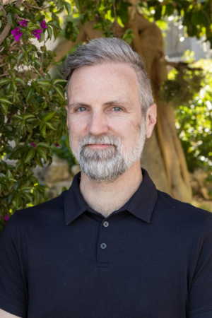

---
hide:
  - footer
  - navigation
  - toc
---

{ align=right }

# Profile

## Leadership & Strategy

Focused on building high-performing technology organizations. I harmonize technical delivery with core operations to pursue scalable growth.  My work centers on building resilient cultures, ecouraging and supporting technical evolution, and ensuring that technical investments move the needle on organizational strategy.

---

## Focus Areas

*   **Organizational Scaling & Culture**
*   **Technology Transformation**
*   **Product-Engineering Alignment**

---

## Background

My leadship approach was developed while spending decades at the intersection of advanced research and large-scale organizational management. Long before entering the corporate world, my career was anchored in academia as a tenured professor and scientific director.

Managing a scientific laboratory is fundamentally an brisk exercise in entrepreneurial operations. It requires orchestrating multi-million-dollar capital portfolios, navigating complex institutional compliance, and building high-performance teams of specialized knowledge workers. I secured and oversaw millions of dollars in federal grant funding which demanded the same financial rigor, risk mitigation, and strategic resource allocation required to scale a commercial enterprise.

Today I leverage that rich foundation in a corporate setting. The ability to look at an organization as a massive, interconnected system allows me to harmonize technical output with back-office operations, optimize fiscal deployment, and drive predictable organizational growth. I treat operational scaling not as a series of reactionary fixes, but as a rigorous, data-driven science.

I received a bachelor’s degree in computer science from Northeastern University and my doctorate in psychology from Vanderbilt University.

---

## Engagements & Advising

Outside of my primary executive roles, I advise early-stage founders on engineering organization design, evaluate technical risk for venture investments, and contribute to the broader technology ecosystem.

If you are looking to discuss technology strategy, organizational design, or an advisory board vacancy, feel free to connect via [LinkedIn](https://linkedin.com/in/cluhmann/).

